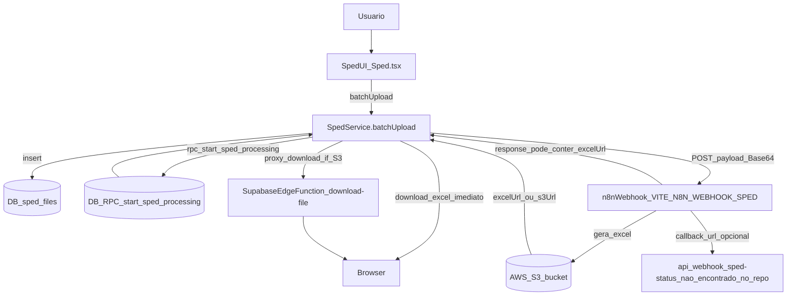
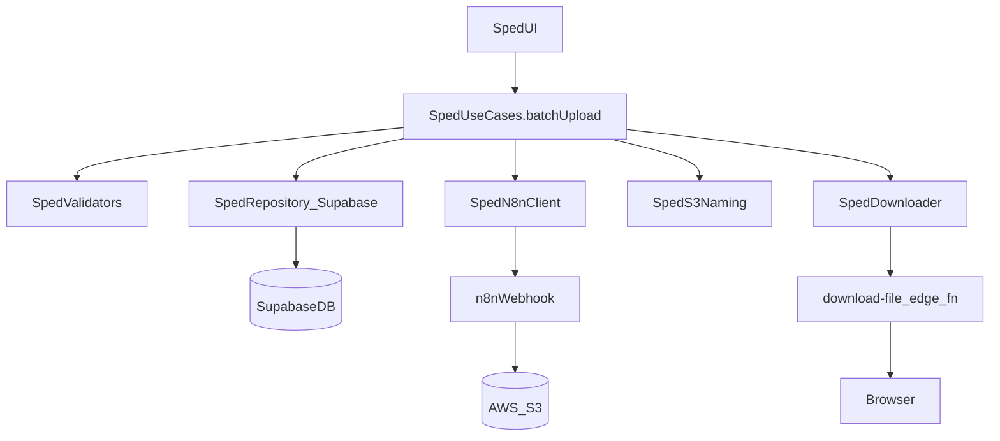

# Análise e Documentação — Módulo SPED (`/documents/sped`)

> Documento gerado a partir da análise do código existente.  
> Foco: entender como foi construído, quais integrações existem (DB/Supabase, n8n, S3, Edge Functions), e apontar melhorias de reestruturação seguindo **DRY/KISS/YAGNI**.  
> **Requisito mantido**: ao enviar o arquivo TXT, o fluxo **deve acionar o webhook do n8n**.

---

## Índice

- [1. Visão geral](#1-visão-geral)
- [2. Arquivos e responsabilidades atuais](#2-arquivos-e-responsabilidades-atuais)
- [3. Fluxo funcional atual (end-to-end)](#3-fluxo-funcional-atual-end-to-end)
- [4. Integrações identificadas](#4-integrações-identificadas)
  - [4.1 Supabase (DB/RPC/Auth)](#41-supabase-dbrpcauth)
  - [4.2 n8n (Webhook)](#42-n8n-webhook)
  - [4.3 AWS S3 (arquivos processados)](#43-aws-s3-arquivos-processados)
  - [4.4 Supabase Edge Function (proxy de download)](#44-supabase-edge-function-proxy-de-download)
- [5. Contratos e modelos (tipos)](#5-contratos-e-modelos-tipos)
- [6. Gaps, riscos e dívidas técnicas](#6-gaps-riscos-e-dívidas-técnicas)
- [7. Mapa de reestruturação (DRY/KISS/YAGNI)](#7-mapa-de-reestruturação-drykissyagni)
  - [7.1 Proposta de pastas (feature-based)](#71-proposta-de-pastas-feature-based)
  - [7.2 Interfaces e responsabilidades](#72-interfaces-e-responsabilidades)
  - [7.3 Fluxo proposto (mantendo n8n no upload TXT)](#73-fluxo-proposto-mantendo-n8n-no-upload-txt)
  - [7.4 Estratégia incremental (sem “big bang refactor”)](#74-estratégia-incremental-sem-big-bang-refactor)
- [8. Recomendações priorizadas](#8-recomendações-priorizadas)

---

## 1. Visão geral

O módulo **SPED** permite:

- Selecionar **empresa**, **tipo de SPED** e **competência** (MM/AAAA)
- Fazer **upload em lote** de até **12 arquivos TXT** (até 50MB cada)
- Disparar o processamento via **webhook do n8n**
- Acompanhar **histórico** de processamentos concluídos e **baixar** o Excel gerado

---

## 2. Arquivos e responsabilidades atuais

### UI (Página)

- `src/pages/documents/Sped.tsx`
  - Tela de upload + histórico de processamentos concluídos
  - Validações de input (competência, quantidade/tamanho/extensão)
  - Dispara `SpedService.batchUpload(...)`
  - Baixa Excel via `SpedService.downloadFile(...)`

### Service (regras + integrações)

- `src/services/spedService.ts`
  - CRUD em tabelas `sped_*` via Supabase
  - Cria e inicia processamento (RPC)
  - Converte TXT → Base64
  - Dispara webhook do n8n com payload + metadados (S3, callback)
  - Atualiza status no DB (inclui fallback via RPC e updates manuais)
  - Download do arquivo Excel (com proxy via Edge Function quando URL é do S3)

### Config

- `src/config/spedConfig.ts`
  - Obtém env do webhook do n8n: `VITE_N8N_WEBHOOK_SPED` (obrigatória)
  - Config do S3: `VITE_SPED_S3_BUCKET`, `VITE_SPED_S3_BASE_PATH`
  - Constrói path/URL do S3 (assume URL no formato `https://{bucket}.s3.amazonaws.com/...`)

### Tipos (contrato)

- `shared/types/sped.ts`
  - Contratos TypeScript: `SpedFile`, `SpedProcessing`, payload/response do webhook, etc.

### Edge Function (download)

- `supabase/functions/download-file/index.ts`
  - Proxy para baixar arquivos do S3 e evitar CORS

### Migração (RPC)

- `supabase/migrations/040_create_sped_processing_functions.sql`
  - Função `receive_sped_processing_result(...)` (atualiza `sped_processing` e `sped_files`)

---

## 3. Fluxo funcional atual (end-to-end)



### Passo a passo (comportamento observado)

1. Usuário escolhe empresa, tipo de SPED e competência e seleciona TXT.
2. Front valida e chama `SpedService.batchUpload(...)`.
3. Service:
   - valida arquivos e competência
   - converte TXT para Base64
   - cria registro(s) em `sped_files` com status inicial
   - cria um processamento via RPC `start_sped_processing` vinculando `file_ids`
   - envia payload ao n8n contendo: arquivos Base64 + metadados (empresa, competência, s3_bucket, s3_directory, etc.)
4. Retorno do n8n:
   - Se **já vier** uma `excelUrl`, o service tenta baixar imediatamente e marcar como `completed` (via RPC `receive_sped_processing_result`).
   - Se **não vier**, o processamento fica `processing` e dependeria de atualização posterior (callback/webhook ou escrita direta no DB).
5. No histórico de concluídos, a UI permite baixar `result_file_url`.
6. Se o download apontar para S3, o front usa a Edge Function `download-file` como proxy para contornar CORS.

---

## 4. Integrações identificadas

## 4.1 Supabase (DB/RPC/Auth)

### Uso de Auth

- `supabase.auth.getUser()` para obter usuário autenticado (ex.: `uploaded_by`, `userId` no payload do n8n)

### Tabelas esperadas/usadas

- `companies` (para listagem na UI)
- `sped_files` (arquivos individuais)
- `sped_processing` (processamento em lote)
- `sped_files_processing` (tabela N:N entre `sped_files` e `sped_processing`)

### RPCs esperadas/usadas pelo código

- `start_sped_processing`  
  - **chamada** pelo front em `SpedService.startProcessing(...)`
  - **não encontrada** em migrations no repositório (risco de drift)

- `get_sped_processing_stats`  
  - **chamada** pelo front em `SpedService.getEnhancedStats(...)`
  - **não encontrada** em migrations no repositório (risco de drift)

- `receive_sped_processing_result`  
  - encontrada em `supabase/migrations/040_create_sped_processing_functions.sql`
  - atualiza `sped_processing` e `sped_files` relacionados, e tenta extrair `s3_url` / `excel_url` de estruturas diferentes

**Observação**: existe um `database-setup.sql` no projeto, porém ele não contém as estruturas de SPED (tabelas/RPC). Para SPED, o versionamento de DB via migrations parece **incompleto**.

---

## 4.2 n8n (Webhook)

### Configuração

- Env obrigatória: `VITE_N8N_WEBHOOK_SPED`
- Obtida por `SpedConfig.getWebhookUrl()`

### Tipo de SPED no formato n8n

- `SPED ICMS IPI` → `ICMS_IPI`
- `SPED Contribuições` → `CONTRIBUICOES`

### Payload enviado (alto nível)

- Dados da empresa e competência
- Lista de arquivos `{ filename, fileContent(Base64), fileSize }`
- `processing_id`
- `callback_url` (hoje aponta para `/api/webhook/sped-status`)
- `metadata` com:
  - bucket/base path/diretório S3
  - caminho “esperado” do Excel

### Robustez de comunicação

- Timeout (90s) + retries (até 3 tentativas)
- Tratamento de erros de rede/timeout/5xx com backoff simples
- Tenta interpretar diferentes formatos de resposta do n8n para localizar `excelUrl` e `s3Url`

---

## 4.3 AWS S3 (arquivos processados)

### Configuração

- `VITE_SPED_S3_BUCKET` (default: `e7sped-processados`)
- `VITE_SPED_S3_BASE_PATH` (default: `sped/`)

### Convenção de path

- `sped/{CNPJ_SEM_FORMATACAO}/{MM_AAAA}/{filename}`

### Construção de URL

- `https://{bucket}.s3.amazonaws.com/{s3Path}`

**Pressuposto atual**: o arquivo é acessível via URL HTTP, seja por bucket público ou por alguma estratégia externa (ex.: signed URL gerada pelo n8n). O front não assina requisições para o S3.

---

## 4.4 Supabase Edge Function (proxy de download)

Arquivo: `supabase/functions/download-file/index.ts`

### Objetivo

Evitar problemas de CORS ao baixar arquivos do S3 no navegador:

- Quando a URL de download é do S3, o front aponta para:
  - `.../functions/v1/download-file?url=...&filename=...`

### Como funciona

- CORS aberto (`Access-Control-Allow-Origin: *`)
- Valida domínio (allowlist do hostname do S3)
- Faz `fetch` do arquivo e devolve com `Content-Disposition: attachment`

**Limitação**: se o bucket for privado, o proxy também não consegue baixar (não há assinatura AWS nem credenciais), resultando em 403.

---

## 5. Contratos e modelos (tipos)

Em `shared/types/sped.ts`:

- `SpedType`: `'SPED ICMS IPI' | 'SPED Contribuições'`
- `SpedFile`: arquivo individual + status + URLs (s3/excel) + dados extraídos
- `SpedProcessing`: lote/processamento + progresso + result URL + erro
- Contratos do n8n:
  - `WebhookPayload` / `WebhookResponse`
  - `WebhookStatusUpdate`

---

## 6. Gaps, riscos e dívidas técnicas

### 6.1 Callback URL sem implementação no repositório

O payload envia:

- `callback_url: {origin}/api/webhook/sped-status`

Mas não foi encontrado no repositório:

- route/API endpoint Vite/React (não existe)
- Edge Function específica para `sped-status` (não existe)
- handler serverless (Vercel) (não encontrado)

**Impacto**:

- Se o processamento for assíncrono e o n8n não escrever diretamente no DB, o status pode ficar “travado” em `processing`.

### 6.2 Migrations SPED incompletas (drift)

Foi encontrada apenas a migration da RPC `receive_sped_processing_result`.  
Não foram encontradas migrations de:

- criação das tabelas `sped_files`, `sped_processing`, `sped_files_processing`
- RPC `start_sped_processing`
- RPC `get_sped_processing_stats`
- RLS/policies/índices para o conjunto SPED

**Impacto**:

- Evolução/replicação de ambiente fica arriscada (dev/staging/prod)
- Bugfix pode depender de estrutura “fora do código”

### 6.3 Determinismo do path esperado do Excel no S3

O método que constrói “expected path” embute `Date.now()` no filename (timestamp).  
Isso cria um nome **não determinístico** (dificulta previsibilidade e reconciliação).

**Impacto**:

- o n8n precisa receber e respeitar exatamente o nome gerado (senão, não bate)
- auditoria e troubleshooting ficam mais difíceis

### 6.4 Mistura de responsabilidades no service

`SpedService` concentra:

- validações
- persistência (Supabase)
- integração HTTP (n8n)
- lógica de parsing de resposta (muitos formatos)
- download e UX (efeito colateral no browser)

**Impacto**:

- menor testabilidade
- maior risco de regressões
- evolução lenta (tudo mexe no mesmo arquivo)

### 6.5 Validações duplicadas

UI e service validam tamanho, extensão, quantidade etc.  
Isso tende a divergir com o tempo.

---

## 7. Mapa de reestruturação (DRY/KISS/YAGNI)

> Objetivo: separar responsabilidades por feature e manter o fluxo atual (upload TXT **aciona n8n**), reduzindo acoplamento e facilitando manutenção.

## 7.1 Proposta de pastas (feature-based)

Sugestão de estrutura:

```text
src/
  features/
    sped/
      pages/
        - SpedPage.tsx
      components/
        - SpedUploadForm.tsx
        - SpedHistoryTable.tsx
      domain/
        - types.ts                (re-export/espelhos dos tipos do shared se necessário)
        - validators.ts           (validateCompetencia, validateBatchFiles, etc.)
      services/
        - SpedUseCases.ts         (casos de uso de alto nível)
      integrations/
        - SpedRepository.ts       (Supabase: tabelas/RPC)
        - SpedN8nClient.ts        (HTTP: webhook n8n)
        - SpedS3Naming.ts         (regras de path/naming)
        - SpedDownloader.ts       (download + proxy edge)
      config/
        - spedConfig.ts           (wrapper do SpedConfig atual, ou mover o existente)
      index.ts                    (barrel exports da feature)

  pages/
    documents/
      - Sped.tsx                  (arquivo “ponte”/rota, importando a feature)
```

**Notas DRY/KISS/YAGNI**:

- Não inventar camadas extras além do necessário.
- Separar apenas o que já está “misturado” hoje (DB, n8n, download, validações).
- Manter `shared/types/sped.ts` como contrato canônico (a feature pode só reexportar).

---

## 7.2 Interfaces e responsabilidades

> Abaixo é um “mapa” conceitual de interfaces (não é para implementar agora neste documento), apenas para clarificar responsabilidades.

### `SpedRepository` (Supabase)

Responsável por tudo que é DB/RPC:

- `createFile(...)`, `updateFile(...)`
- `startProcessing(...)`
- `getProcessingHistory(...)`
- `getCompanies(...)`
- `receiveStatusUpdate(...)` (se existir endpoint/edge function no futuro)

### `SpedN8nClient` (Webhook)

Responsável por:

- montar payload n8n (incluindo tipo `ICMS_IPI`/`CONTRIBUICOES`)
- enviar HTTP com timeout/retries
- normalizar resposta (extrair `excelUrl`, `s3Url`, `estimated_time`, etc.)

### `SpedS3Naming` (S3 path)

Responsável por:

- gerar `s3_directory` e nomes consistentes
- idealmente usar um identificador determinístico (ex.: `processing_id`) em vez de `Date.now()`

### `SpedDownloader` (download)

Responsável por:

- decidir quando usar Edge Function
- encapsular fetch + criação de link

### `SpedUseCases` (orquestração)

Responsável por:

- fluxo “upload em lote”:
  - validar
  - criar registros
  - iniciar processamento
  - enviar ao n8n
  - atualizar status conforme resposta
  - (opcional) baixar Excel se URL imediata estiver disponível

**Ganhos**:

- UI consome apenas `SpedUseCases.batchUpload(...)` e `SpedUseCases.listHistory(...)`
- integrações ficam isoladas e substituíveis

---

## 7.3 Fluxo proposto (mantendo n8n no upload TXT)



**Garantia do requisito**: o `UseCases.batchUpload` sempre chama `SpedN8nClient.send(...)` após iniciar o processamento e persistir os registros.

---

## 7.4 Estratégia incremental (sem “big bang refactor”)

1. Criar `src/features/sped/` e mover a UI para `SpedPage.tsx` (mantendo `src/pages/documents/Sped.tsx` como “ponte” por enquanto).
2. Extrair validações para `domain/validators.ts` e reutilizar na UI e no service.
3. Quebrar `SpedService` em arquivos menores (repository + n8n client + downloader), mantendo a mesma API pública inicialmente.
4. Depois, substituir chamadas diretas por `SpedUseCases`.

---

## 8. Recomendações priorizadas

### Quick wins (alto impacto, baixo risco)

- Centralizar validações em um único lugar (evitar duplicação UI/service).
- Tornar naming/path do Excel **determinístico** (ideal: baseado em `processing_id`), reduzindo divergências com o n8n.
- Normalizar parsing de resposta do n8n em um único módulo (`SpedN8nClient`), evitando “espalhar” formatos.

### Estruturais (médio/alto impacto)

- Versionar o DB do SPED via migrations completas:
  - tabelas `sped_files`, `sped_processing`, `sped_files_processing`
  - RPC `start_sped_processing` e `get_sped_processing_stats`
  - RLS/policies/índices

### Gap crítico a decidir (recomendação de arquitetura)

- Implementar um “ponto de retorno” real para processamentos assíncronos:
  - opção A: Edge Function (ex.: `sped-status`) recebendo callback do n8n e chamando `receive_sped_processing_result`
  - opção B: n8n escreve diretamente no Supabase (service role) e o front apenas consulta

> Observação: este documento não implementa essas mudanças, apenas as recomenda para um próximo passo.


