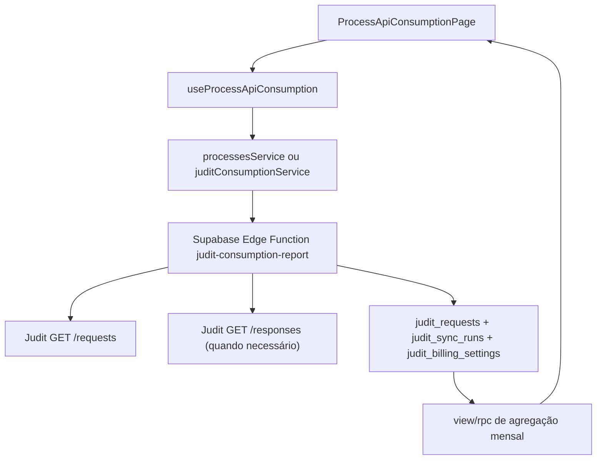

# Planejamento: Integração Judit Consumo

## Objetivo

Os usuários devem ser capazes de:

- visualizar o consumo mensal da Judit na rota `[/documents/cases/api-consumption]( /Users/andrefelipe/CURSOR_DEV/app-e7aicenter/src/features/processes/pages/ProcessApiConsumptionPage.tsx )` com dados reais;
- acompanhar saldo contratado, consumo acumulado, excedente faturável e limite até bloqueio;
- filtrar o histórico por período, origem, tipo de busca, status, `on_demand` e anexos;
- inspecionar cada requisição com custo estimado/apurado e rastreabilidade da última sincronização.

## Decisão de arquitetura

- A integração deve ser **backend-first** via Edge Function do Supabase. A `api-key` da Judit não deve ir para o frontend nem para variáveis `VITE_`*.
- O frontend continuará dentro da feature `[src/features/processes]( /Users/andrefelipe/CURSOR_DEV/app-e7aicenter/src/features/processes )`, reaproveitando a rota existente e o contrato do provider em `[src/features/processes/adapters/processProvider.ts]( /Users/andrefelipe/CURSOR_DEV/app-e7aicenter/src/features/processes/adapters/processProvider.ts )`.
- O Supabase será usado para **persistir histórico normalizado, sincronizações e agregados**, evitando recalcular tudo no cliente e permitindo auditoria.
- A cobrança será tratada como **saldo financeiro mensal em BRL**:
  - franquia contratada: `R$ 1.000,00`;
  - uso excedente permitido até `R$ 5.000,00` no mês;
  - após `R$ 5.000,00`, status operacional deve sinalizar risco/bloqueio.

## Fluxo proposto

## Estado atual encontrado

- A página já existe em `[src/features/processes/pages/ProcessApiConsumptionPage.tsx]( /Users/andrefelipe/CURSOR_DEV/app-e7aicenter/src/features/processes/pages/ProcessApiConsumptionPage.tsx )`, mas hoje exibe apenas mock de métricas e tabela simples.
- O hook `[src/features/processes/hooks/useProcesses.ts]( /Users/andrefelipe/CURSOR_DEV/app-e7aicenter/src/features/processes/hooks/useProcesses.ts )` já isola `useProcessApiConsumption()`.
- O serviço `[src/features/processes/services/processesService.ts]( /Users/andrefelipe/CURSOR_DEV/app-e7aicenter/src/features/processes/services/processesService.ts )` retorna `apiConsumptionMock`, então a substituição é localizada.
- O MCP do Supabase mostra que **não há tabelas Judit hoje**; há bons padrões em `payroll_processing`, `processing_logs`, `sped_processing` e nas Edge Functions `chat-completion` e `download-file`.

## Escopo do Supabase via MCP

Usar o MCP `user-supabase` para implementar e validar:

- `list_tables` e `list_migrations` para checagem inicial e prevenção de colisão de nomes.
- `apply_migration` para criar a estrutura nova.
- `deploy_edge_function` para publicar a função segura da Judit.
- `generate_typescript_types` ao final, se necessário, para alinhar tipos do frontend.

### Estrutura mínima recomendada

Criar via migration:

- `public.judit_billing_settings`
  - contrato ativo, `included_amount_brl`, `max_monthly_amount_brl`, `pricing_rules jsonb`, `active_from`, `active_to`, `is_active`.
  - seed inicial com `1000.00` e `5000.00` e a tabela de preços informada por você.
- `public.judit_requests`
  - `request_id` único da Judit;
  - payload bruto resumido (`raw_payload jsonb`);
  - campos normalizados: `origin`, `search_type`, `response_type`, `on_demand`, `with_attachments`, `status`, `created_at_judit`, `updated_at_judit`;
  - campos derivados: `billing_reference_month`, `product_name`, `cost_brl`, `cost_type`, `cost_confidence`, `returned_items_count`, `has_overage`, `pricing_version`.
- `public.judit_sync_runs`
  - período sincronizado, paginação percorrida, quantidade importada, status, erro, `started_at`, `finished_at`, `triggered_by`.
- `public.judit_consumption_monthly_view` ou RPC equivalente
  - agrega KPIs do mês, breakdown por produto/origem/status e saldo restante.

### Regras de modelagem importantes

- Indexar `billing_reference_month`, `created_at_judit`, `origin`, `search_type`, `status`.
- Criar RLS apenas para leitura autenticada conforme o padrão do projeto, preferencialmente restrita a perfis com acesso ao módulo.
- Registrar `cost_confidence` com valores como `exact`, `estimated`, `pending_enrichment`.
- Persistir o `pricing_rules` versionado para evitar recalcular histórico com regra nova.

## Backend da integração

Criar uma nova Edge Function baseada no padrão de `[supabase/functions/chat-completion/index.ts]( /Users/andrefelipe/CURSOR_DEV/app-e7aicenter/supabase/functions/chat-completion/index.ts )`:

- nova função sugerida: `[supabase/functions/judit-consumption-report/index.ts]( /Users/andrefelipe/CURSOR_DEV/app-e7aicenter/supabase/functions/judit-consumption-report/index.ts )`
- responsabilidade:
  - validar JWT do usuário;
  - receber `startDate`, `endDate`, `forceSync`, paginação/filtros opcionais;
  - consumir `GET https://requests.prod.judit.io/requests?page_size=1000&created_at_gte=...&created_at_lte=...`;
  - paginar até o fim do período;
  - normalizar cada item;
  - enriquecer custo quando necessário;
  - fazer upsert em `judit_requests`;
  - registrar `judit_sync_runs`;
  - devolver payload já pronto para o frontend.

### Estratégia de cálculo de custo

- Usar a **tabela comercial enviada por você como fonte primária** de precificação.
- Usar os campos da Judit para classificar o produto:
  - `origin` distingue `api` vs `tracking`;
  - `search.search_type` classifica `cpf`, `cnpj`, `oab`, `name`, `lawsuit_cnj` etc.;
  - `response_type` ajuda a separar `lawsuit`, `lawsuits`, `entity`, `warrant`;
  - `on_demand` diferencia data lake vs on-demand quando aplicável;
  - `with_attachments` adiciona o custo de autos processuais.
- Para modalidades cobradas por volume retornado, como histórico por 1.000 processos, prever enriquecimento opcional com `/responses?request_id=<id>` para preencher `returned_items_count` e melhorar o `cost_confidence`.
- Quando a API de histórico não fornecer dados suficientes para custo exato, exibir no frontend `custo estimado` e marcar a confiança do cálculo.

### Estratégia de saldo mensal

Calcular no backend e devolver pronto para a UI:

- `consumedMonthBrl`
- `includedPlanBrl = 1000`
- `remainingIncludedBrl = max(0, 1000 - consumedMonthBrl)`
- `overageBrl = max(0, consumedMonthBrl - 1000)`
- `remainingUntilBlockBrl = max(0, 5000 - consumedMonthBrl)`
- `billingStatus = within_plan | additional_billing | threshold_reached`

## Adequações do frontend

Evoluir o contrato atual em `[src/features/processes/types.ts]( /Users/andrefelipe/CURSOR_DEV/app-e7aicenter/src/features/processes/types.ts )` e a implementação em `[src/features/processes/services/processesService.ts]( /Users/andrefelipe/CURSOR_DEV/app-e7aicenter/src/features/processes/services/processesService.ts )`.

### Ajustes estruturais recomendados

- Expandir `ApiConsumptionData` para incluir:
  - `summary` com KPIs financeiros e operacionais;
  - `breakdownByProduct`;
  - `breakdownByOrigin`;
  - `dailySeries` ou `monthlySeries` para evolução;
  - `filters` aplicados e `lastSync`;
  - `entries` detalhadas com campos Judit normalizados.
- Criar tipos específicos para `JuditConsumptionEntry`, `JuditConsumptionSummary`, `JuditBillingStatus` e `JuditSyncStatus`.
- Manter o provider plugável em `[src/features/processes/adapters/processProvider.ts]( /Users/andrefelipe/CURSOR_DEV/app-e7aicenter/src/features/processes/adapters/processProvider.ts )` para não contaminar a UI com payload bruto da Judit.

### Evolução visual da página

Adequar `[src/features/processes/pages/ProcessApiConsumptionPage.tsx]( /Users/andrefelipe/CURSOR_DEV/app-e7aicenter/src/features/processes/pages/ProcessApiConsumptionPage.tsx )` para mostrar:

- cards de topo com `consumo do mês`, `saldo da franquia`, `excedente atual`, `limite restante até bloqueio` e `total de requisições`;
- aviso contextual quando o consumo passar de `R$ 1.000,00` e quando se aproximar de `R$ 5.000,00`;
- filtros por período, origem, tipo de busca, status, anexos e `on_demand`;
- breakdown por produto com nome amigável e custo consolidado;
- tabela detalhada com `request_id`, data, origem, produto inferido, status, anexos, custo, confiança do custo;
- estado de `última sincronização` e ação de `atualizar agora`.

### Reaproveitamento interno

Reaproveitar onde fizer sentido:

- padrão de query/hook em `[src/features/processes/hooks/useProcesses.ts]( /Users/andrefelipe/CURSOR_DEV/app-e7aicenter/src/features/processes/hooks/useProcesses.ts )`;
- componentes visuais e cards do módulo `processes` para manter consistência;
- caso a tabela atual fique limitada, extrair componentes novos em `[src/features/processes/components/api-consumption/]( /Users/andrefelipe/CURSOR_DEV/app-e7aicenter/src/features/processes/components/api-consumption/ )`.

## Variáveis de ambiente e segurança

- Implementar `JUDIT_API_KEY` e `JUDIT_BASE_URL` para consumo **somente no backend**.
- Em desenvolvimento local, usar `supabase/functions/.env` conforme a documentação atual do Supabase.
- Em produção, replicar a mesma chave como secret da Edge Function.
- Se você ainda quiser espelhar isso em um `.env` do projeto, manter a chave **sem prefixo `VITE_`** e nunca consumi-la no cliente.

## Sequência recomendada de implementação

1. Modelar contrato de consumo e matriz de precificação Judit.
2. Criar migration Supabase via MCP com tabelas, índices, RLS e seed de `judit_billing_settings`.
3. Implementar Edge Function de sincronização + cálculo de custo + retorno consolidado.
4. Ajustar `types`, `service`, `hook` e `page` da feature `processes`.
5. Validar cenários de franquia, excedente, anexos e requisições com custo por volume.
6. Gerar documentação final em `docs/` no padrão de data e título, por exemplo `17-03-2026 - Integracao_Judit_Consumo.md`.

## Riscos e pontos de atenção já mapeados

- O endpoint `/requests` permite inferência de custo, mas nem sempre custo exato para modalidades cobradas por volume retornado; por isso o plano prevê `cost_confidence` e enriquecimento por `/responses`.
- O payload real da Judit pode trazer combinações não cobertas no exemplo de documentação; a matriz de classificação deve ser centralizada e versionada.
- A página atual foi desenhada para mock simples; o tipo `ApiConsumptionData` precisará crescer antes de qualquer ajuste visual relevante.
- Como não existe backend Judit hoje no projeto, a Edge Function é o ponto certo para segredo, paginação, retries e observabilidade.

## Arquivos que devem concentrar a mudança

- `[/Users/andrefelipe/CURSOR_DEV/app-e7aicenter/src/features/processes/pages/ProcessApiConsumptionPage.tsx](/Users/andrefelipe/CURSOR_DEV/app-e7aicenter/src/features/processes/pages/ProcessApiConsumptionPage.tsx)`
- `[/Users/andrefelipe/CURSOR_DEV/app-e7aicenter/src/features/processes/hooks/useProcesses.ts](/Users/andrefelipe/CURSOR_DEV/app-e7aicenter/src/features/processes/hooks/useProcesses.ts)`
- `[/Users/andrefelipe/CURSOR_DEV/app-e7aicenter/src/features/processes/services/processesService.ts](/Users/andrefelipe/CURSOR_DEV/app-e7aicenter/src/features/processes/services/processesService.ts)`
- `[/Users/andrefelipe/CURSOR_DEV/app-e7aicenter/src/features/processes/types.ts](/Users/andrefelipe/CURSOR_DEV/app-e7aicenter/src/features/processes/types.ts)`
- `[/Users/andrefelipe/CURSOR_DEV/app-e7aicenter/supabase/functions/judit-consumption-report/index.ts](/Users/andrefelipe/CURSOR_DEV/app-e7aicenter/supabase/functions/judit-consumption-report/index.ts)`
- `[/Users/andrefelipe/CURSOR_DEV/app-e7aicenter/supabase/migrations/](/Users/andrefelipe/CURSOR_DEV/app-e7aicenter/supabase/migrations/)`
- `[/Users/andrefelipe/CURSOR_DEV/app-e7aicenter/docs/](/Users/andrefelipe/CURSOR_DEV/app-e7aicenter/docs/)`

