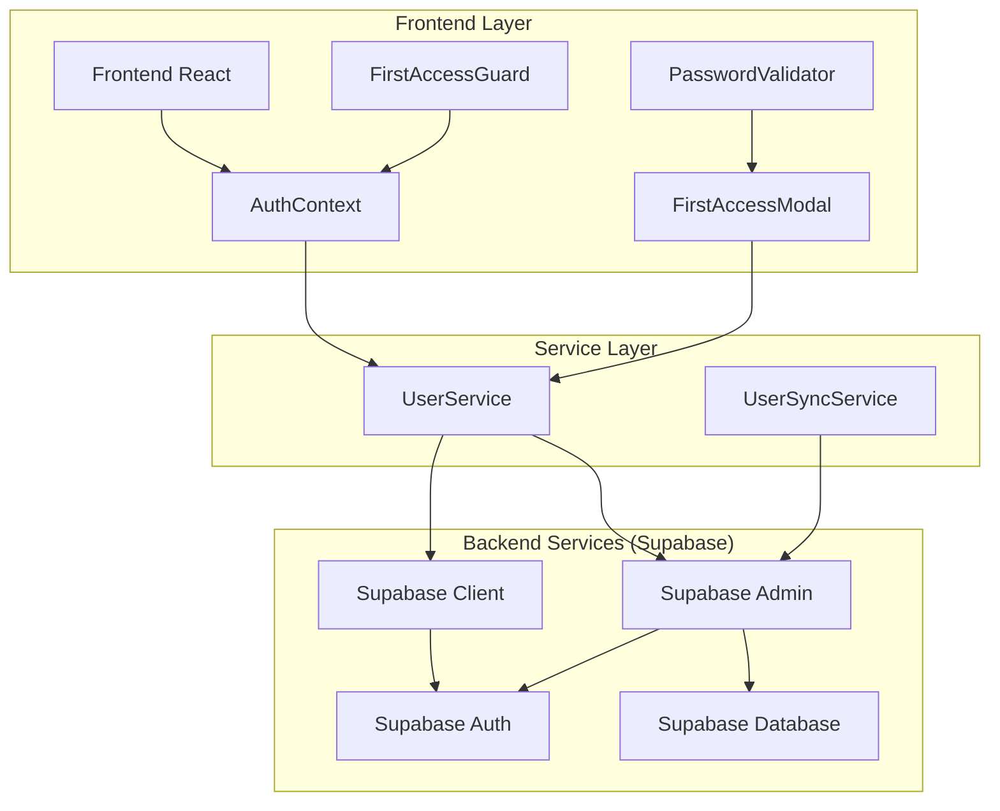
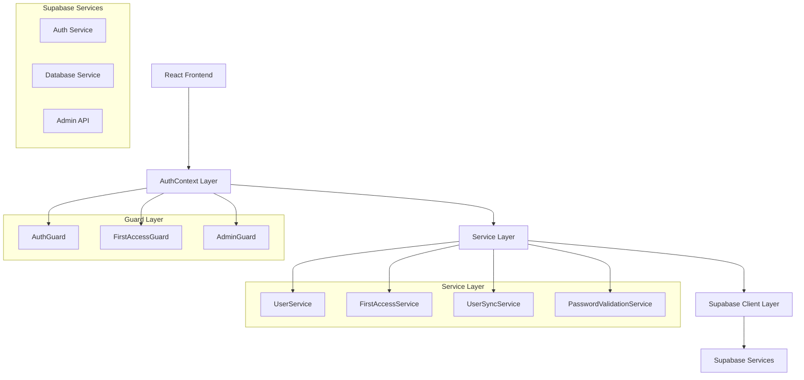
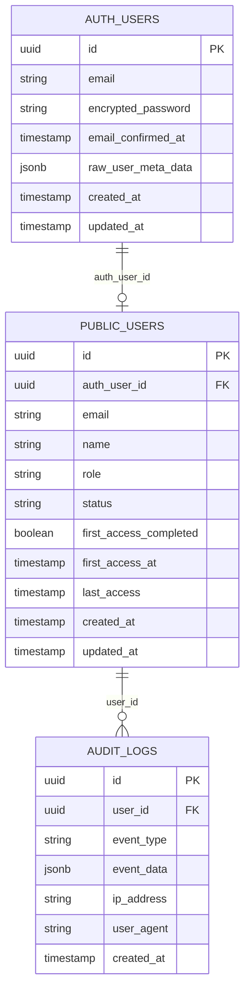

# Arquitetura Técnica: Sistema de Autenticação e Primeiro Acesso

## 1. Arquitetura Geral



## 2. Descrição das Tecnologias

- **Frontend**: React@18 + TypeScript + Tailwind CSS + Vite
- **Backend**: Supabase (Auth + Database)
- **Autenticação**: Supabase Auth com Admin API
- **Banco de Dados**: PostgreSQL (via Supabase)
- **Estado**: React Context API
- **Validação**: Zod + React Hook Form

## 3. Definições de Rotas

| Rota | Propósito | Guard Aplicado |
|------|-----------|----------------|
| `/login` | Página de login | Nenhum |
| `/dashboard` | Dashboard principal | AuthGuard + FirstAccessGuard |
| `/admin/users` | Gerenciamento de usuários | AuthGuard + AdminGuard + FirstAccessGuard |
| `/profile` | Perfil do usuário | AuthGuard + FirstAccessGuard |
| `/first-access` | Modal de primeiro acesso | AuthGuard (sem FirstAccessGuard) |

## 4. Definições de API

### 4.1 UserService APIs

#### Diagnóstico de Usuário
```typescript
POST /api/users/diagnose
```

Request:
| Parâmetro | Tipo | Obrigatório | Descrição |
|-----------|------|-------------|-----------|
| email | string | true | E-mail do usuário para diagnóstico |

Response:
| Parâmetro | Tipo | Descrição |
|-----------|------|-----------|
| issues | DiagnosticIssue[] | Lista de problemas encontrados |
| canRepair | boolean | Se os problemas podem ser reparados automaticamente |

Exemplo:
```json
{
  "email": "cristiano@e7tax.com.br",
  "issues": [
    {
      "type": "missing_auth_user_id",
      "description": "Campo auth_user_id está nulo",
      "severity": "high"
    }
  ],
  "canRepair": true
}
```

#### Sincronização de Usuário
```typescript
POST /api/users/sync
```

Request:
| Parâmetro | Tipo | Obrigatório | Descrição |
|-----------|------|-------------|-----------|
| email | string | true | E-mail do usuário para sincronizar |
| forceRepair | boolean | false | Forçar reparo mesmo com riscos |

Response:
| Parâmetro | Tipo | Descrição |
|-----------|------|-----------|
| success | boolean | Se a sincronização foi bem-sucedida |
| actions | string[] | Ações realizadas durante a sincronização |

#### Validação de Primeiro Acesso
```typescript
GET /api/users/{id}/first-access-status
```

Response:
| Parâmetro | Tipo | Descrição |
|-----------|------|-----------|
| isFirstAccess | boolean | Se é o primeiro acesso do usuário |
| completedAt | string | Data de conclusão do primeiro acesso |

#### Conclusão de Primeiro Acesso
```typescript
POST /api/users/{id}/complete-first-access
```

Request:
| Parâmetro | Tipo | Obrigatório | Descrição |
|-----------|------|-------------|-----------|
| currentPassword | string | true | Senha atual (gerada pelo sistema) |
| newPassword | string | true | Nova senha definida pelo usuário |

Response:
| Parâmetro | Tipo | Descrição |
|-----------|------|-----------|
| success | boolean | Se a troca foi bem-sucedida |
| authToken | string | Token de autenticação atualizado |

## 5. Arquitetura do Servidor



## 6. Modelo de Dados

### 6.1 Diagrama de Entidades



### 6.2 DDL (Data Definition Language)

#### Tabela Users (Modificações)
```sql
-- Adicionar campos para controle de primeiro acesso
ALTER TABLE public.users 
ADD COLUMN IF NOT EXISTS first_access_completed BOOLEAN DEFAULT FALSE,
ADD COLUMN IF NOT EXISTS first_access_at TIMESTAMP WITH TIME ZONE;

-- Adicionar índices para performance
CREATE INDEX IF NOT EXISTS idx_users_first_access 
ON public.users(first_access_completed);

CREATE INDEX IF NOT EXISTS idx_users_auth_user_id 
ON public.users(auth_user_id);

-- Atualizar usuários existentes para marcar primeiro acesso como concluído
UPDATE public.users 
SET first_access_completed = TRUE, 
    first_access_at = created_at 
WHERE first_access_completed IS NULL OR first_access_completed = FALSE;
```

#### Tabela de Auditoria
```sql
-- Criar tabela de logs de auditoria
CREATE TABLE IF NOT EXISTS public.audit_logs (
    id UUID PRIMARY KEY DEFAULT gen_random_uuid(),
    user_id UUID REFERENCES public.users(id) ON DELETE SET NULL,
    event_type VARCHAR(50) NOT NULL,
    event_data JSONB,
    ip_address INET,
    user_agent TEXT,
    created_at TIMESTAMP WITH TIME ZONE DEFAULT NOW()
);

-- Índices para performance
CREATE INDEX IF NOT EXISTS idx_audit_logs_user_id ON public.audit_logs(user_id);
CREATE INDEX IF NOT EXISTS idx_audit_logs_event_type ON public.audit_logs(event_type);
CREATE INDEX IF NOT EXISTS idx_audit_logs_created_at ON public.audit_logs(created_at DESC);

-- RLS para audit_logs
ALTER TABLE public.audit_logs ENABLE ROW LEVEL SECURITY;

CREATE POLICY "Users can view their own audit logs" ON public.audit_logs
    FOR SELECT
    USING (
        auth.uid() IN (
            SELECT auth_user_id FROM public.users WHERE id = audit_logs.user_id
        )
    );

CREATE POLICY "Admins can view all audit logs" ON public.audit_logs
    FOR SELECT
    USING (
        EXISTS (
            SELECT 1 FROM public.users 
            WHERE auth_user_id = auth.uid() 
            AND role = 'administrator'
            AND status = 'ativo'
        )
    );
```

#### Funções de Diagnóstico
```sql
-- Função para diagnosticar problemas de usuário
CREATE OR REPLACE FUNCTION public.diagnose_user_auth_issues(user_email TEXT)
RETURNS TABLE (
    issue_type TEXT,
    description TEXT,
    severity TEXT,
    suggested_action TEXT
) AS $$
DECLARE
    user_record RECORD;
    auth_user_exists BOOLEAN := FALSE;
BEGIN
    -- Verificar se usuário existe em public.users
    SELECT * INTO user_record FROM public.users WHERE email = user_email;
    
    IF NOT FOUND THEN
        RETURN QUERY SELECT 
            'missing_public_user'::TEXT,
            'Usuário não encontrado na tabela public.users'::TEXT,
            'critical'::TEXT,
            'Criar usuário na tabela public.users'::TEXT;
        RETURN;
    END IF;
    
    -- Verificar auth_user_id
    IF user_record.auth_user_id IS NULL THEN
        RETURN QUERY SELECT 
            'missing_auth_user_id'::TEXT,
            'Campo auth_user_id está nulo'::TEXT,
            'high'::TEXT,
            'Sincronizar com auth.users ou recriar usuário'::TEXT;
    END IF;
    
    -- Se chegou até aqui, não há problemas críticos
    IF NOT EXISTS (
        SELECT 1 FROM public.audit_logs 
        WHERE user_id = user_record.id 
        AND event_type = 'password_reset_failed'
        AND created_at > NOW() - INTERVAL '24 hours'
    ) THEN
        RETURN QUERY SELECT 
            'no_issues'::TEXT,
            'Nenhum problema detectado'::TEXT,
            'info'::TEXT,
            'Usuário está em estado consistente'::TEXT;
    END IF;
    
    RETURN;
END;
$$ LANGUAGE plpgsql SECURITY DEFINER;

-- Função para sincronizar usuário
CREATE OR REPLACE FUNCTION public.sync_user_with_auth(user_email TEXT)
RETURNS TABLE (
    success BOOLEAN,
    action_taken TEXT,
    details TEXT
) AS $$
DECLARE
    user_record RECORD;
    new_auth_id UUID;
BEGIN
    -- Buscar usuário
    SELECT * INTO user_record FROM public.users WHERE email = user_email;
    
    IF NOT FOUND THEN
        RETURN QUERY SELECT 
            FALSE,
            'user_not_found'::TEXT,
            'Usuário não existe na tabela public.users'::TEXT;
        RETURN;
    END IF;
    
    -- Se auth_user_id está nulo, tentar encontrar na auth.users
    IF user_record.auth_user_id IS NULL THEN
        -- Esta parte seria implementada via aplicação
        -- pois não temos acesso direto à auth.users via SQL
        RETURN QUERY SELECT 
            FALSE,
            'requires_app_sync'::TEXT,
            'Sincronização deve ser feita via aplicação'::TEXT;
        RETURN;
    END IF;
    
    RETURN QUERY SELECT 
        TRUE,
        'no_action_needed'::TEXT,
        'Usuário já possui auth_user_id válido'::TEXT;
    
    RETURN;
END;
$$ LANGUAGE plpgsql SECURITY DEFINER;

-- Função para registrar eventos de auditoria
CREATE OR REPLACE FUNCTION public.log_auth_event(
    p_user_id UUID,
    p_event_type TEXT,
    p_event_data JSONB DEFAULT NULL,
    p_ip_address INET DEFAULT NULL,
    p_user_agent TEXT DEFAULT NULL
)
RETURNS UUID AS $$
DECLARE
    log_id UUID;
BEGIN
    INSERT INTO public.audit_logs (
        user_id,
        event_type,
        event_data,
        ip_address,
        user_agent
    ) VALUES (
        p_user_id,
        p_event_type,
        p_event_data,
        p_ip_address,
        p_user_agent
    ) RETURNING id INTO log_id;
    
    RETURN log_id;
END;
$$ LANGUAGE plpgsql SECURITY DEFINER;
```

#### Trigger para Confirmação Automática de E-mail
```sql
-- Função para confirmar e-mail automaticamente
CREATE OR REPLACE FUNCTION public.auto_confirm_user_email()
RETURNS TRIGGER AS $$
BEGIN
    -- Marcar e-mail como confirmado automaticamente
    IF NEW.email_confirmed_at IS NULL THEN
        NEW.email_confirmed_at = NOW();
    END IF;
    
    RETURN NEW;
END;
$$ LANGUAGE plpgsql;

-- Remover trigger existente se houver
DROP TRIGGER IF EXISTS auto_confirm_email_trigger ON auth.users;

-- Criar trigger para novos usuários (se possível)
-- Nota: Este trigger pode não funcionar dependendo das permissões do Supabase
-- A confirmação automática deve ser feita via aplicação
```

## 7. Implementação de Segurança

### 7.1 Políticas RLS Atualizadas

```sql
-- Política para permitir que usuários vejam seus próprios dados
CREATE POLICY "Users can view own data" ON public.users
    FOR SELECT
    USING (auth.uid() = auth_user_id);

-- Política para permitir que administradores vejam todos os usuários
CREATE POLICY "Admins can view all users" ON public.users
    FOR SELECT
    USING (
        EXISTS (
            SELECT 1 FROM public.users 
            WHERE auth_user_id = auth.uid() 
            AND role = 'administrator'
            AND status = 'ativo'
        )
    );

-- Política para permitir que usuários atualizem seus próprios dados
CREATE POLICY "Users can update own data" ON public.users
    FOR UPDATE
    USING (auth.uid() = auth_user_id)
    WITH CHECK (auth.uid() = auth_user_id);

-- Política para permitir que administradores atualizem qualquer usuário
CREATE POLICY "Admins can update all users" ON public.users
    FOR UPDATE
    USING (
        EXISTS (
            SELECT 1 FROM public.users 
            WHERE auth_user_id = auth.uid() 
            AND role = 'administrator'
            AND status = 'ativo'
        )
    );
```

### 7.2 Validação de Senha

```typescript
interface PasswordComplexityRules {
  minLength: number;
  requireUppercase: boolean;
  requireLowercase: boolean;
  requireNumbers: boolean;
  requireSpecialChars: boolean;
  forbiddenPatterns: string[];
}

const DEFAULT_PASSWORD_RULES: PasswordComplexityRules = {
  minLength: 8,
  requireUppercase: true,
  requireLowercase: true,
  requireNumbers: true,
  requireSpecialChars: true,
  forbiddenPatterns: ['123456', 'password', 'qwerty']
};
```

## 8. Monitoramento e Logs

### 8.1 Eventos de Auditoria

```typescript
enum AuthEventType {
  FIRST_ACCESS_STARTED = 'first_access_started',
  FIRST_ACCESS_COMPLETED = 'first_access_completed',
  PASSWORD_RESET_ATTEMPTED = 'password_reset_attempted',
  PASSWORD_RESET_FAILED = 'password_reset_failed',
  PASSWORD_RESET_SUCCESS = 'password_reset_success',
  USER_SYNC_PERFORMED = 'user_sync_performed',
  AUTH_DIAGNOSTIC_RUN = 'auth_diagnostic_run',
  LOGIN_ATTEMPT = 'login_attempt',
  LOGIN_SUCCESS = 'login_success',
  LOGIN_FAILED = 'login_failed'
}
```

### 8.2 Estrutura de Log

```typescript
interface AuthLogEntry {
  id: string;
  userId?: string;
  eventType: AuthEventType;
  eventData: {
    success?: boolean;
    errorMessage?: string;
    userEmail?: string;
    ipAddress?: string;
    userAgent?: string;
    additionalData?: Record<string, any>;
  };
  createdAt: string;
}
```

## 9. Testes de Integração

### 9.1 Cenários de Teste Automatizado

```typescript
describe('First Access Flow', () => {
  test('should require first access for new users', async () => {
    // Criar usuário novo
    // Tentar fazer login
    // Verificar se FirstAccessModal é exibido
    // Completar primeiro acesso
    // Verificar redirecionamento para dashboard
  });
  
  test('should validate password complexity', async () => {
    // Tentar senhas fracas
    // Verificar mensagens de erro
    // Usar senha forte
    // Verificar aceitação
  });
});

describe('Password Reset Diagnostic', () => {
  test('should diagnose user with missing auth_user_id', async () => {
    // Criar usuário com auth_user_id nulo
    // Executar diagnóstico
    // Verificar problemas detectados
  });
  
  test('should repair user data inconsistencies', async () => {
    // Criar inconsistência
    // Executar reparo
    // Verificar correção
  });
});
```

## 10. Deployment e Configuração

### 10.1 Variáveis de Ambiente

```env
# Supabase Configuration
VITE_SUPABASE_URL=your_supabase_url
VITE_SUPABASE_ANON_KEY=your_anon_key
SUPABASE_SERVICE_ROLE_KEY=your_service_role_key

# Password Complexity
VITE_PASSWORD_MIN_LENGTH=8
VITE_PASSWORD_REQUIRE_UPPERCASE=true
VITE_PASSWORD_REQUIRE_LOWERCASE=true
VITE_PASSWORD_REQUIRE_NUMBERS=true
VITE_PASSWORD_REQUIRE_SPECIAL=true

# Audit Configuration
ENABLE_AUDIT_LOGS=true
AUDIT_LOG_RETENTION_DAYS=90
```

### 10.2 Configuração do Supabase

```sql
-- Executar após deployment
SELECT public.diagnose_user_auth_issues('test@example.com');
SELECT public.sync_user_with_auth('test@example.com');

-- Verificar políticas RLS
SELECT schemaname, tablename, policyname, permissive, roles, cmd, qual 
FROM pg_policies 
WHERE schemaname = 'public' AND tablename = 'users';
```

Esta arquitetura fornece uma base sólida para resolver os problemas de autenticação e implementar o fluxo de primeiro acesso de forma segura e escalável.