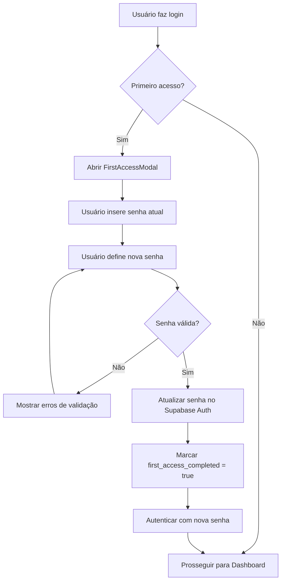
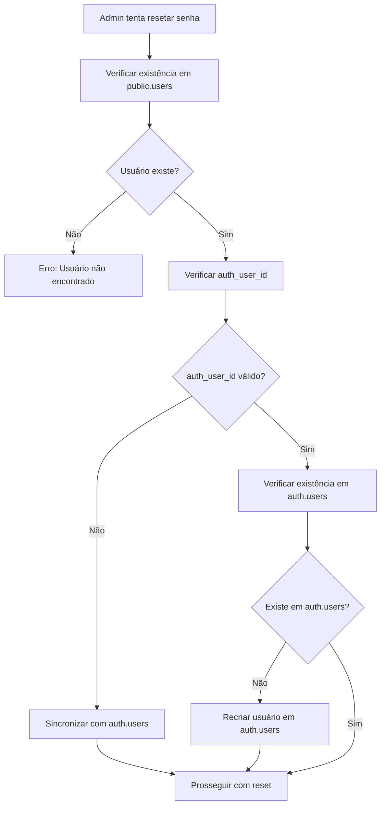

# Requisitos Técnicos: Correção de Reset de Senha e Fluxo de Primeiro Acesso

## 1. Visão Geral do Projeto

Este documento define os requisitos técnicos para resolver dois problemas críticos no sistema de autenticação:

1. **Correção do erro "User not found"** no reset de senha para usuários específicos
2. **Implementação do fluxo de primeiro acesso** para novos usuários com troca obrigatória de senha

### 1.1 Problemas Identificados

- Usuários específicos (ex: cristiano@e7tax.com.br) não conseguem resetar senha devido ao erro "AuthApiError: User not found"
- Ausência de fluxo de primeiro acesso para novos usuários
- Falta de confirmação automática de e-mail
- Necessidade de controle de status de primeiro acesso

## 2. Funcionalidades Principais

### 2.1 Correção do Reset de Senha

#### 2.1.1 Análise do Problema
- **Sintoma**: Erro "User not found" ao tentar resetar senha de usuários específicos
- **Causa Provável**: Inconsistência entre `auth.users` e `public.users` ou `auth_user_id` inválido
- **Impacto**: Usuários não conseguem ter suas senhas resetadas pelo administrador

#### 2.1.2 Funcionalidades Necessárias
- Diagnóstico automático de inconsistências entre tabelas
- Sincronização de dados entre `auth.users` e `public.users`
- Validação de `auth_user_id` antes do reset
- Logs detalhados para auditoria

### 2.2 Fluxo de Primeiro Acesso

#### 2.2.1 Confirmação Automática de E-mail
- Confirmação automática após criação do usuário
- Atualização do status `email_confirmed` no Supabase Auth
- Logs de confirmação para auditoria

#### 2.2.2 Modal de Primeiro Acesso
- Detecção automática de primeiro login
- Modal obrigatório para troca de senha
- Validação de complexidade em tempo real
- Bloqueio de acesso até conclusão da troca

#### 2.2.3 Controle de Status
- Campo `first_access_completed` na tabela `users`
- Middleware para verificação de status
- Redirecionamento automático conforme necessário

## 3. Detalhamento das Páginas e Componentes

### 3.1 Componentes Frontend

| Componente | Módulo | Descrição da Funcionalidade |
|------------|--------|------------------------------|
| **FirstAccessModal** | Modal de Primeiro Acesso | Modal obrigatório para troca de senha inicial. Campos: senha atual, nova senha, confirmação. Validação em tempo real. |
| **PasswordResetDiagnostic** | Diagnóstico de Reset | Componente para diagnosticar problemas de reset de senha. Verifica consistência de dados. |
| **UserSyncService** | Serviço de Sincronização | Serviço para sincronizar dados entre auth.users e public.users. |
| **FirstAccessGuard** | Guard de Primeiro Acesso | Middleware para verificar status de primeiro acesso e redirecionar conforme necessário. |
| **PasswordComplexityValidator** | Validador de Senha | Componente para validação em tempo real de complexidade de senha. |

### 3.2 Páginas Modificadas

| Página | Módulo | Modificações Necessárias |
|--------|--------|--------------------------|
| **Login** | Autenticação | Adicionar verificação de primeiro acesso após login bem-sucedido. |
| **Dashboard** | Principal | Adicionar guard para verificar primeiro acesso antes de permitir acesso. |
| **Users (Admin)** | Administração | Melhorar diagnóstico de problemas de reset de senha. |

## 4. Fluxo de Processo

### 4.1 Fluxo de Primeiro Acesso



### 4.2 Fluxo de Diagnóstico de Reset



## 5. Design da Interface

### 5.1 Estilo de Design

- **Cores Primárias**: Azul (#2563eb), Cinza (#64748b)
- **Cores Secundárias**: Verde (#16a34a) para sucesso, Vermelho (#dc2626) para erro
- **Estilo de Botão**: Rounded com sombra sutil
- **Fonte**: Inter, tamanhos 14px (corpo), 16px (títulos), 12px (labels)
- **Layout**: Card-based com espaçamento consistente
- **Ícones**: Lucide React para consistência

### 5.2 Design dos Componentes

| Componente | Módulo | Elementos de UI |
|------------|--------|-----------------|
| **FirstAccessModal** | Modal de Primeiro Acesso | Modal centralizado, fundo escuro semi-transparente. Título "Primeiro Acesso", campos de senha com ícones de visibilidade, indicador de força da senha, botões "Cancelar" e "Confirmar". |
| **PasswordComplexityValidator** | Validador de Senha | Lista de critérios com ícones de check/x. Cores verde/vermelho. Texto pequeno e claro. |
| **UserSyncService** | Diagnóstico | Interface administrativa com botões de ação, logs em tempo real, indicadores de status. |

### 5.3 Responsividade

- **Desktop-first** com adaptação para mobile
- **Breakpoints**: 768px (tablet), 640px (mobile)
- **Touch optimization** para botões e campos de entrada
- **Modal responsivo** que se adapta ao tamanho da tela

## 6. Modificações no Banco de Dados

### 6.1 Alterações na Tabela Users

```sql
-- Adicionar campo para controle de primeiro acesso
ALTER TABLE public.users 
ADD COLUMN IF NOT EXISTS first_access_completed BOOLEAN DEFAULT FALSE;

-- Adicionar índice para performance
CREATE INDEX IF NOT EXISTS idx_users_first_access 
ON public.users(first_access_completed);

-- Adicionar campo para timestamp de primeiro acesso
ALTER TABLE public.users 
ADD COLUMN IF NOT EXISTS first_access_at TIMESTAMP WITH TIME ZONE;
```

### 6.2 Função de Diagnóstico de Usuários

```sql
-- Função para diagnosticar problemas de usuários
CREATE OR REPLACE FUNCTION public.diagnose_user_auth_issues(user_email TEXT)
RETURNS TABLE (
    issue_type TEXT,
    description TEXT,
    suggested_action TEXT
) AS $$
BEGIN
    -- Verificar se usuário existe em public.users
    IF NOT EXISTS (SELECT 1 FROM public.users WHERE email = user_email) THEN
        RETURN QUERY SELECT 
            'missing_public_user'::TEXT,
            'Usuário não encontrado na tabela public.users'::TEXT,
            'Criar usuário na tabela public.users'::TEXT;
        RETURN;
    END IF;
    
    -- Verificar auth_user_id
    IF EXISTS (
        SELECT 1 FROM public.users 
        WHERE email = user_email AND auth_user_id IS NULL
    ) THEN
        RETURN QUERY SELECT 
            'missing_auth_user_id'::TEXT,
            'Campo auth_user_id está nulo'::TEXT,
            'Sincronizar com auth.users'::TEXT;
    END IF;
    
    -- Verificar se existe em auth.users
    -- (Esta verificação seria feita via aplicação)
    
    RETURN;
END;
$$ LANGUAGE plpgsql SECURITY DEFINER;
```

### 6.3 Trigger para Confirmação Automática de E-mail

```sql
-- Função para confirmar e-mail automaticamente
CREATE OR REPLACE FUNCTION public.auto_confirm_user_email()
RETURNS TRIGGER AS $$
BEGIN
    -- Marcar e-mail como confirmado automaticamente
    NEW.email_confirmed_at = NOW();
    RETURN NEW;
END;
$$ LANGUAGE plpgsql;

-- Trigger para novos usuários
CREATE TRIGGER auto_confirm_email_trigger
    BEFORE INSERT ON auth.users
    FOR EACH ROW
    EXECUTE FUNCTION public.auto_confirm_user_email();
```

## 7. Implementação Backend

### 7.1 Serviços Necessários

#### UserSyncService
```typescript
class UserSyncService {
  // Sincronizar usuário entre auth.users e public.users
  static async syncUserData(email: string): Promise<SyncResult>
  
  // Diagnosticar problemas de autenticação
  static async diagnoseAuthIssues(email: string): Promise<DiagnosticResult>
  
  // Reparar inconsistências
  static async repairUserData(email: string): Promise<RepairResult>
}
```

#### FirstAccessService
```typescript
class FirstAccessService {
  // Verificar se é primeiro acesso
  static async isFirstAccess(userId: string): Promise<boolean>
  
  // Marcar primeiro acesso como concluído
  static async completeFirstAccess(userId: string): Promise<void>
  
  // Validar complexidade de senha
  static validatePasswordComplexity(password: string): ValidationResult
}
```

### 7.2 Middlewares e Guards

#### FirstAccessGuard
```typescript
const firstAccessGuard = async (req: Request, res: Response, next: NextFunction) => {
  const user = req.user;
  if (user && !user.first_access_completed) {
    return res.status(403).json({
      error: 'first_access_required',
      message: 'Primeiro acesso deve ser concluído'
    });
  }
  next();
};
```

## 8. Logs e Auditoria

### 8.1 Eventos de Log

- **first_access_started**: Usuário iniciou processo de primeiro acesso
- **first_access_completed**: Usuário concluiu primeiro acesso
- **password_reset_failed**: Falha no reset de senha com detalhes do erro
- **user_sync_performed**: Sincronização de dados realizada
- **auth_diagnostic_run**: Diagnóstico de autenticação executado

### 8.2 Estrutura de Log

```typescript
interface AuthLogEntry {
  timestamp: string;
  event_type: string;
  user_id?: string;
  user_email?: string;
  details: Record<string, any>;
  ip_address?: string;
  user_agent?: string;
}
```

## 9. Testes e Validação

### 9.1 Cenários de Teste

#### Reset de Senha
- Usuário com dados consistentes
- Usuário com auth_user_id inválido
- Usuário inexistente em auth.users
- Usuário inexistente em public.users

#### Primeiro Acesso
- Login com usuário novo (first_access_completed = false)
- Tentativa de acesso direto a rotas protegidas
- Validação de complexidade de senha
- Conclusão bem-sucedida do primeiro acesso

### 9.2 Critérios de Aceitação

- ✅ Reset de senha funciona para todos os usuários
- ✅ Primeiro acesso é obrigatório para usuários novos
- ✅ E-mail é confirmado automaticamente
- ✅ Validação de senha funciona em tempo real
- ✅ Logs de auditoria são gerados corretamente
- ✅ Interface é responsiva e acessível

## 10. Cronograma de Implementação

### Fase 1: Correção do Reset de Senha (2-3 dias)
1. Implementar diagnóstico de usuários
2. Criar serviço de sincronização
3. Corrigir função de reset no UserService
4. Testes e validação

### Fase 2: Fluxo de Primeiro Acesso (3-4 dias)
1. Modificar banco de dados (campo first_access_completed)
2. Implementar FirstAccessModal
3. Criar validador de complexidade de senha
4. Implementar guards e middlewares

### Fase 3: Integração e Testes (1-2 dias)
1. Integrar todos os componentes
2. Testes end-to-end
3. Ajustes finais e documentação

**Total estimado: 6-9 dias de desenvolvimento**