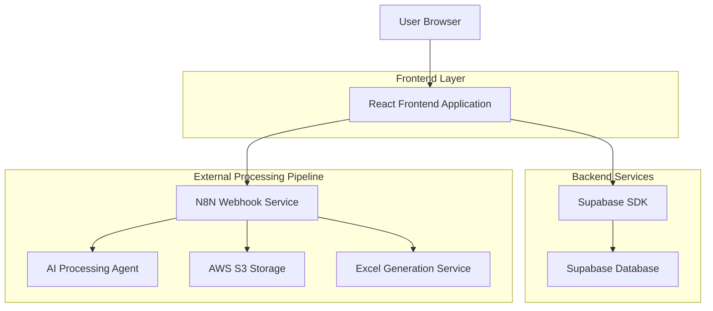
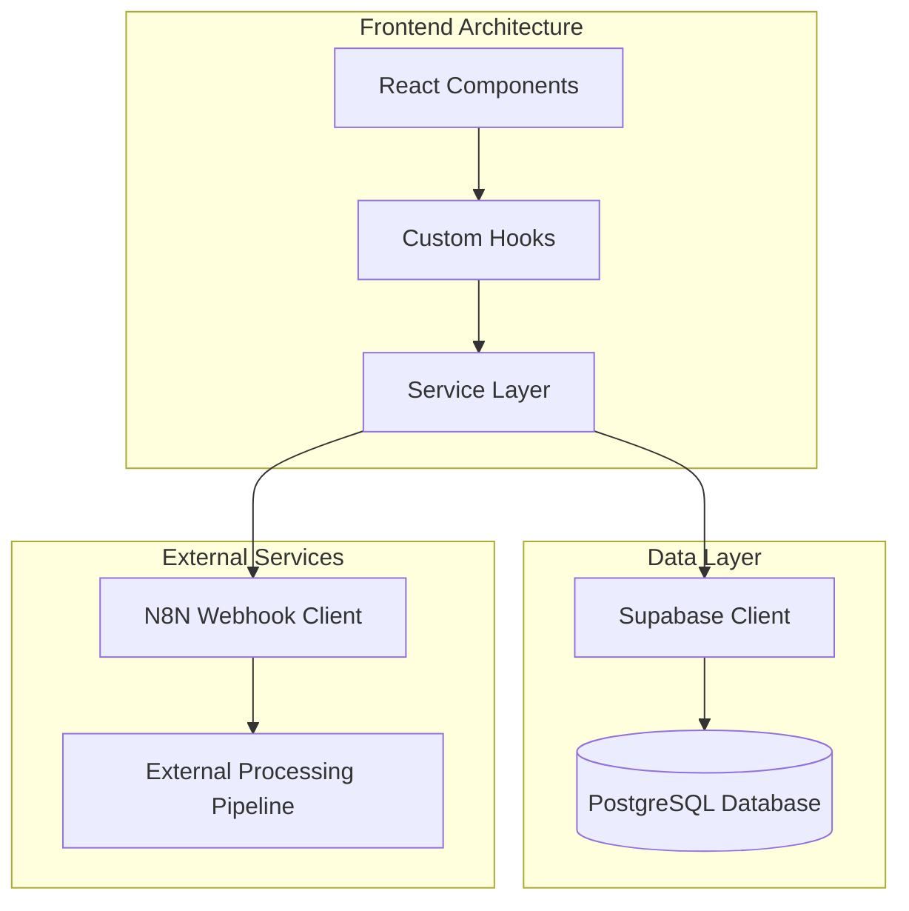
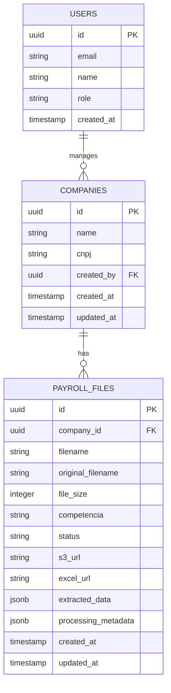

# Sistema de Gestão de Empresas e Holerites - Arquitetura Técnica

## 1. Arquitetura do Sistema



## 2. Descrição das Tecnologias

- **Frontend**: React@18 + TypeScript + TailwindCSS@3 + Vite + Lucide React
- **Backend**: Supabase (PostgreSQL + Auth + Storage)
- **Processamento**: N8N Webhook + AI Agent + AWS S3
- **Bibliotecas**: React Hook Form + Zod + React Query + File Upload

## 3. Definições de Rotas

| Rota | Propósito |
|------|-----------|
| /companies | Lista de empresas cadastradas com ações de CRUD |
| /companies/new | Modal de cadastro de nova empresa |
| /companies/:id/edit | Modal de edição de dados da empresa |
| /companies/:id/payroll | Página de gestão de holerites da empresa específica |
| /companies/:id/payroll/upload | Interface de upload e processamento de holerites |

## 4. Definições de API

### 4.1 APIs Core do Sistema

**Gestão de Empresas**
```
GET /api/companies
```
Request: Query parameters para paginação e filtros
| Param Name | Param Type | isRequired | Description |
|------------|------------|------------|-------------|
| page | number | false | Número da página (default: 1) |
| limit | number | false | Itens por página (default: 10) |
| search | string | false | Busca por nome ou CNPJ |

Response:
| Param Name | Param Type | Description |
|------------|------------|-------------|
| data | Company[] | Lista de empresas |
| total | number | Total de empresas |
| page | number | Página atual |

```
POST /api/companies
```
Request:
| Param Name | Param Type | isRequired | Description |
|------------|------------|------------|-------------|
| name | string | true | Nome da empresa |
| cnpj | string | true | CNPJ da empresa (formato: XX.XXX.XXX/XXXX-XX) |

**Processamento de Holerites**
```
POST https://n8n-lab-n8n.bjivvx.easypanel.host/webhook/processar-folha-pagamento
```
Request:
| Param Name | Param Type | isRequired | Description |
|------------|------------|------------|-------------|
| file_base64 | string | true | PDF convertido em Base64 |
| company_id | string | true | ID da empresa |
| competencia | string | true | Período no formato MM/AAAA |
| filename | string | true | Nome original do arquivo |

Response:
| Param Name | Param Type | Description |
|------------|------------|-------------|
| success | boolean | Status do processamento |
| s3_url | string | URL do PDF armazenado no S3 |
| excel_url | string | URL da planilha Excel gerada |
| extracted_data | object | Dados extraídos do holerite |

## 5. Arquitetura do Servidor



## 6. Modelo de Dados

### 6.1 Definição do Modelo de Dados



### 6.2 Linguagem de Definição de Dados (DDL)

**Tabela de Empresas (companies)**
```sql
-- Criar tabela companies
CREATE TABLE companies (
    id UUID PRIMARY KEY DEFAULT gen_random_uuid(),
    name VARCHAR(255) NOT NULL,
    cnpj VARCHAR(18) UNIQUE NOT NULL,
    created_by UUID REFERENCES auth.users(id),
    created_at TIMESTAMP WITH TIME ZONE DEFAULT NOW(),
    updated_at TIMESTAMP WITH TIME ZONE DEFAULT NOW()
);

-- Criar índices
CREATE INDEX idx_companies_cnpj ON companies(cnpj);
CREATE INDEX idx_companies_created_by ON companies(created_by);
CREATE INDEX idx_companies_name ON companies USING gin(to_tsvector('portuguese', name));

-- Políticas RLS
ALTER TABLE companies ENABLE ROW LEVEL SECURITY;

GRANT SELECT, INSERT, UPDATE, DELETE ON companies TO authenticated;
GRANT SELECT ON companies TO anon;

-- Política para usuários autenticados
CREATE POLICY "Users can manage their companies" ON companies
    FOR ALL USING (auth.uid() = created_by);

-- Dados iniciais
INSERT INTO companies (name, cnpj, created_by) VALUES
('Empresa Exemplo Ltda', '12.345.678/0001-90', auth.uid()),
('Contabilidade ABC', '98.765.432/0001-10', auth.uid());
```

**Tabela de Holerites (payroll_files)**
```sql
-- Criar tabela payroll_files
CREATE TABLE payroll_files (
    id UUID PRIMARY KEY DEFAULT gen_random_uuid(),
    company_id UUID NOT NULL REFERENCES companies(id) ON DELETE CASCADE,
    filename VARCHAR(255) NOT NULL,
    original_filename VARCHAR(255) NOT NULL,
    file_size INTEGER NOT NULL,
    competencia VARCHAR(7) NOT NULL, -- MM/AAAA
    status VARCHAR(50) DEFAULT 'pending' CHECK (status IN ('pending', 'processing', 'completed', 'error')),
    s3_url TEXT,
    excel_url TEXT,
    extracted_data JSONB,
    processing_metadata JSONB DEFAULT '{}',
    created_at TIMESTAMP WITH TIME ZONE DEFAULT NOW(),
    updated_at TIMESTAMP WITH TIME ZONE DEFAULT NOW()
);

-- Criar índices
CREATE INDEX idx_payroll_files_company_id ON payroll_files(company_id);
CREATE INDEX idx_payroll_files_competencia ON payroll_files(competencia);
CREATE INDEX idx_payroll_files_status ON payroll_files(status);
CREATE INDEX idx_payroll_files_created_at ON payroll_files(created_at DESC);

-- Políticas RLS
ALTER TABLE payroll_files ENABLE ROW LEVEL SECURITY;

GRANT SELECT, INSERT, UPDATE, DELETE ON payroll_files TO authenticated;
GRANT SELECT ON payroll_files TO anon;

-- Política para usuários autenticados (através da empresa)
CREATE POLICY "Users can manage payroll files of their companies" ON payroll_files
    FOR ALL USING (
        company_id IN (
            SELECT id FROM companies WHERE created_by = auth.uid()
        )
    );

-- Função para atualizar updated_at automaticamente
CREATE OR REPLACE FUNCTION update_updated_at_column()
RETURNS TRIGGER AS $$
BEGIN
    NEW.updated_at = NOW();
    RETURN NEW;
END;
$$ language 'plpgsql';

-- Triggers para updated_at
CREATE TRIGGER update_companies_updated_at BEFORE UPDATE ON companies
    FOR EACH ROW EXECUTE FUNCTION update_updated_at_column();

CREATE TRIGGER update_payroll_files_updated_at BEFORE UPDATE ON payroll_files
    FOR EACH ROW EXECUTE FUNCTION update_updated_at_column();
```

**Funções de Apoio**
```sql
-- Função para obter estatísticas de holerites
CREATE OR REPLACE FUNCTION get_payroll_stats(company_uuid UUID)
RETURNS JSON AS $$
DECLARE
    week_count INTEGER;
    month_count INTEGER;
    total_count INTEGER;
BEGIN
    -- Holerites da semana
    SELECT COUNT(*) INTO week_count
    FROM payroll_files
    WHERE company_id = company_uuid
    AND created_at >= NOW() - INTERVAL '7 days'
    AND status = 'completed';
    
    -- Holerites do mês
    SELECT COUNT(*) INTO month_count
    FROM payroll_files
    WHERE company_id = company_uuid
    AND created_at >= DATE_TRUNC('month', NOW())
    AND status = 'completed';
    
    -- Total de holerites
    SELECT COUNT(*) INTO total_count
    FROM payroll_files
    WHERE company_id = company_uuid
    AND status = 'completed';
    
    RETURN json_build_object(
        'week', week_count,
        'month', month_count,
        'total', total_count
    );
END;
$$ LANGUAGE plpgsql SECURITY DEFINER;

-- Função para validar CNPJ
CREATE OR REPLACE FUNCTION validate_cnpj(cnpj_input TEXT)
RETURNS BOOLEAN AS $$
BEGIN
    -- Remove caracteres não numéricos
    cnpj_input := regexp_replace(cnpj_input, '[^0-9]', '', 'g');
    
    -- Verifica se tem 14 dígitos
    IF length(cnpj_input) != 14 THEN
        RETURN FALSE;
    END IF;
    
    -- Verifica se não são todos iguais
    IF cnpj_input ~ '^(.)\1{13}$' THEN
        RETURN FALSE;
    END IF;
    
    -- Aqui poderia implementar a validação completa do CNPJ
    -- Por simplicidade, retornamos TRUE se passou nas verificações básicas
    RETURN TRUE;
END;
$$ LANGUAGE plpgsql;
```