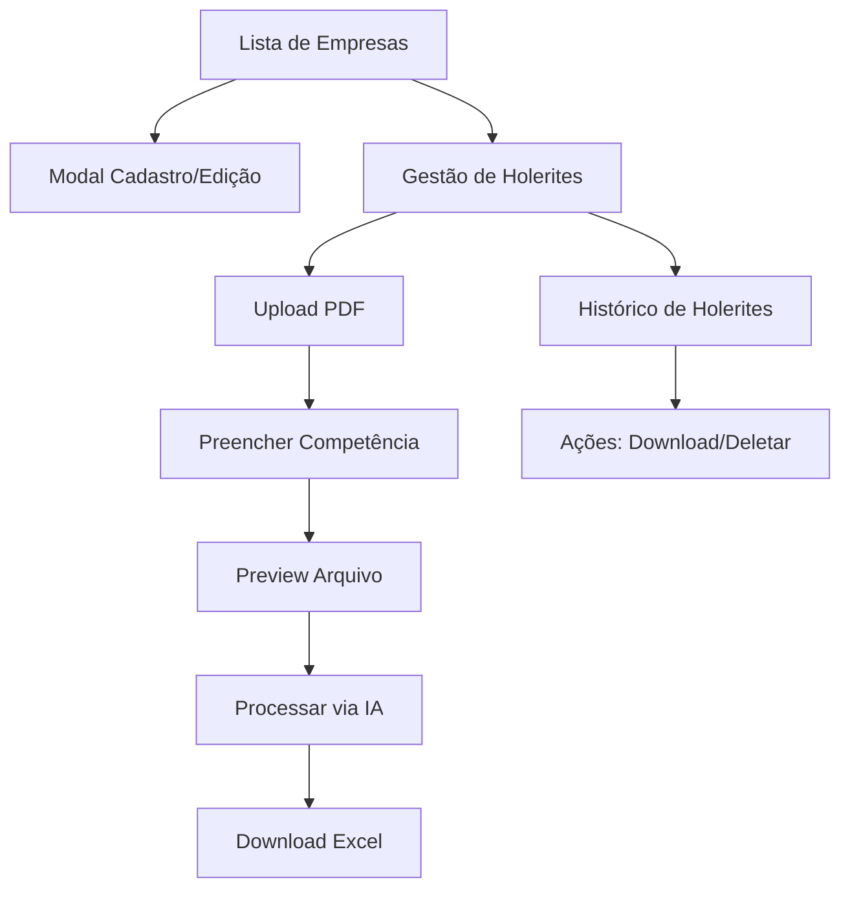

# Sistema de Gestão de Empresas e Holerites - Requisitos do Produto

## 1. Visão Geral do Produto

Sistema integrado para gestão de empresas e processamento automatizado de holerites através de inteligência artificial. A plataforma permite o cadastro de empresas, upload de PDFs de holerites, processamento via webhook n8n com IA, e conversão automática para planilhas Excel.

- **Objetivo Principal**: Automatizar o processamento de holerites através de IA, convertendo PDFs em dados estruturados e planilhas Excel.
- **Usuários-alvo**: Empresas de contabilidade, departamentos de RH e gestores financeiros que precisam processar grandes volumes de holerites.
- **Valor de Mercado**: Redução de 90% do tempo de processamento manual de holerites, eliminando erros humanos e aumentando a produtividade.

## 2. Funcionalidades Principais

### 2.1 Papéis de Usuário

| Papel | Método de Registro | Permissões Principais |
|-------|-------------------|----------------------|
| Administrador | Acesso total do sistema | Pode gerenciar empresas, usuários e visualizar todos os holerites |
| Usuário Padrão | Registro por email | Pode gerenciar empresas atribuídas e processar holerites |

### 2.2 Módulos de Funcionalidades

Nosso sistema de gestão de empresas e holerites consiste nas seguintes páginas principais:

1. **Lista de Empresas**: cadastro de empresas, tabela de listagem, ações de edição e gerenciamento.
2. **Gestão de Holerites**: página dedicada por empresa, upload de PDFs, processamento via IA, histórico de arquivos.
3. **Dashboard de Estatísticas**: cards de métricas, relatórios de processamento, indicadores de performance.

### 2.3 Detalhes das Páginas

| Nome da Página | Nome do Módulo | Descrição da Funcionalidade |
|----------------|----------------|----------------------------|
| Lista de Empresas | Modal de Cadastro | Criar nova empresa com nome e CNPJ, validação de dados obrigatórios |
| Lista de Empresas | Modal de Edição | Editar dados da empresa existente, atualização de informações |
| Lista de Empresas | Tabela de Empresas | Listar empresas cadastradas com paginação, busca e filtros |
| Lista de Empresas | Ações da Tabela | Botões de editar empresa e gerenciar holerites por empresa |
| Gestão de Holerites | Cards de Estatísticas | Exibir quantidade de holerites processados (semana, mês, total) |
| Gestão de Holerites | Upload de Arquivos | Drag & drop ou seleção manual de PDFs, preview de arquivos |
| Gestão de Holerites | Campo Competência | Input com máscara MM/AAAA para período do holerite |
| Gestão de Holerites | Processamento IA | Envio para webhook n8n, loading states, tratamento de erros |
| Gestão de Holerites | Lista de Holerites | Histórico de arquivos processados com status e ações |
| Gestão de Holerites | Ações dos Holerites | Download da planilha XLSX gerada, deletar arquivo processado |

## 3. Fluxo Principal de Processos

### Fluxo de Gestão de Empresas:
1. **Cadastro**: Usuário acessa lista de empresas → Clica em "Nova Empresa" → Preenche modal com nome e CNPJ → Salva empresa
2. **Edição**: Usuário localiza empresa na tabela → Clica no ícone de editar → Modifica dados no modal → Salva alterações
3. **Gerenciamento**: Usuário clica no ícone de gerenciar holerites → Redireciona para página de gestão da empresa específica

### Fluxo de Processamento de Holerites:
1. **Upload**: Usuário arrasta PDF ou seleciona arquivo → Sistema valida formato e tamanho
2. **Competência**: Usuário preenche campo competência (MM/AAAA) → Sistema valida formato
3. **Preview**: Sistema exibe nome do arquivo, tamanho e status → Habilita botão "Processar"
4. **Processamento**: Sistema converte PDF para Base64 → Envia para webhook n8n → Exibe loading "Processando holerite..."
5. **Resultado**: Webhook retorna dados processados → Sistema gera Excel → Disponibiliza download

## 4. Design da Interface do Usuário

### 4.1 Estilo de Design

- **Cores Primárias**: Azul (#3B82F6) para elementos principais, Verde (#10B981) para sucesso
- **Cores Secundárias**: Cinza (#6B7280) para textos secundários, Vermelho (#EF4444) para erros
- **Estilo de Botões**: Arredondados com sombra sutil, estados hover e disabled bem definidos
- **Tipografia**: Inter como fonte principal, tamanhos 14px (corpo), 16px (títulos), 12px (legendas)
- **Layout**: Design baseado em cards, navegação superior, sidebar para filtros
- **Ícones**: Lucide React para consistência, estilo outline, tamanho 16px-24px

### 4.2 Visão Geral do Design das Páginas

| Nome da Página | Nome do Módulo | Elementos da UI |
|----------------|----------------|-----------------|
| Lista de Empresas | Header da Página | Título "Empresas", botão "Nova Empresa" (azul, ícone +), breadcrumb de navegação |
| Lista de Empresas | Tabela de Empresas | Colunas: Nome, CNPJ, Data Criação, Ações. Paginação inferior, busca no topo |
| Lista de Empresas | Modal de Cadastro/Edição | Campos: Nome (obrigatório), CNPJ (máscara), botões Cancelar/Salvar |
| Gestão de Holerites | Cards de Estatísticas | 3 cards horizontais: Semana (azul), Mês (verde), Total (roxo) com ícones |
| Gestão de Holerites | Área de Upload | Zona drag & drop com borda tracejada, ícone de upload, texto explicativo |
| Gestão de Holerites | Preview de Arquivo | Card com ícone PDF, nome do arquivo, tamanho, status colorido |
| Gestão de Holerites | Campo Competência | Input com máscara MM/AAAA, label "Competência", validação em tempo real |
| Gestão de Holerites | Lista de Holerites | Tabela com colunas: Arquivo, Competência, Status, Data, Ações (download/delete) |

### 4.3 Responsividade

- **Desktop-first**: Layout otimizado para telas grandes (1200px+)
- **Adaptação Mobile**: Tabelas se tornam cards empilhados, modais ocupam tela inteira
- **Interação Touch**: Botões com área mínima de 44px, gestos de swipe para ações
- **Breakpoints**: Mobile (768px), Tablet (1024px), Desktop (1200px+)