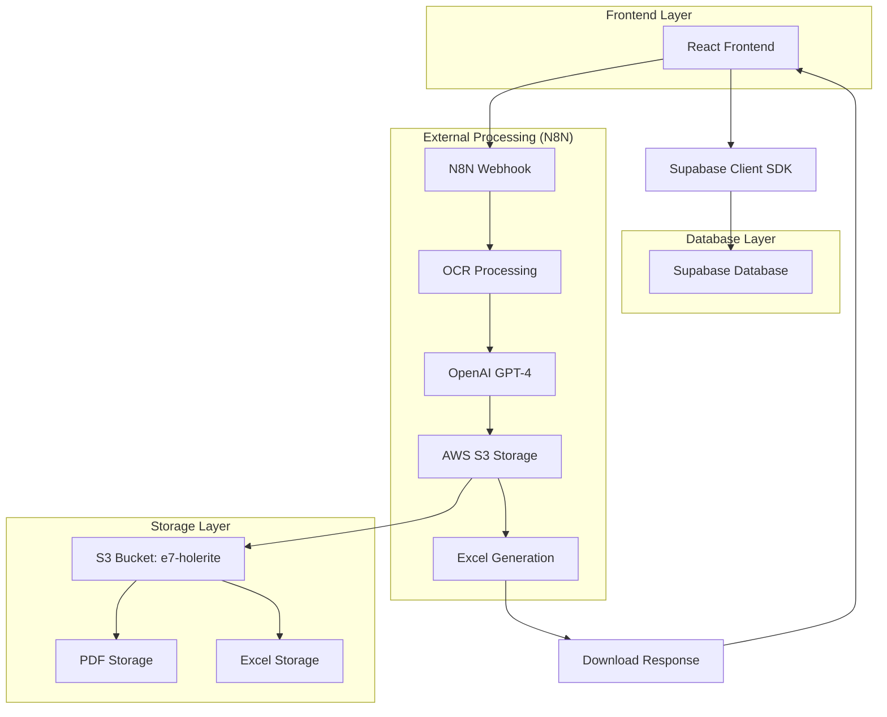
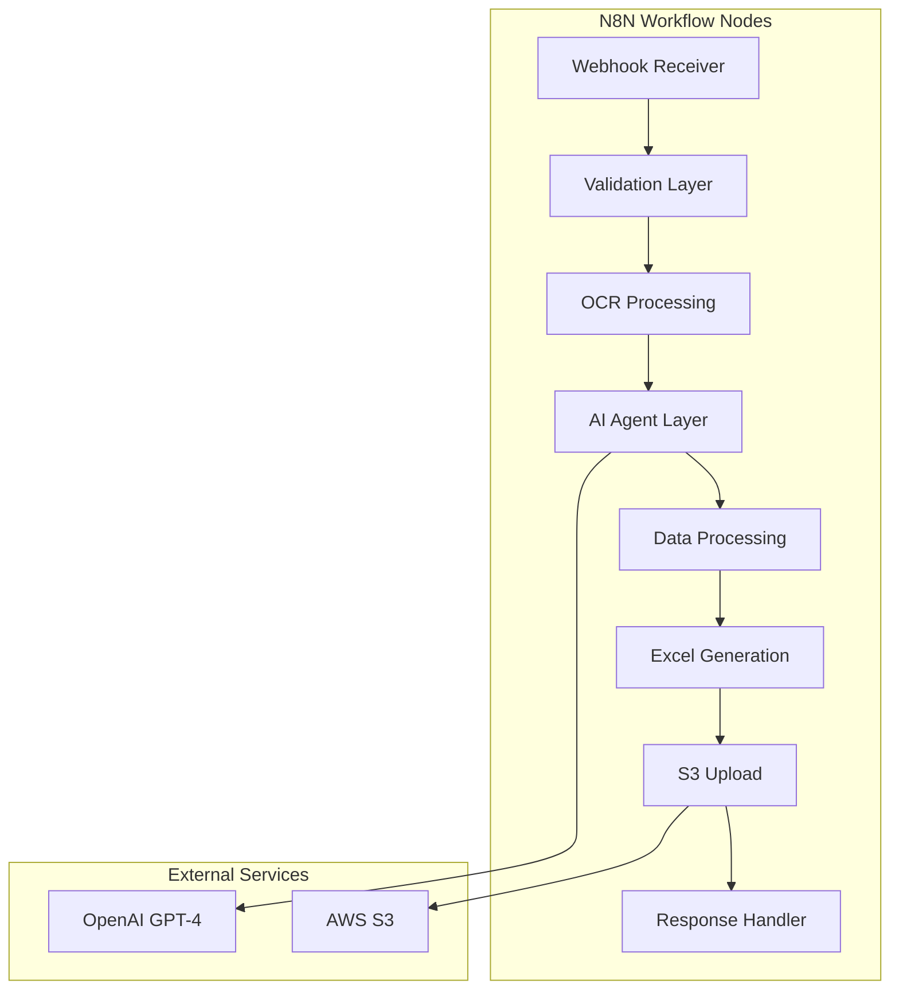
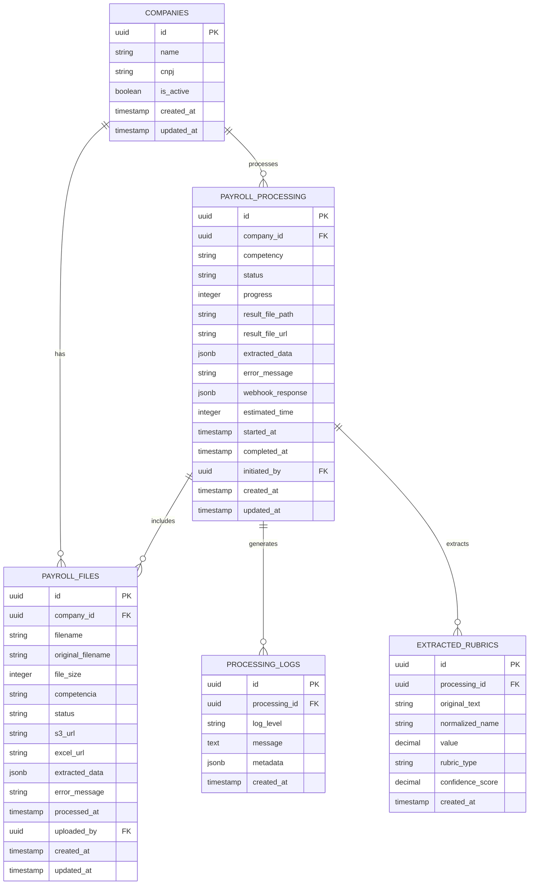

# Sistema de Gestão de Holerites - Arquitetura Técnica

## 1. Arquitetura do Sistema



## 2. Descrição das Tecnologias

* **Frontend**: React\@18 + TypeScript + TailwindCSS\@3 + Vite

* **Backend**: Supabase (PostgreSQL + Auth + Storage)

* **Processamento**: N8N Workflow Engine

* **IA**: OpenAI GPT-4 para extração de dados

* **Armazenamento**: AWS S3 (bucket e7-holerite)

* **OCR**: N8N ExtractFromFile node

## 3. Definições de Rotas

| Rota                             | Propósito                               |
| -------------------------------- | --------------------------------------- |
| `/documents/payroll`             | Página principal de gestão de holerites |
| `/documents/payroll/upload`      | Interface de upload de arquivos PDF     |
| `/documents/payroll/processing`  | Acompanhamento de processamentos ativos |
| `/documents/payroll/history`     | Histórico de processamentos anteriores  |
| `/documents/payroll/results/:id` | Visualização de resultados específicos  |
| `/companies`                     | Gerenciamento de empresas cadastradas   |

## 4. Definições de API

### 4.1 APIs Principais do Sistema

**Upload e processamento de holerites**

```
POST /api/payroll/upload
```

Request:

| Parâmetro   | Tipo    | Obrigatório | Descrição                      |
| ----------- | ------- | ----------- | ------------------------------ |
| files       | File\[] | true        | Arquivos PDF dos holerites     |
| company\_id | string  | true        | ID da empresa selecionada      |
| competencia | string  | true        | Competência no formato MM/AAAA |

Response:

| Parâmetro      | Tipo   | Descrição                           |
| -------------- | ------ | ----------------------------------- |
| processing\_id | string | ID único do processamento           |
| status         | string | Status inicial (pending/processing) |
| files\_count   | number | Quantidade de arquivos enviados     |

**Webhook N8N Integration**

```
POST https://n8n-lab-n8n.bjivvx.easypanel.host/webhook/processar-folha-pagamento
```

Request:

```json
{
  "competencia": "03/2025",
  "nomeArquivo": "holerite_empresa_032025.pdf",
  "pdf": "base64_encoded_pdf_data"
}
```

Response:

```json
{
  "success": true,
  "message": "Processamento concluído com sucesso",
  "data": {
    "competencia": "03/2025",
    "totalProventos": 15,
    "processadoEm": "2025-01-02T10:30:00Z",
    "arquivos": {
      "excel": {
        "url": "https://s3.amazonaws.com/e7-holerite/...",
        "nome": "holerite_processado_032025.xlsx",
        "tamanho": 45678,
        "tipo": "application/vnd.openxmlformats-officedocument.spreadsheetml.sheet"
      },
      "pdf": {
        "url": "https://s3.amazonaws.com/e7-holerite/...",
        "nome": "holerite_empresa_032025.pdf"
      }
    },
    "resumo": {
      "valorTotal": 125000.50,
      "creditoTotal": 8750.25
    }
  }
}
```

**Status de processamento**

```
GET /api/payroll/processing/:id/status
```

Response:

| Parâmetro       | Tipo   | Descrição                          |
| --------------- | ------ | ---------------------------------- |
| status          | string | pending/processing/completed/error |
| progress        | number | Progresso de 0 a 100               |
| estimated\_time | number | Tempo estimado em minutos          |
| current\_step   | string | Etapa atual do processamento       |

**Histórico de processamentos**

```
GET /api/payroll/history
```

Query Parameters:

| Parâmetro   | Tipo   | Descrição               |
| ----------- | ------ | ----------------------- |
| company\_id | string | Filtrar por empresa     |
| competencia | string | Filtrar por competência |
| status      | string | Filtrar por status      |
| page        | number | Página para paginação   |
| limit       | number | Itens por página        |

### 4.2 APIs de Suporte

**Listagem de empresas**

```
GET /api/companies
```

**Estatísticas de processamento**

```
GET /api/payroll/stats
```

**Download de arquivo processado**

```
GET /api/payroll/download/:processing_id
```

## 5. Arquitetura do Servidor N8N



## 6. Modelo de Dados

### 6.1 Definição do Modelo de Dados



### 6.2 Linguagem de Definição de Dados (DDL)

**Tabela de Empresas**

```sql
-- Criar tabela de empresas (já existe)
CREATE TABLE companies (
    id UUID PRIMARY KEY DEFAULT gen_random_uuid(),
    name VARCHAR(255) NOT NULL,
    cnpj VARCHAR(18) UNIQUE NOT NULL,
    is_active BOOLEAN DEFAULT true,
    created_at TIMESTAMP WITH TIME ZONE DEFAULT NOW(),
    updated_at TIMESTAMP WITH TIME ZONE DEFAULT NOW()
);

-- Índices para empresas
CREATE INDEX idx_companies_cnpj ON companies(cnpj);
CREATE INDEX idx_companies_active ON companies(is_active);
```

**Tabela de Arquivos de Holerite**

```sql
-- Criar tabela de arquivos de holerite (já existe)
CREATE TABLE payroll_files (
    id UUID PRIMARY KEY DEFAULT gen_random_uuid(),
    company_id UUID NOT NULL REFERENCES companies(id) ON DELETE CASCADE,
    filename VARCHAR(255) NOT NULL,
    original_filename VARCHAR(255) NOT NULL,
    file_size INTEGER NOT NULL,
    competencia VARCHAR(7) NOT NULL, -- MM/AAAA
    status VARCHAR(20) DEFAULT 'pending' CHECK (status IN ('pending', 'processing', 'completed', 'error')),
    s3_url TEXT,
    excel_url TEXT,
    extracted_data JSONB,
    error_message TEXT,
    processed_at TIMESTAMP WITH TIME ZONE,
    uploaded_by UUID REFERENCES auth.users(id),
    created_at TIMESTAMP WITH TIME ZONE DEFAULT NOW(),
    updated_at TIMESTAMP WITH TIME ZONE DEFAULT NOW()
);

-- Índices para arquivos de holerite
CREATE INDEX idx_payroll_files_company_id ON payroll_files(company_id);
CREATE INDEX idx_payroll_files_competencia ON payroll_files(competencia);
CREATE INDEX idx_payroll_files_status ON payroll_files(status);
CREATE INDEX idx_payroll_files_created_at ON payroll_files(created_at DESC);
```

**Tabela de Processamentos**

```sql
-- Criar tabela de processamentos (já existe)
CREATE TABLE payroll_processing (
    id UUID PRIMARY KEY DEFAULT gen_random_uuid(),
    company_id UUID NOT NULL REFERENCES companies(id) ON DELETE CASCADE,
    competency VARCHAR(7) NOT NULL, -- MM/AAAA
    status VARCHAR(20) DEFAULT 'pending' CHECK (status IN ('pending', 'processing', 'completed', 'error')),
    progress INTEGER DEFAULT 0 CHECK (progress >= 0 AND progress <= 100),
    result_file_path TEXT,
    result_file_url TEXT,
    extracted_data JSONB,
    error_message TEXT,
    webhook_response JSONB,
    estimated_time INTEGER, -- em minutos
    started_at TIMESTAMP WITH TIME ZONE DEFAULT NOW(),
    completed_at TIMESTAMP WITH TIME ZONE,
    initiated_by UUID NOT NULL REFERENCES auth.users(id),
    created_at TIMESTAMP WITH TIME ZONE DEFAULT NOW(),
    updated_at TIMESTAMP WITH TIME ZONE DEFAULT NOW()
);

-- Índices para processamentos
CREATE INDEX idx_payroll_processing_company_id ON payroll_processing(company_id);
CREATE INDEX idx_payroll_processing_status ON payroll_processing(status);
CREATE INDEX idx_payroll_processing_competency ON payroll_processing(competency);
CREATE INDEX idx_payroll_processing_started_at ON payroll_processing(started_at DESC);
```

**Tabela de Logs de Processamento**

```sql
-- Criar tabela de logs de processamento
CREATE TABLE processing_logs (
    id UUID PRIMARY KEY DEFAULT gen_random_uuid(),
    processing_id UUID NOT NULL REFERENCES payroll_processing(id) ON DELETE CASCADE,
    log_level VARCHAR(10) NOT NULL CHECK (log_level IN ('DEBUG', 'INFO', 'WARN', 'ERROR')),
    message TEXT NOT NULL,
    metadata JSONB,
    created_at TIMESTAMP WITH TIME ZONE DEFAULT NOW()
);

-- Índices para logs
CREATE INDEX idx_processing_logs_processing_id ON processing_logs(processing_id);
CREATE INDEX idx_processing_logs_level ON processing_logs(log_level);
CREATE INDEX idx_processing_logs_created_at ON processing_logs(created_at DESC);
```

**Tabela de Rubricas Extraídas**

```sql
-- Criar tabela de rubricas extraídas
CREATE TABLE extracted_rubrics (
    id UUID PRIMARY KEY DEFAULT gen_random_uuid(),
    processing_id UUID NOT NULL REFERENCES payroll_processing(id) ON DELETE CASCADE,
    original_text TEXT NOT NULL,
    normalized_name VARCHAR(255),
    value DECIMAL(15,2),
    rubric_type VARCHAR(20) CHECK (rubric_type IN ('provento', 'desconto', 'base')),
    confidence_score DECIMAL(3,2) CHECK (confidence_score >= 0.0 AND confidence_score <= 1.0),
    created_at TIMESTAMP WITH TIME ZONE DEFAULT NOW()
);

-- Índices para rubricas extraídas
CREATE INDEX idx_extracted_rubrics_processing_id ON extracted_rubrics(processing_id);
CREATE INDEX idx_extracted_rubrics_type ON extracted_rubrics(rubric_type);
CREATE INDEX idx_extracted_rubrics_confidence ON extracted_rubrics(confidence_score DESC);
```

**Tabela de Relacionamento Arquivo-Processamento**

```sql
-- Criar tabela de relacionamento entre arquivos e processamentos
CREATE TABLE payroll_file_processing (
    id UUID PRIMARY KEY DEFAULT gen_random_uuid(),
    payroll_file_id UUID NOT NULL REFERENCES payroll_files(id) ON DELETE CASCADE,
    processing_id UUID NOT NULL REFERENCES payroll_processing(id) ON DELETE CASCADE,
    created_at TIMESTAMP WITH TIME ZONE DEFAULT NOW(),
    UNIQUE(payroll_file_id, processing_id)
);

-- Índices para relacionamento
CREATE INDEX idx_payroll_file_processing_file_id ON payroll_file_processing(payroll_file_id);
CREATE INDEX idx_payroll_file_processing_processing_id ON payroll_file_processing(processing_id);
```

**Políticas RLS (Row Level Security)**

```sql
-- Habilitar RLS nas tabelas
ALTER TABLE payroll_files ENABLE ROW LEVEL SECURITY;
ALTER TABLE payroll_processing ENABLE ROW LEVEL SECURITY;
ALTER TABLE processing_logs ENABLE ROW LEVEL SECURITY;
ALTER TABLE extracted_rubrics ENABLE ROW LEVEL SECURITY;

-- Políticas para usuários autenticados
CREATE POLICY "Users can view their own payroll files" ON payroll_files
    FOR SELECT USING (auth.uid() = uploaded_by);

CREATE POLICY "Users can insert their own payroll files" ON payroll_files
    FOR INSERT WITH CHECK (auth.uid() = uploaded_by);

CREATE POLICY "Users can view their own processing" ON payroll_processing
    FOR SELECT USING (auth.uid() = initiated_by);

CREATE POLICY "Users can insert their own processing" ON payroll_processing
    FOR INSERT WITH CHECK (auth.uid() = initiated_by);

-- Permissões para roles
GRANT SELECT, INSERT, UPDATE ON payroll_files TO authenticated;
GRANT SELECT, INSERT, UPDATE ON payroll_processing TO authenticated;
GRANT SELECT, INSERT ON processing_logs TO authenticated;
GRANT SELECT, INSERT ON extracted_rubrics TO authenticated;
GRANT SELECT, INSERT ON payroll_file_processing TO authenticated;
```

**Dados Iniciais**

```sql
-- Inserir empresas de exemplo (se necessário)
INSERT INTO companies (name, cnpj, is_active) VALUES
('Empresa Exemplo Ltda', '12.345.678/0001-90', true),
('Consultoria ABC S/A', '98.765.432/0001-10', true)
ON CONFLICT (cnpj) DO NOTHING;

-- Função para estatísticas de holerites
CREATE OR REPLACE FUNCTION get_payroll_stats(company_uuid UUID)
RETURNS TABLE(
    total_files BIGINT,
    files_this_week BIGINT,
    files_this_month BIGINT
) AS $$
BEGIN
    RETURN QUERY
    SELECT 
        COUNT(*) as total_files,
        COUNT(*) FILTER (WHERE created_at >= NOW() - INTERVAL '7 days') as files_this_week,
        COUNT(*) FILTER (WHERE created_at >= DATE_TRUNC('month', NOW())) as files_this_month
    FROM payroll_files 
    WHERE company_id = company_uuid;
END;
$$ LANGUAGE plpgsql SECURITY DEFINER;
```

## 7. Especificações de Integração

### 7.1 Fluxo de Dados N8N

1. **Recepção**: Webhook recebe PDF em base64 + metadados
2. **Validação**: Verifica formato, competência e integridade
3. **OCR**: Extrai texto usando ExtractFromFile node
4. **IA**: OpenAI GPT-4 processa texto e identifica rubricas
5. **Cálculos**: Aplica fórmulas tributárias (RAT, SELIC, etc.)
6. **Excel**: Gera planilha com estrutura específica
7. **S3**: Upload de PDF e Excel em estrutura organizada
8. **Resposta**: Retorna URLs e metadados para frontend

### 7.2 Estrutura S3

* **Bucket**: e7-holerite

* **PDFs**: `e7-holerites/{empresa_normalizada}/{ano}/{competencia}/arquivo.pdf`

* **Excel**: `e7-holerites/{empresa_normalizada}/{ano}/{competencia}/extracao_excel/arquivo.xlsx`

* **Permissões**: PDFs privados, Excel público para download

### 7.3 Monitoramento e Logs

* Logs detalhados em cada etapa do processamento N8N

* Métricas de performance e taxa de sucesso

* Alertas para falhas de processamento

* Auditoria completa de uploads e downloads

