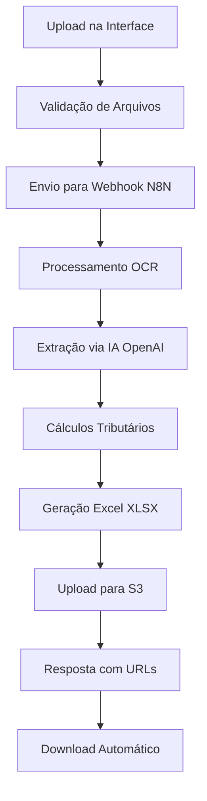

# Sistema de Gestão de Holerites - Requisitos do Produto

## 1. Visão Geral do Produto

O Sistema de Gestão de Holerites é uma solução integrada que permite o processamento automatizado de arquivos PDF de folhas de pagamento através de inteligência artificial, extraindo dados tributários e gerando planilhas Excel para análise contábil especializada.

- **Problema a resolver**: Automatizar a extração e processamento de dados de holerites em PDF, eliminando trabalho manual repetitivo e reduzindo erros na análise tributária.
- **Usuários-alvo**: Equipes contábeis especializadas em inteligência tributária que precisam processar grandes volumes de holerites de diferentes empresas.
- **Valor de mercado**: Redução de 80% no tempo de processamento manual de holerites, aumentando a produtividade e precisão das análises tributárias.

## 2. Funcionalidades Principais

### 2.1 Papéis de Usuário

| Papel | Método de Registro | Permissões Principais |
|-------|-------------------|----------------------|
| Usuário Contábil | Autenticação via sistema existente | Pode fazer upload de holerites, visualizar processamentos, baixar planilhas |
| Administrador | Acesso administrativo | Pode gerenciar empresas, visualizar todos os processamentos, configurar sistema |

### 2.2 Módulos de Funcionalidades

Nossos requisitos de gestão de holerites consistem nas seguintes páginas principais:

1. **Página de Upload de Holerites**: seleção de empresa, campo de competência, área de upload drag-and-drop, validação de arquivos.
2. **Página de Processamentos**: lista de processamentos em andamento, histórico completo, status detalhado, logs de processamento.
3. **Página de Resultados**: download de planilhas Excel, visualização de dados extraídos, estatísticas de processamento.
4. **Página de Empresas**: cadastro e gerenciamento de empresas para organização dos holerites.

### 2.3 Detalhes das Páginas

| Nome da Página | Nome do Módulo | Descrição da Funcionalidade |
|----------------|----------------|----------------------------|
| Upload de Holerites | Seleção de Empresa | Dropdown com empresas cadastradas, filtro de busca por nome/CNPJ |
| Upload de Holerites | Campo Competência | Input formatado MM/AAAA com validação automática |
| Upload de Holerites | Área de Upload | Drag-and-drop para múltiplos PDFs, validação de tipo e tamanho, preview de arquivos |
| Upload de Holerites | Botão Processar | Envio para webhook N8N, feedback visual de envio |
| Processamentos | Lista Ativa | Processamentos em andamento com barra de progresso, tempo estimado |
| Processamentos | Histórico | Lista paginada de processamentos anteriores, filtros por data/empresa/status |
| Processamentos | Detalhes | Logs detalhados, arquivos processados, mensagens de erro |
| Resultados | Download Excel | Botão de download automático, preview de dados extraídos |
| Resultados | Estatísticas | Resumo financeiro (valor total, crédito total), quantidade de rubricas |
| Resultados | Validação | Verificação de integridade dos dados extraídos |
| Empresas | Cadastro | Formulário com nome, CNPJ, dados complementares |
| Empresas | Listagem | Tabela com empresas ativas, opções de edição/desativação |

## 3. Fluxo Principal de Processos

### Fluxo do Usuário Contábil:
1. Usuário acessa a página de Upload de Holerites
2. Seleciona a empresa no dropdown
3. Insere a competência no formato MM/AAAA
4. Faz upload de um ou múltiplos arquivos PDF via drag-and-drop
5. Sistema valida arquivos (tipo PDF, tamanho máximo)
6. Usuário clica em "Processar Holerites"
7. Sistema envia dados para webhook N8N
8. Usuário é redirecionado para página de Processamentos
9. Acompanha progresso em tempo real
10. Recebe notificação quando processamento é concluído
11. Faz download automático da planilha Excel gerada
12. Pode visualizar dados extraídos e estatísticas

### Fluxo de Integração N8N:

## 4. Design da Interface do Usuário

### 4.1 Estilo de Design

- **Cores primárias**: Azul corporativo (#2563eb), Verde sucesso (#16a34a)
- **Cores secundárias**: Cinza neutro (#6b7280), Vermelho erro (#dc2626)
- **Estilo de botões**: Arredondados com sombra sutil, estados hover/disabled claros
- **Tipografia**: Inter ou system fonts, tamanhos 14px (corpo), 16px (títulos), 12px (labels)
- **Layout**: Design responsivo com cards, navegação superior, sidebar para filtros
- **Ícones**: Lucide React icons, estilo outline, tamanho 20px padrão

### 4.2 Visão Geral do Design das Páginas

| Nome da Página | Nome do Módulo | Elementos de UI |
|----------------|----------------|-----------------|
| Upload de Holerites | Área Principal | Card centralizado, fundo branco, sombra suave, padding 24px |
| Upload de Holerites | Seleção Empresa | Select customizado com busca, ícone de empresa, placeholder claro |
| Upload de Holerites | Campo Competência | Input com máscara MM/AAAA, validação visual em tempo real |
| Upload de Holerites | Zona de Upload | Área tracejada azul, ícone de upload, texto explicativo, animação hover |
| Processamentos | Cards de Status | Cards com cores por status (azul=processando, verde=concluído, vermelho=erro) |
| Processamentos | Barra de Progresso | Barra animada com percentual, tempo estimado, ícone de loading |
| Resultados | Botão Download | Botão verde com ícone de download, animação de sucesso |
| Resultados | Tabela de Dados | Tabela responsiva com scroll horizontal, zebra striping |

### 4.3 Responsividade

O sistema é desktop-first com adaptação mobile completa. Inclui otimização para touch em tablets, colapso de sidebar em telas menores, e reorganização de cards em layout vertical para dispositivos móveis.

## 5. Requisitos Técnicos Específicos

### 5.1 Integração N8N
- **Webhook URL**: `https://n8n-lab-n8n.bjivvx.easypanel.host/webhook/processar-folha-pagamento`
- **Método**: POST com multipart/form-data
- **Timeout**: 60 segundos para upload, processamento assíncrono
- **Retry**: 3 tentativas com backoff exponencial

### 5.2 Processamento de Arquivos
- **Formatos aceitos**: PDF únicamente
- **Tamanho máximo**: 50MB por arquivo
- **Múltiplos arquivos**: Até 10 arquivos simultâneos
- **Validação**: Verificação de integridade PDF, detecção de páginas

### 5.3 Armazenamento S3
- **Bucket**: e7-holerite
- **Estrutura PDFs**: `e7-holerites/{nome_empresa}/{ano}/{competencia}/arquivo.pdf`
- **Estrutura Excel**: `e7-holerites/{nome_empresa}/{ano}/{competencia}/extracao_excel/arquivo.xlsx`
- **Permissões**: PDFs privados, Excel público para download

### 5.4 Dados Extraídos
- **Cabeçalho**: Nome empresa, CNPJ, competência, data emissão
- **Rubricas**: Código, nome, valor calculado
- **Tipos de provento**: Salário base, adicionais, horas extras, benefícios
- **Cálculos**: RAT (2%), Terceiros (5.8%), SELIC (variável)

### 5.5 Estrutura Excel Gerada
- **Coluna A**: COD (código da rubrica)
- **Coluna B**: Nome Rubrica
- **Coluna C**: Valor (monetário)
- **Coluna D**: Contribuição (C × 2%)
- **Coluna E**: RAT (2%)
- **Coluna F**: VL RAT AJUSTADO (D × E)
- **Coluna G**: TERCEIROS 5,8 (5.8%)
- **Coluna H**: VL CONT TERCEIROS (G × C)
- **Coluna I**: TOTAL (H + F + D)
- **Coluna J**: SELIC (taxa atual)
- **Coluna K**: VL SELIC (I × J)
- **Coluna L**: Crédito (I + K)
- **Coluna M**: Período (DD/MM/AAAA)
- **Coluna N**: CNPJ

## 6. Requisitos Não Funcionais

### 6.1 Performance
- Tempo de upload: < 5 segundos para arquivos até 10MB
- Processamento N8N: 2-5 minutos dependendo do tamanho
- Interface responsiva: < 200ms para ações locais

### 6.2 Segurança
- Autenticação obrigatória via sistema existente
- Validação de tipos de arquivo no frontend e backend
- Logs de auditoria para todos os processamentos
- Dados sensíveis criptografados em trânsito

### 6.3 Confiabilidade
- Disponibilidade: 99.5% durante horário comercial
- Recuperação de falhas: Retry automático para webhook
- Backup: Arquivos S3 com versionamento
- Monitoramento: Logs detalhados de erro e sucesso

### 6.4 Usabilidade
- Interface intuitiva sem necessidade de treinamento
- Feedback visual claro para todas as ações
- Mensagens de erro compreensíveis
- Suporte a múltiplos formatos de PDF de diferentes sistemas