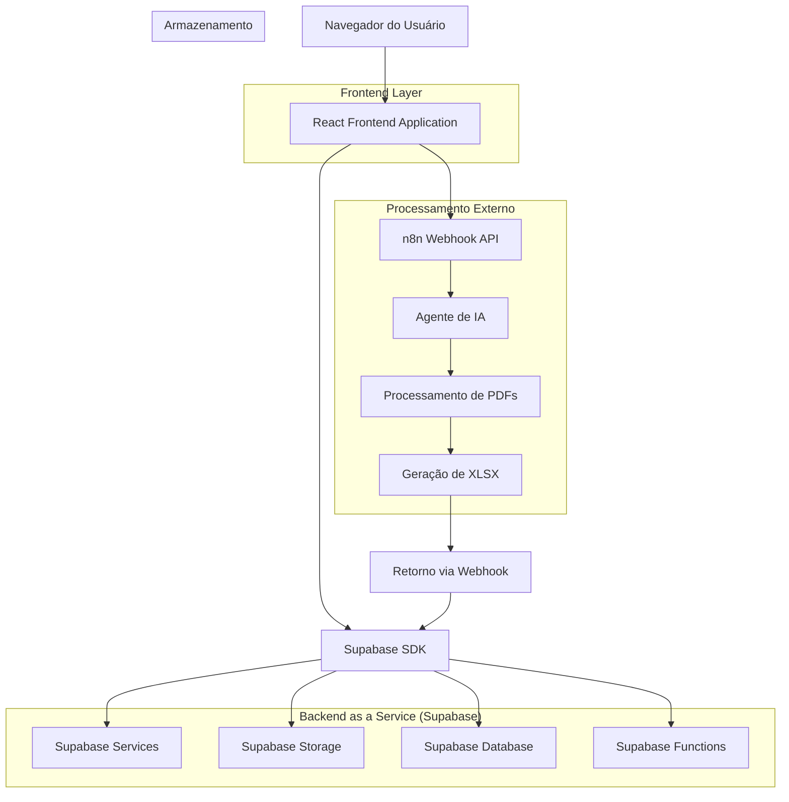
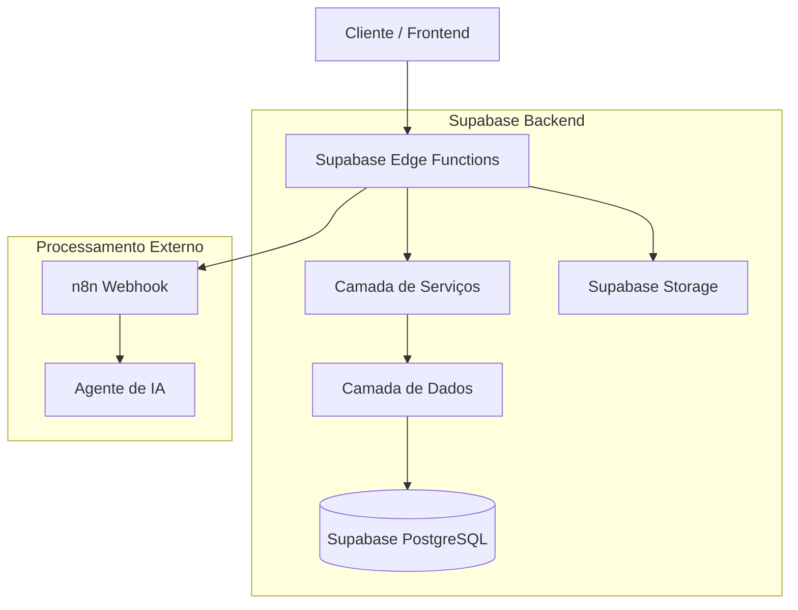
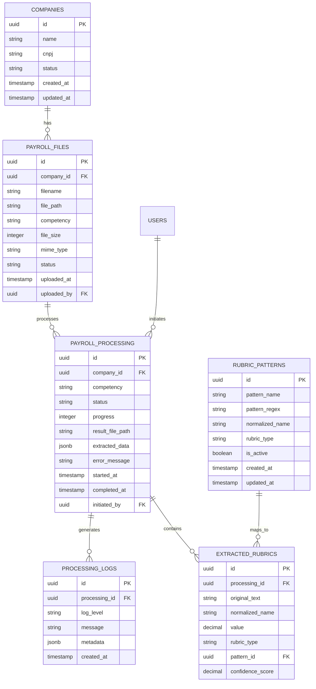

# Sistema de Processamento de Holerites - Arquitetura Técnica

## 1. Design da Arquitetura



## 2. Descrição das Tecnologias

* **Frontend**: React\@18 + TypeScript + shadcn/ui + Tailwind CSS + Vite

* **Backend**: Supabase (Database, Storage, Functions, Auth)

* **Processamento**: n8n Webhook + Agente de IA

* **Armazenamento**: Supabase Storage (PDFs e XLSX) + Supabase PostgreSQL

## 3. Definições de Rotas

| Rota                              | Propósito                                                      |
| --------------------------------- | -------------------------------------------------------------- |
| /documents/payroll                | Página principal de gestão de holerites com upload e histórico |
| /documents/payroll/config         | Configuração de padrões de rubricas e mapeamentos              |
| /documents/payroll/logs           | Visualização de logs detalhados e auditoria                    |
| /documents/payroll/processing/:id | Acompanhamento em tempo real do processamento                  |
| /documents/payroll/download/:id   | Download direto de arquivos XLSX processados                   |

## 4. Definições de API

### 4.1 APIs do Frontend (Supabase)

**Upload de arquivos PDF**

```typescript
POST /storage/v1/object/payroll-pdfs/{filename}
```

Request:

| Parâmetro   | Tipo   | Obrigatório | Descrição               |
| ----------- | ------ | ----------- | ----------------------- |
| file        | File   | true        | Arquivo PDF para upload |
| company\_id | string | true        | ID da empresa           |
| competency  | string | true        | Competência (MM/AAAA)   |

Response:

| Parâmetro | Tipo   | Descrição                     |
| --------- | ------ | ----------------------------- |
| path      | string | Caminho do arquivo no storage |
| id        | string | ID único do arquivo           |

**Iniciar processamento**

```typescript
POST /rest/v1/rpc/start_payroll_processing
```

Request:

| Parâmetro   | Tipo      | Obrigatório | Descrição                       |
| ----------- | --------- | ----------- | ------------------------------- |
| file\_ids   | string\[] | true        | IDs dos arquivos para processar |
| company\_id | string    | true        | ID da empresa                   |
| competency  | string    | true        | Competência                     |

Response:

| Parâmetro      | Tipo   | Descrição           |
| -------------- | ------ | ------------------- |
| processing\_id | string | ID do processamento |
| status         | string | Status inicial      |

**Consultar status do processamento**

```typescript
GET /rest/v1/payroll_processing?id=eq.{processing_id}
```

Response:

| Parâmetro          | Tipo   | Descrição              |
| ------------------ | ------ | ---------------------- |
| id                 | string | ID do processamento    |
| status             | string | Status atual           |
| progress           | number | Progresso (0-100)      |
| result\_file\_path | string | Caminho do XLSX gerado |

### 4.2 API Externa (n8n Webhook)

**Processar folha de pagamento**

```typescript
POST https://n8n-lab-n8n.bjivvx.easypanel.host/webhook-test/processar-folha-pagamento
```

Request:

| Parâmetro      | Tipo      | Obrigatório | Descrição                         |
| -------------- | --------- | ----------- | --------------------------------- |
| file\_urls     | string\[] | true        | URLs dos PDFs no Supabase Storage |
| company\_info  | object    | true        | Informações da empresa            |
| competency     | string    | true        | Competência (MM/AAAA)             |
| processing\_id | string    | true        | ID para callback                  |
| callback\_url  | string    | true        | URL para retorno dos resultados   |

Response:

| Parâmetro       | Tipo    | Descrição                 |
| --------------- | ------- | ------------------------- |
| success         | boolean | Status da requisição      |
| processing\_id  | string  | ID do processamento       |
| estimated\_time | number  | Tempo estimado em minutos |

**Callback de resultado**

```typescript
POST /rest/v1/rpc/receive_processing_result
```

Request:

| Parâmetro         | Tipo   | Obrigatório | Descrição                    |
| ----------------- | ------ | ----------- | ---------------------------- |
| processing\_id    | string | true        | ID do processamento          |
| status            | string | true        | Status final (success/error) |
| result\_file\_url | string | false       | URL do XLSX gerado           |
| extracted\_data   | object | false       | Dados extraídos estruturados |
| error\_message    | string | false       | Mensagem de erro se houver   |

## 5. Arquitetura do Servidor



## 6. Modelo de Dados

### 6.1 Definição do Modelo de Dados



### 6.2 Linguagem de Definição de Dados

**Tabela de Arquivos de Holerites (payroll\_files)**

```sql
-- Criar tabela
CREATE TABLE payroll_files (
    id UUID PRIMARY KEY DEFAULT gen_random_uuid(),
    company_id UUID NOT NULL REFERENCES companies(id) ON DELETE CASCADE,
    filename VARCHAR(255) NOT NULL,
    file_path TEXT NOT NULL,
    competency VARCHAR(7) NOT NULL, -- MM/AAAA
    file_size INTEGER NOT NULL,
    mime_type VARCHAR(100) NOT NULL,
    status VARCHAR(20) DEFAULT 'uploaded' CHECK (status IN ('uploaded', 'processing', 'processed', 'error')),
    uploaded_at TIMESTAMP WITH TIME ZONE DEFAULT NOW(),
    uploaded_by UUID NOT NULL REFERENCES auth.users(id)
);

-- Criar índices
CREATE INDEX idx_payroll_files_company_id ON payroll_files(company_id);
CREATE INDEX idx_payroll_files_competency ON payroll_files(competency);
CREATE INDEX idx_payroll_files_status ON payroll_files(status);
CREATE INDEX idx_payroll_files_uploaded_at ON payroll_files(uploaded_at DESC);

-- Políticas RLS
ALTER TABLE payroll_files ENABLE ROW LEVEL SECURITY;

CREATE POLICY "Users can view payroll files of their companies" ON payroll_files
    FOR SELECT USING (
        company_id IN (
            SELECT company_id FROM user_companies 
            WHERE user_id = auth.uid()
        )
    );

CREATE POLICY "Users can upload payroll files to their companies" ON payroll_files
    FOR INSERT WITH CHECK (
        company_id IN (
            SELECT company_id FROM user_companies 
            WHERE user_id = auth.uid()
        )
    );
```

**Tabela de Processamento de Holerites (payroll\_processing)**

```sql
-- Criar tabela
CREATE TABLE payroll_processing (
    id UUID PRIMARY KEY DEFAULT gen_random_uuid(),
    company_id UUID NOT NULL REFERENCES companies(id) ON DELETE CASCADE,
    competency VARCHAR(7) NOT NULL,
    status VARCHAR(20) DEFAULT 'pending' CHECK (status IN ('pending', 'processing', 'completed', 'error')),
    progress INTEGER DEFAULT 0 CHECK (progress >= 0 AND progress <= 100),
    result_file_path TEXT,
    extracted_data JSONB,
    error_message TEXT,
    started_at TIMESTAMP WITH TIME ZONE DEFAULT NOW(),
    completed_at TIMESTAMP WITH TIME ZONE,
    initiated_by UUID NOT NULL REFERENCES auth.users(id)
);

-- Criar índices
CREATE INDEX idx_payroll_processing_company_id ON payroll_processing(company_id);
CREATE INDEX idx_payroll_processing_status ON payroll_processing(status);
CREATE INDEX idx_payroll_processing_started_at ON payroll_processing(started_at DESC);

-- Políticas RLS
ALTER TABLE payroll_processing ENABLE ROW LEVEL SECURITY;

CREATE POLICY "Users can view processing of their companies" ON payroll_processing
    FOR SELECT USING (
        company_id IN (
            SELECT company_id FROM user_companies 
            WHERE user_id = auth.uid()
        )
    );
```

**Tabela de Padrões de Rubricas (rubric\_patterns)**

```sql
-- Criar tabela
CREATE TABLE rubric_patterns (
    id UUID PRIMARY KEY DEFAULT gen_random_uuid(),
    pattern_name VARCHAR(255) NOT NULL,
    pattern_regex TEXT NOT NULL,
    normalized_name VARCHAR(255) NOT NULL,
    rubric_type VARCHAR(50) NOT NULL CHECK (rubric_type IN ('provento', 'desconto', 'base')),
    is_active BOOLEAN DEFAULT true,
    created_at TIMESTAMP WITH TIME ZONE DEFAULT NOW(),
    updated_at TIMESTAMP WITH TIME ZONE DEFAULT NOW()
);

-- Criar índices
CREATE INDEX idx_rubric_patterns_type ON rubric_patterns(rubric_type);
CREATE INDEX idx_rubric_patterns_active ON rubric_patterns(is_active);
CREATE UNIQUE INDEX idx_rubric_patterns_name ON rubric_patterns(pattern_name) WHERE is_active = true;

-- Dados iniciais
INSERT INTO rubric_patterns (pattern_name, pattern_regex, normalized_name, rubric_type) VALUES
('Salário Base', '(?i)(sal[aá]rio|vencimento|ordenado).*base', 'SALARIO_BASE', 'provento'),
('Horas Extras', '(?i)(horas?.*extras?|h\.?e\.?)', 'HORAS_EXTRAS', 'provento'),
('INSS', '(?i)(inss|prev.*social)', 'INSS', 'desconto'),
('IRRF', '(?i)(irrf|imp.*renda)', 'IRRF', 'desconto'),
('FGTS', '(?i)(fgts|fundo.*garantia)', 'FGTS', 'desconto'),
('Vale Transporte', '(?i)(vale.*transp|v\.?t\.?)', 'VALE_TRANSPORTE', 'desconto'),
('Vale Alimentação', '(?i)(vale.*aliment|v\.?a\.?)', 'VALE_ALIMENTACAO', 'desconto');
```

**Tabela de Logs de Processamento (processing\_logs)**

```sql
-- Criar tabela
CREATE TABLE processing_logs (
    id UUID PRIMARY KEY DEFAULT gen_random_uuid(),
    processing_id UUID NOT NULL REFERENCES payroll_processing(id) ON DELETE CASCADE,
    log_level VARCHAR(10) NOT NULL CHECK (log_level IN ('DEBUG', 'INFO', 'WARN', 'ERROR')),
    message TEXT NOT NULL,
    metadata JSONB,
    created_at TIMESTAMP WITH TIME ZONE DEFAULT NOW()
);

-- Criar índices
CREATE INDEX idx_processing_logs_processing_id ON processing_logs(processing_id);
CREATE INDEX idx_processing_logs_level ON processing_logs(log_level);
CREATE INDEX idx_processing_logs_created_at ON processing_logs(created_at DESC);

-- Políticas RLS
ALTER TABLE processing_logs ENABLE ROW LEVEL SECURITY;

CREATE POLICY "Users can view logs of their processing" ON processing_logs
    FOR SELECT USING (
        processing_id IN (
            SELECT id FROM payroll_processing 
            WHERE company_id IN (
                SELECT company_id FROM user_companies 
                WHERE user_id = auth.uid()
            )
        )
    );
```

**Funções de Suporte**

```sql
-- Função para iniciar processamento
CREATE OR REPLACE FUNCTION start_payroll_processing(
    p_file_ids UUID[],
    p_company_id UUID,
    p_competency VARCHAR(7)
) RETURNS UUID AS $$
DECLARE
    processing_id UUID;
BEGIN
    -- Criar registro de processamento
    INSERT INTO payroll_processing (company_id, competency, initiated_by)
    VALUES (p_company_id, p_competency, auth.uid())
    RETURNING id INTO processing_id;
    
    -- Atualizar status dos arquivos
    UPDATE payroll_files 
    SET status = 'processing'
    WHERE id = ANY(p_file_ids) AND company_id = p_company_id;
    
    -- Log inicial
    INSERT INTO processing_logs (processing_id, log_level, message)
    VALUES (processing_id, 'INFO', 'Processamento iniciado');
    
    RETURN processing_id;
END;
$$ LANGUAGE plpgsql SECURITY DEFINER;

-- Função para receber resultado do processamento
CREATE OR REPLACE FUNCTION receive_processing_result(
    p_processing_id UUID,
    p_status VARCHAR(20),
    p_result_file_url TEXT DEFAULT NULL,
    p_extracted_data JSONB DEFAULT NULL,
    p_error_message TEXT DEFAULT NULL
) RETURNS BOOLEAN AS $$
BEGIN
    -- Atualizar processamento
    UPDATE payroll_processing 
    SET 
        status = p_status,
        progress = CASE WHEN p_status = 'completed' THEN 100 ELSE progress END,
        result_file_path = p_result_file_url,
        extracted_data = p_extracted_data,
        error_message = p_error_message,
        completed_at = NOW()
    WHERE id = p_processing_id;
    
    -- Log do resultado
    INSERT INTO processing_logs (processing_id, log_level, message, metadata)
    VALUES (
        p_processing_id, 
        CASE WHEN p_status = 'completed' THEN 'INFO' ELSE 'ERROR' END,
        CASE WHEN p_status = 'completed' THEN 'Processamento concluído com sucesso' ELSE 'Erro no processamento' END,
        jsonb_build_object('status', p_status, 'error', p_error_message)
    );
    
    RETURN TRUE;
END;
$$ LANGUAGE plpgsql SECURITY DEFINER;
```

