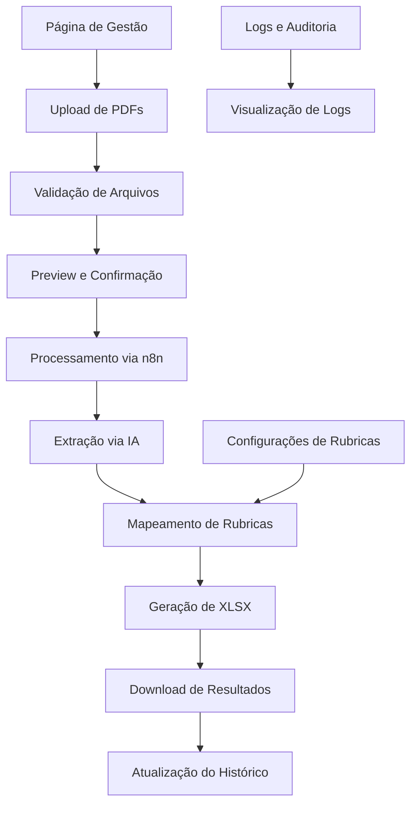

# Sistema de Processamento de Holerites - Requisitos

## 1. Visão Geral do Produto

Sistema completo de processamento inteligente de holerites que permite upload de PDFs de diversas origens, extração automatizada de dados via IA, e geração de planilhas XLSX estruturadas. O sistema oferece flexibilidade para adaptar-se a diferentes modelos contábeis sem necessidade de alterações de código, mantendo alta precisão na extração de dados.

- **Problema a resolver**: Automatizar o processamento manual de holerites de diferentes formatos e origens contábeis
- **Usuários**: Contadores, gestores de RH e profissionais que lidam com folhas de pagamento
- **Valor**: Redução significativa do tempo de processamento e eliminação de erros manuais na extração de dados

## 2. Funcionalidades Principais

### 2.1 Papéis de Usuário

| Papel | Método de Registro | Permissões Principais |
|-------|-------------------|----------------------|
| Usuário Autenticado | Login via sistema existente | Pode fazer upload, processar e baixar holerites |
| Administrador | Acesso via painel admin | Pode gerenciar configurações, visualizar logs e auditorias |

### 2.2 Módulos Funcionais

O sistema de processamento de holerites consiste nas seguintes páginas principais:

1. **Página de Gestão de Holerites**: interface principal, upload de arquivos, histórico de processamentos
2. **Página de Configurações de Rubricas**: cadastro e mapeamento de padrões de rubricas
3. **Página de Logs e Auditoria**: visualização de logs detalhados e histórico de operações

### 2.3 Detalhes das Páginas

| Nome da Página | Nome do Módulo | Descrição da Funcionalidade |
|----------------|----------------|----------------------------|
| Gestão de Holerites | Módulo de Upload | Interface drag-and-drop para múltiplos PDFs, validação de arquivos (10MB max, formato PDF), preview dos arquivos |
| Gestão de Holerites | Processamento via Webhook | Comunicação segura com n8n, envio de dados específicos, timeout e retry automático |
| Gestão de Holerites | Extração Inteligente | Processamento via IA, identificação automática de rubricas, mapeamento entre modelos contábeis |
| Gestão de Holerites | Download de Resultados | Recebimento de XLSX processado, interface de download, histórico de processamentos |
| Gestão de Holerites | Estatísticas e Monitoramento | Cards com métricas em tempo real, status de processamentos, indicadores de performance |
| Configurações de Rubricas | Cadastro de Padrões | Criar e editar padrões de rubricas, mapeamento entre diferentes modelos contábeis |
| Configurações de Rubricas | Mapeamento Inteligente | Sugestões automáticas de mapeamento, validação de padrões, teste de reconhecimento |
| Logs e Auditoria | Visualização de Logs | Logs detalhados de processamento, filtros por data/empresa/status, exportação de relatórios |
| Logs e Auditoria | Auditoria de Operações | Histórico completo de ações, rastreabilidade de alterações, relatórios de conformidade |

## 3. Fluxo Principal de Operação

### Fluxo do Usuário Autenticado:

1. **Upload de Arquivos**: Usuário acessa a página de gestão, seleciona empresa e competência, faz upload de PDFs via drag-and-drop
2. **Validação e Preview**: Sistema valida arquivos (tamanho, formato, integridade), exibe preview dos arquivos carregados
3. **Processamento**: Usuário inicia processamento, sistema envia dados para webhook n8n, IA extrai dados estruturados
4. **Mapeamento de Rubricas**: Sistema identifica e mapeia rubricas automaticamente, solicita confirmação para novos padrões
5. **Geração de Resultados**: Sistema gera XLSX estruturado, disponibiliza para download, atualiza histórico
6. **Monitoramento**: Usuário acompanha status em tempo real, visualiza estatísticas e logs

## 4. Design da Interface do Usuário

### 4.1 Estilo de Design

- **Cores primárias**: Azul (#3B82F6) para ações principais, Verde (#10B981) para sucesso
- **Cores secundárias**: Cinza (#6B7280) para textos secundários, Laranja (#F59E0B) para alertas
- **Estilo de botões**: Arredondados com sombra sutil, estados hover e focus bem definidos
- **Fontes**: Inter como fonte principal, tamanhos 14px para texto base, 16px para labels
- **Layout**: Design baseado em cards, navegação superior, sidebar para filtros
- **Ícones**: Lucide React para consistência, estilo outline, tamanho 16px-24px

### 4.2 Visão Geral do Design das Páginas

| Nome da Página | Nome do Módulo | Elementos da UI |
|----------------|----------------|-----------------|
| Gestão de Holerites | Módulo de Upload | Card com área drag-and-drop, bordas tracejadas azuis, ícone de upload centralizado, progress bars para upload |
| Gestão de Holerites | Estatísticas | Grid responsivo 3 colunas, cards com ícones coloridos, números grandes em destaque, animações sutis |
| Gestão de Holerites | Histórico | Tabela responsiva com paginação, badges coloridos para status, botões de ação compactos |
| Configurações de Rubricas | Cadastro | Formulários em cards, campos de input padronizados, botões de ação alinhados à direita |
| Logs e Auditoria | Visualização | Tabela com filtros laterais, código de cores para tipos de log, modal para detalhes expandidos |

### 4.3 Responsividade

O sistema é mobile-first com adaptação para desktop. Inclui otimização para touch em dispositivos móveis, com botões maiores e espaçamento adequado. Tabelas se transformam em cards empilhados em telas menores, e a navegação se adapta para menu hambúrguer em dispositivos móveis.

## 5. Requisitos de Qualidade e Segurança

### 5.1 Performance
- Suporte a uploads simultâneos de até 10 arquivos
- Processamento assíncrono com feedback em tempo real
- Cache inteligente para padrões de rubricas frequentes
- Otimização de imagens e lazy loading

### 5.2 Segurança
- Autenticação obrigatória via sistema existente
- Validação rigorosa de arquivos (tipo MIME, assinatura binária)
- Sanitização de dados recebidos do webhook
- Proteção contra arquivos maliciosos via scanning
- Logs de auditoria para todas as operações

### 5.3 Confiabilidade
- Tratamento robusto de erros com mensagens claras
- Sistema de retry automático para falhas temporárias
- Backup automático de arquivos processados
- Monitoramento de saúde do sistema

### 5.4 Flexibilidade
- Cadastro dinâmico de novos padrões sem código
- Mapeamento inteligente entre diferentes modelos contábeis
- Configuração de regras de validação personalizadas
- API extensível para integrações futuras