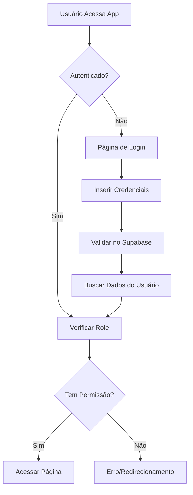

# Requisitos do Backend Supabase - E7AI Center App

## 1. Visão Geral do Produto

O E7AI Center App é uma plataforma de assistentes de IA para escritórios de advocacia e contabilidade que necessita de um sistema robusto de autenticação e autorização baseado em perfis de usuário. O backend será implementado utilizando Supabase para fornecer autenticação segura, controle de acesso baseado em roles e gerenciamento de dados.

O objetivo é implementar um sistema de backend que suporte diferentes perfis de usuário com permissões específicas, garantindo segurança e controle de acesso adequado para cada tipo de usuário da plataforma.

## 2. Funcionalidades Principais

### 2.1 Perfis de Usuário

| Perfil | Método de Cadastro | Permissões Principais |
|--------|-------------------|----------------------|
| Administrador | Cadastro direto pelo sistema | Acesso total a todos os módulos, gestão de usuários e empresas |
| TI | Cadastro por Administrador | Mesmos acessos do Administrador |
| Advogado ADM | Cadastro por Administrador | Mesmos acessos do Administrador |
| Advogado | Cadastro por perfis administrativos | Acesso aos módulos exceto administração |
| Contábil | Cadastro por perfis administrativos | Acesso aos módulos, visualização e cadastro de empresas, sem acesso a usuários |
| Financeiro | Cadastro por perfis administrativos | Acesso aos módulos exceto administração |

### 2.2 Módulos do Sistema

Nossa aplicação consiste nas seguintes páginas principais:
1. **Dashboard**: página inicial, estatísticas gerais, navegação principal.
2. **Assistentes de IA**: chat geral, direito tributário, direito civil, financeiro, contábil.
3. **Documentos**: folha de pagamento, casos, relatórios.
4. **Integrações**: PowerBI, Trello, calendário.
5. **Administração**: gestão de usuários, gestão de empresas.

### 2.3 Detalhes das Páginas

| Nome da Página | Nome do Módulo | Descrição da Funcionalidade |
|----------------|----------------|----------------------------|
| Dashboard | Painel Principal | Exibir estatísticas, métricas de uso, navegação rápida para módulos |
| Assistentes | Chat Geral | Interface de conversação com IA para consultas gerais |
| Assistentes | Direito Tributário | Assistente especializado em questões tributárias |
| Assistentes | Direito Civil | Assistente especializado em direito civil |
| Assistentes | Financeiro | Assistente para análises financeiras |
| Assistentes | Contábil | Assistente para questões contábeis |
| Documentos | Folha de Pagamento | Gerenciar e visualizar holerites e documentos de RH |
| Documentos | Casos | Gerenciar casos jurídicos e documentação relacionada |
| Documentos | Relatórios | Gerar e visualizar relatórios diversos |
| Integrações | PowerBI | Integração com dashboards do PowerBI |
| Integrações | Trello | Sincronização com boards do Trello |
| Integrações | Calendário | Integração com calendários externos |
| Administração | Usuários | Gerenciar cadastro, edição e permissões de usuários |
| Administração | Empresas | Gerenciar cadastro e dados das empresas clientes |

## 3. Fluxo Principal

### Fluxo de Autenticação
1. Usuário acessa a aplicação
2. Sistema verifica se há sessão ativa
3. Se não autenticado, redireciona para login
4. Usuário insere credenciais (email/senha)
5. Sistema valida no Supabase Auth
6. Após autenticação, busca dados do perfil na tabela public.users
7. Sistema carrega permissões baseadas no role
8. Usuário é redirecionado para dashboard com acesso controlado

### Fluxo de Autorização
1. Usuário tenta acessar uma página/funcionalidade
2. Sistema verifica o role do usuário
3. Compara com as permissões necessárias para a página
4. Se autorizado, permite acesso
5. Se não autorizado, exibe erro ou redireciona

## 4. Design da Interface

### 4.1 Estilo de Design
- Cores primárias: Azul (#3B82F6), Verde (#10B981)
- Cores secundárias: Cinza (#6B7280), Branco (#FFFFFF)
- Estilo de botões: Arredondados com sombras sutis
- Fonte: Inter, tamanhos 14px-24px
- Layout: Baseado em cards, navegação lateral
- Ícones: Lucide React, estilo minimalista

### 4.2 Visão Geral do Design das Páginas

| Nome da Página | Nome do Módulo | Elementos da UI |
|----------------|----------------|-----------------|
| Login | Autenticação | Formulário centralizado, campos de email/senha, botão de login, logo da empresa |
| Dashboard | Painel Principal | Cards de estatísticas, gráficos, menu lateral, header com perfil do usuário |
| Administração | Usuários | Tabela responsiva, filtros de busca, botões de ação, modais de edição |
| Administração | Empresas | Lista de empresas, contadores de holerites, status visual, formulários de cadastro |

### 4.3 Responsividade
O sistema será mobile-first com adaptação para desktop, utilizando breakpoints do Tailwind CSS para garantir experiência otimizada em todos os dispositivos.