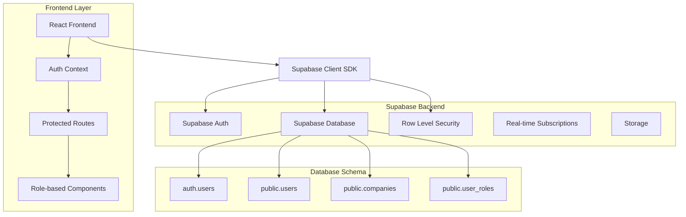
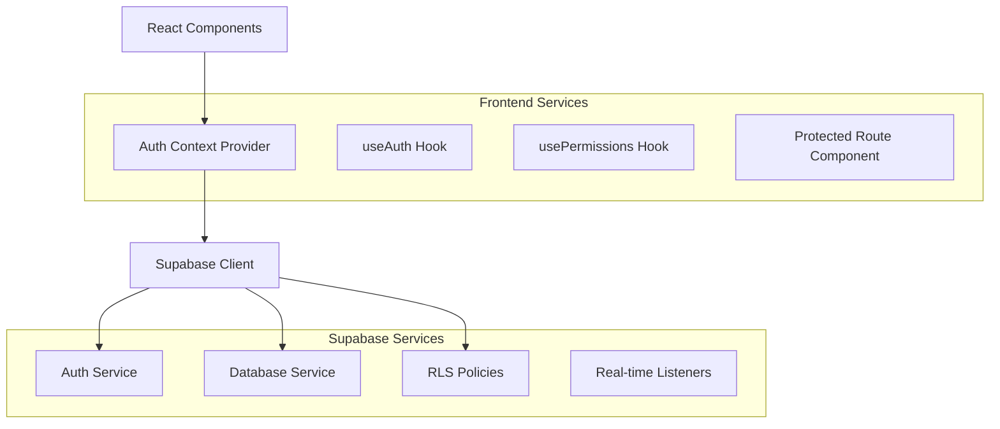
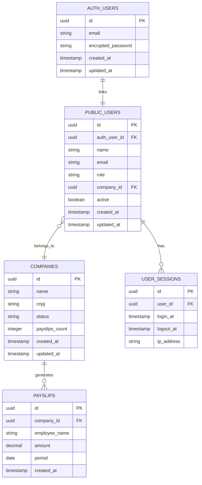

# Arquitetura Técnica - Backend Supabase E7AI Center App

## 1. Design da Arquitetura



## 2. Descrição das Tecnologias

* Frontend: React\@18 + TypeScript + Vite + Tailwind CSS

* Backend: Supabase (PostgreSQL + Auth + Real-time)

* Autenticação: Supabase Auth com JWT

* Banco de Dados: PostgreSQL (via Supabase)

* ORM: Supabase Client SDK

* Segurança: Row Level Security (RLS)

## 3. Definições de Rotas

| Rota             | Propósito                 | Permissões Necessárias                               |
| ---------------- | ------------------------- | ---------------------------------------------------- |
| /login           | Página de autenticação    | Público                                              |
| /                | Dashboard principal       | Autenticado                                          |
| /assistants/\*   | Módulos de assistentes IA | Todos os perfis autenticados                         |
| /documents/\*    | Gestão de documentos      | Todos os perfis autenticados                         |
| /integrations/\* | Integrações externas      | Todos os perfis autenticados                         |
| /admin/users     | Gestão de usuários        | Administrador, TI, Advogado ADM                      |
| /admin/companies | Gestão de empresas        | Administrador, TI, Advogado ADM, Contábil (view/add) |

## 4. Definições de API

### 4.1 Autenticação

**Login de usuário**

```
POST /auth/v1/token
```

Request:

| Nome do Parâmetro | Tipo   | Obrigatório | Descrição        |
| ----------------- | ------ | ----------- | ---------------- |
| email             | string | true        | Email do usuário |
| password          | string | true        | Senha do usuário |

Response:

| Nome do Parâmetro | Tipo   | Descrição                |
| ----------------- | ------ | ------------------------ |
| access\_token     | string | JWT token de acesso      |
| refresh\_token    | string | Token para renovação     |
| user              | object | Dados básicos do usuário |

**Logout de usuário**

```
POST /auth/v1/logout
```

**Obter dados do usuário**

```
GET /rest/v1/users?id=eq.{user_id}
```

Response:

| Nome do Parâmetro | Tipo   | Descrição               |
| ----------------- | ------ | ----------------------- |
| id                | uuid   | ID do usuário           |
| email             | string | Email do usuário        |
| name              | string | Nome completo           |
| role              | string | Perfil do usuário       |
| company\_id       | uuid   | ID da empresa vinculada |

### 4.2 Gestão de Usuários

**Listar usuários**

```
GET /rest/v1/users
```

**Criar usuário**

```
POST /rest/v1/users
```

Request:

| Nome do Parâmetro | Tipo   | Obrigatório | Descrição                                                                 |
| ----------------- | ------ | ----------- | ------------------------------------------------------------------------- |
| email             | string | true        | Email do usuário                                                          |
| name              | string | true        | Nome completo                                                             |
| role              | string | true        | Perfil (administrador, ti, advogado\_adm, advogado, contabil, financeiro) |
| company\_id       | uuid   | false       | ID da empresa                                                             |

### 4.3 Gestão de Empresas

**Listar empresas**

```
GET /rest/v1/companies
```

**Criar empresa**

```
POST /rest/v1/companies
```

Request:

| Nome do Parâmetro | Tipo   | Obrigatório | Descrição               |
| ----------------- | ------ | ----------- | ----------------------- |
| name              | string | true        | Nome da empresa         |
| cnpj              | string | true        | CNPJ da empresa         |
| status            | string | true        | Status (ativo, inativo) |

## 5. Arquitetura do Servidor



## 6. Modelo de Dados

### 6.1 Definição do Modelo de Dados



### 6.2 Linguagem de Definição de Dados (DDL)

**Tabela de Usuários (public.users)**

```sql
-- Criar tabela de usuários
CREATE TABLE public.users (
    id UUID PRIMARY KEY DEFAULT gen_random_uuid(),
    auth_user_id UUID REFERENCES auth.users(id) ON DELETE CASCADE,
    name VARCHAR(255) NOT NULL,
    email VARCHAR(255) UNIQUE NOT NULL,
    role VARCHAR(50) NOT NULL CHECK (role IN ('administrador', 'ti', 'advogado_adm', 'advogado', 'contabil', 'financeiro')),
    company_id UUID REFERENCES public.companies(id),
    active BOOLEAN DEFAULT true,
    created_at TIMESTAMP WITH TIME ZONE DEFAULT NOW(),
    updated_at TIMESTAMP WITH TIME ZONE DEFAULT NOW()
);

-- Criar índices
CREATE INDEX idx_users_auth_user_id ON public.users(auth_user_id);
CREATE INDEX idx_users_email ON public.users(email);
CREATE INDEX idx_users_role ON public.users(role);
CREATE INDEX idx_users_company_id ON public.users(company_id);

-- Trigger para atualizar updated_at
CREATE OR REPLACE FUNCTION update_updated_at_column()
RETURNS TRIGGER AS $$
BEGIN
    NEW.updated_at = NOW();
    RETURN NEW;
END;
$$ language 'plpgsql';

CREATE TRIGGER update_users_updated_at BEFORE UPDATE ON public.users
    FOR EACH ROW EXECUTE FUNCTION update_updated_at_column();
```

**Tabela de Empresas (public.companies)**

```sql
-- Criar tabela de empresas
CREATE TABLE public.companies (
    id UUID PRIMARY KEY DEFAULT gen_random_uuid(),
    name VARCHAR(255) NOT NULL,
    cnpj VARCHAR(18) UNIQUE NOT NULL,
    status VARCHAR(20) DEFAULT 'ativo' CHECK (status IN ('ativo', 'inativo')),
    payslips_count INTEGER DEFAULT 0,
    created_at TIMESTAMP WITH TIME ZONE DEFAULT NOW(),
    updated_at TIMESTAMP WITH TIME ZONE DEFAULT NOW()
);

-- Criar índices
CREATE INDEX idx_companies_cnpj ON public.companies(cnpj);
CREATE INDEX idx_companies_status ON public.companies(status);

-- Trigger para atualizar updated_at
CREATE TRIGGER update_companies_updated_at BEFORE UPDATE ON public.companies
    FOR EACH ROW EXECUTE FUNCTION update_updated_at_column();
```

**Tabela de Holerites (public.payslips)**

```sql
-- Criar tabela de holerites
CREATE TABLE public.payslips (
    id UUID PRIMARY KEY DEFAULT gen_random_uuid(),
    company_id UUID REFERENCES public.companies(id) ON DELETE CASCADE,
    employee_name VARCHAR(255) NOT NULL,
    amount DECIMAL(10,2) NOT NULL,
    period DATE NOT NULL,
    created_at TIMESTAMP WITH TIME ZONE DEFAULT NOW()
);

-- Criar índices
CREATE INDEX idx_payslips_company_id ON public.payslips(company_id);
CREATE INDEX idx_payslips_period ON public.payslips(period);

-- Trigger para atualizar contador de holerites
CREATE OR REPLACE FUNCTION update_company_payslips_count()
RETURNS TRIGGER AS $$
BEGIN
    IF TG_OP = 'INSERT' THEN
        UPDATE public.companies 
        SET payslips_count = payslips_count + 1 
        WHERE id = NEW.company_id;
        RETURN NEW;
    ELSIF TG_OP = 'DELETE' THEN
        UPDATE public.companies 
        SET payslips_count = payslips_count - 1 
        WHERE id = OLD.company_id;
        RETURN OLD;
    END IF;
    RETURN NULL;
END;
$$ language 'plpgsql';

CREATE TRIGGER update_payslips_count_insert AFTER INSERT ON public.payslips
    FOR EACH ROW EXECUTE FUNCTION update_company_payslips_count();

CREATE TRIGGER update_payslips_count_delete AFTER DELETE ON public.payslips
    FOR EACH ROW EXECUTE FUNCTION update_company_payslips_count();
```

**Políticas de Segurança (RLS)**

```sql
-- Habilitar RLS nas tabelas
ALTER TABLE public.users ENABLE ROW LEVEL SECURITY;
ALTER TABLE public.companies ENABLE ROW LEVEL SECURITY;
ALTER TABLE public.payslips ENABLE ROW LEVEL SECURITY;

-- Políticas para tabela users
CREATE POLICY "Usuários podem ver próprios dados" ON public.users
    FOR SELECT USING (auth.uid() = auth_user_id);

CREATE POLICY "Admins podem ver todos os usuários" ON public.users
    FOR SELECT USING (
        EXISTS (
            SELECT 1 FROM public.users 
            WHERE auth_user_id = auth.uid() 
            AND role IN ('administrador', 'ti', 'advogado_adm')
        )
    );

CREATE POLICY "Admins podem inserir usuários" ON public.users
    FOR INSERT WITH CHECK (
        EXISTS (
            SELECT 1 FROM public.users 
            WHERE auth_user_id = auth.uid() 
            AND role IN ('administrador', 'ti', 'advogado_adm')
        )
    );

CREATE POLICY "Admins podem atualizar usuários" ON public.users
    FOR UPDATE USING (
        EXISTS (
            SELECT 1 FROM public.users 
            WHERE auth_user_id = auth.uid() 
            AND role IN ('administrador', 'ti', 'advogado_adm')
        )
    );

-- Políticas para tabela companies
CREATE POLICY "Usuários autenticados podem ver empresas" ON public.companies
    FOR SELECT USING (auth.role() = 'authenticated');

CREATE POLICY "Admins e Contábil podem inserir empresas" ON public.companies
    FOR INSERT WITH CHECK (
        EXISTS (
            SELECT 1 FROM public.users 
            WHERE auth_user_id = auth.uid() 
            AND role IN ('administrador', 'ti', 'advogado_adm', 'contabil')
        )
    );

CREATE POLICY "Admins podem atualizar empresas" ON public.companies
    FOR UPDATE USING (
        EXISTS (
            SELECT 1 FROM public.users 
            WHERE auth_user_id = auth.uid() 
            AND role IN ('administrador', 'ti', 'advogado_adm')
        )
    );

-- Políticas para tabela payslips
CREATE POLICY "Usuários autenticados podem ver holerites" ON public.payslips
    FOR SELECT USING (auth.role() = 'authenticated');

CREATE POLICY "Usuários autenticados podem inserir holerites" ON public.payslips
    FOR INSERT WITH CHECK (auth.role() = 'authenticated');

-- Permissões básicas
GRANT USAGE ON SCHEMA public TO anon, authenticated;
GRANT SELECT ON public.users TO anon;
GRANT ALL ON public.users TO authenticated;
GRANT SELECT ON public.companies TO anon;
GRANT ALL ON public.companies TO authenticated;
GRANT SELECT ON public.payslips TO anon;
GRANT ALL ON public.payslips TO authenticated;

-- Dados iniciais
INSERT INTO public.companies (name, cnpj, status, payslips_count) VALUES
('Empresa Exemplo Ltda', '12.345.678/0001-90', 'ativo', 15),
('Consultoria ABC', '98.765.432/0001-10', 'ativo', 8),
('Escritório XYZ', '11.222.333/0001-44', 'inativo', 0);

INSERT INTO public.payslips (company_id, employee_name, amount, period) 
SELECT 
    c.id,
    'Funcionário ' || generate_series(1, c.payslips_count),
    (random() * 5000 + 2000)::decimal(10,2),
    CURRENT_DATE - (random() * 365)::integer
FROM public.companies c
WHERE c.payslips_count > 0;
```

