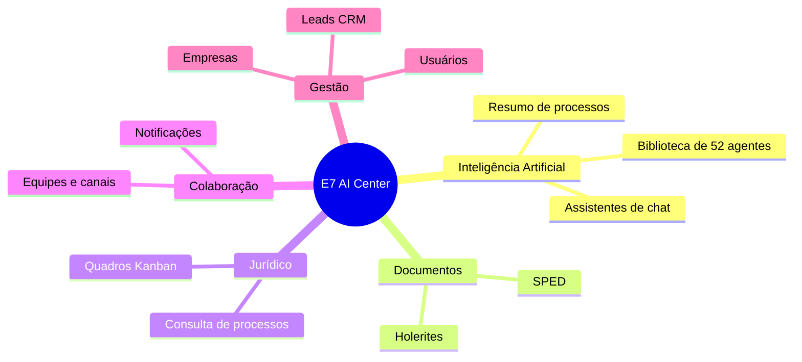
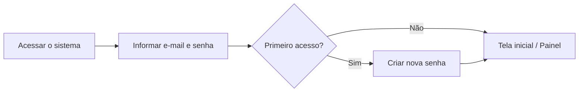
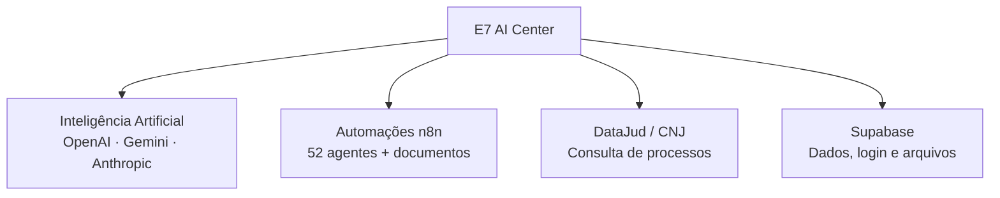

# Manual do Sistema — E7 AI Center

> **Público-alvo:** usuários e gestores do escritório.
> **Data:** 24/06/2026 · **Versão:** 1.0

---

## Sumário

1. [Visão geral do sistema](#1-visão-geral-do-sistema)
2. [Objetivos da plataforma](#2-objetivos-da-plataforma)
3. [Perfis de usuários e permissões](#3-perfis-de-usuários-e-permissões)
4. [Módulos disponíveis](#4-módulos-disponíveis)
5. [Como usar — passo a passo](#5-como-usar--passo-a-passo)
6. [Integrações utilizadas](#6-integrações-utilizadas)
7. [Benefícios da solução](#7-benefícios-da-solução)
8. [Requisitos mínimos](#8-requisitos-mínimos)
9. [Perguntas frequentes (FAQ)](#9-perguntas-frequentes-faq)

---

## 1. Visão geral do sistema

O **E7 AI Center** é uma plataforma web única que reúne, em um só lugar, as ferramentas do dia a dia de **escritórios de advocacia e contabilidade**. Com ela, a equipe consegue:

- Conversar com **assistentes de inteligência artificial** especializados;
- Usar uma **biblioteca com 52 agentes de IA** para tarefas jurídicas, contábeis e de marketing;
- **Processar holerites e arquivos SPED** de forma automatizada;
- **Consultar processos judiciais** e obter resumos gerados por IA;
- Organizar o trabalho em **quadros (Kanban)** jurídicos e operacionais;
- **Comunicar-se em equipe** por canais, postagens e comentários;
- Gerenciar uma **base de leads (CRM)**;
- Controlar **empresas clientes** e **usuários** do sistema.

---

## 2. Objetivos da plataforma

- **Centralizar** ferramentas hoje espalhadas em vários sistemas.
- **Acelerar tarefas repetitivas** com automação e inteligência artificial.
- **Padronizar** o processamento de documentos (holerites e SPED).
- **Dar visibilidade** ao andamento de casos, processos e tarefas.
- **Melhorar a comunicação interna** com um espaço de equipes integrado.
- **Garantir segurança** com controle de acesso por perfil de usuário.

---

## 3. Perfis de usuários e permissões

Cada usuário possui um **perfil (papel)** que define o que pode acessar.

| Perfil | O que pode fazer |
|--------|------------------|
| **Administrador** | Acesso total: administração, usuários, empresas, equipes, módulos e gestão operacional |
| **TI** | Mesmo acesso do Administrador |
| **Advogado Adm.** | Mesmo acesso do Administrador |
| **Advogado** | Usa os módulos e visualiza empresas |
| **Contábil** | Usa os módulos, visualiza e cadastra empresas |
| **Financeiro** | Usa os módulos |

> **Importante:** apenas usuários com status **ativo** conseguem entrar. No **primeiro acesso**, o sistema exige a criação de uma nova senha. Por segurança, a sessão é encerrada automaticamente após **30 minutos** sem uso.

---

## 4. Módulos disponíveis

### 4.1 Assistentes de IA
Chats inteligentes especializados: **Geral**, **Jurídico Tributário**, **Jurídico Cível**, **Financeiro** e **Contábil**. As conversas ficam salvas e podem ser marcadas como favoritas.

### 4.2 Biblioteca de IA
Coleção de **52 agentes** organizados em **11 temas** (criação e revisão de peças, jurisprudência, estratégia de caso, contratos, marketing jurídico, atendimento ao cliente, entre outros). Permite anexar arquivos para análise.

### 4.3 Holerites
Envio de holerites em lote (PDF), informando a competência (mês/ano). O sistema processa automaticamente e mostra o **andamento em tempo real**, com histórico pesquisável.

### 4.4 SPED
Envio e processamento de arquivos SPED, com validação de competência e histórico, no mesmo modelo dos holerites.

### 4.5 Processos
Consulta de **processos judiciais** por número (CNJ) ou por filtros avançados (tribunal, classe, assunto, grau, datas). Permite favoritar processos e gerar um **resumo automático por IA**.

### 4.6 Quadros Jurídicos (Kanban)
Organização de casos e tarefas em **quadros** com colunas e cartões. Cada cartão permite descrição rica, responsáveis, etiquetas, prazos, listas de tarefas, anexos e comentários.

### 4.7 Gestão Operacional (Kanban)
Quadros voltados à rotina operacional do escritório, com a mesma dinâmica dos quadros jurídicos. Disponível para perfis autorizados.

### 4.8 Equipes (Teams)
Espaço de **comunicação interna** com equipes, canais, postagens, comentários, reações, menções e **notificações em tempo real**. Postagens podem ser conectadas a cartões dos quadros.

### 4.9 Leads (CRM)
Cadastro e gestão de **leads** (clientes e parceiros), com múltiplos contatos, importação e exportação em planilha (CSV).

### 4.10 Perfil
Cada usuário gerencia seus **dados pessoais**, **foto** e **senha**.

### 4.11 Administração e Empresas
Gestão de **usuários** (criar, editar, ativar/desativar) e de **empresas clientes** (com validação de CNPJ). Disponível para perfis administrativos.

---

## 5. Como usar — passo a passo

### 5.1 Entrar no sistema

1. Abra o endereço do sistema.
2. Informe **e-mail** e **senha**.
3. No primeiro acesso, **crie uma nova senha** seguindo os requisitos de segurança.
4. Você será direcionado ao **Painel inicial**.

### 5.2 Conversar com um assistente de IA
1. No menu, escolha **Assistentes de IA**.
2. Selecione o assistente desejado (ex.: Tributário).
3. Digite sua pergunta e envie.
4. A resposta aparece na tela e a conversa fica salva.

### 5.3 Usar a Biblioteca de IA
1. Acesse **Biblioteca IA**.
2. Escolha um **tema** e depois um **agente**.
3. Escreva a solicitação (e anexe um arquivo, se necessário).
4. Receba o resultado gerado pelo agente.

### 5.4 Processar holerites
1. Acesse **Documentos → Holerites**.
2. Selecione a **empresa**.
3. Adicione os **PDFs** e informe a **competência (MM/AAAA)** de cada um.
4. Clique em **Processar** e acompanhe o **andamento em tempo real**.

### 5.5 Consultar um processo
1. Acesse **Documentos → Casos**.
2. Informe o número **CNJ** ou use a **busca avançada**.
3. Abra o processo para ver detalhes, movimentações e o **resumo por IA**.

### 5.6 Trabalhar com quadros (Kanban)
1. Acesse **Quadros Jurídicos** (ou **Gestão Operacional**).
2. Abra um quadro e crie **cartões** nas colunas.
3. Arraste os cartões conforme o andamento.
4. No cartão, adicione responsáveis, prazos, anexos e comentários.

### 5.7 Comunicar-se em Equipes
1. Acesse **Equipes**.
2. Escolha um **canal**.
3. Crie uma **postagem** e interaja por **comentários**, reações e menções.

---

## 6. Integrações utilizadas

| Integração | Para que serve |
|------------|----------------|
| **Inteligência Artificial** | Respostas dos assistentes e resumos de processos |
| **Automações (n8n)** | Agentes da biblioteca e processamento de documentos |
| **DataJud (CNJ)** | Consulta oficial de processos judiciais (dados públicos) |
| **Supabase** | Armazenamento de dados, login seguro e arquivos |

---

## 7. Benefícios da solução

- ⏱️ **Mais agilidade:** automação de tarefas repetitivas.
- 🤖 **Apoio de IA:** assistentes e agentes especializados.
- 📂 **Organização:** documentos, processos e tarefas centralizados.
- 👥 **Colaboração:** comunicação interna integrada ao trabalho.
- 🔒 **Segurança:** acesso por perfil, login protegido e encerramento automático de sessão.
- 📈 **Visibilidade:** painel com indicadores do escritório.

---

## 8. Requisitos mínimos

- **Navegador atualizado** (Google Chrome, Microsoft Edge, Firefox ou Safari).
- **Conexão com a internet**.
- **Credenciais de acesso** fornecidas pelo administrador.
- Compatível com **computador, tablet e celular** (layout responsivo).

---

## 9. Perguntas frequentes (FAQ)

**Esqueci minha senha. O que faço?**
Solicite ao administrador do sistema a redefinição de senha.

**Por que fui desconectado sozinho?**
Por segurança, a sessão encerra após **30 minutos** de inatividade. Basta entrar novamente.

**Não consigo ver alguns menus. É um erro?**
Não. Os menus aparecem conforme o **seu perfil de acesso**. Fale com o administrador se precisar de mais permissões.

**As conversas com a IA ficam salvas?**
Sim. Os chats ficam registrados na sua conta e podem ser marcados como favoritos.

**O resumo de processo por IA é oficial?**
Não. É um **apoio** gerado a partir de dados públicos do DataJud (CNJ); sempre valide as informações na fonte oficial.

**Quais arquivos posso enviar para holerites/SPED?**
Arquivos em **PDF**, informando a **competência (mês/ano)**. O sistema valida os dados antes de processar.

**Posso usar pelo celular?**
Sim. O sistema é responsivo e funciona em celulares e tablets.

**Quem pode cadastrar usuários e empresas?**
Perfis administrativos (Administrador, TI e Advogado Adm.). O perfil Contábil também pode cadastrar empresas.

---

*Manual elaborado a partir das funcionalidades existentes no sistema em 24/06/2026.*
