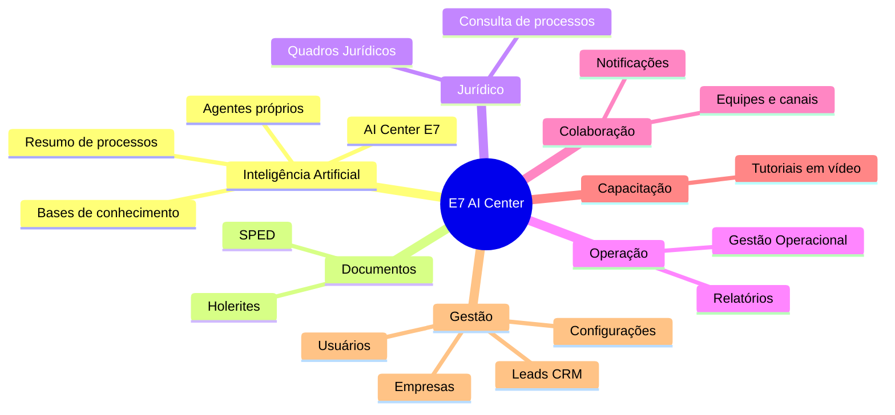
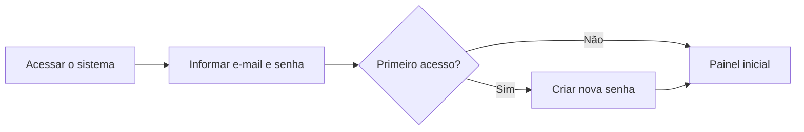
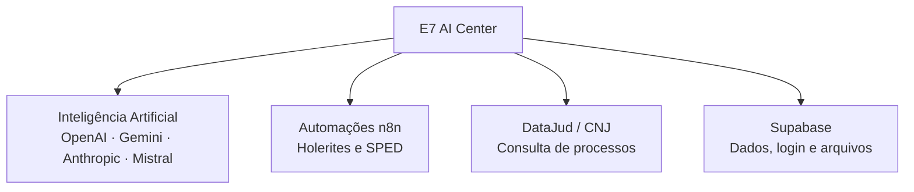

# Manual do Sistema — E7 AI Center

> **Público-alvo:** usuários e gestores do escritório.
> **Data:** 14/08/2026 · **Versão do manual:** 2.0
> **Base:** funcionalidades existentes na aplicação em 14/08/2026.

---

## Sumário

1. [Visão geral do sistema](#1-visão-geral-do-sistema)
2. [Objetivos da plataforma](#2-objetivos-da-plataforma)
3. [Perfis de usuários e permissões](#3-perfis-de-usuários-e-permissões)
4. [Mapa do menu](#4-mapa-do-menu)
5. [Módulos disponíveis](#5-módulos-disponíveis)
6. [Como usar — passo a passo](#6-como-usar--passo-a-passo)
7. [Integrações utilizadas](#7-integrações-utilizadas)
8. [Benefícios da solução](#8-benefícios-da-solução)
9. [Requisitos mínimos](#9-requisitos-mínimos)
10. [Perguntas frequentes (FAQ)](#10-perguntas-frequentes-faq)

---

## 1. Visão geral do sistema

O **E7 AI Center** é uma plataforma web única que reúne, em um só lugar, as ferramentas do dia a dia de **escritórios de advocacia e contabilidade**. Com ela, a equipe consegue:

- **Criar os próprios agentes de inteligência artificial** — sem programar — e conversar com eles (**AI Center E7**);
- Alimentar esses agentes com **bases de conhecimento** próprias (contratos, manuais, normas) para que respondam com base nos documentos do escritório;
- **Processar holerites e arquivos SPED** de forma automatizada, acompanhando o andamento em tempo real;
- **Consultar processos judiciais** na base oficial do CNJ e obter resumos gerados por IA;
- Organizar o trabalho em **quadros (Kanban)** jurídicos e operacionais;
- **Comunicar-se em equipe** por canais, postagens e comentários;
- Acompanhar tudo em um **hub de relatórios** com gráficos e exportação para Excel;
- Aprender a usar cada módulo pela **videoteca de tutoriais** interna;
- Gerenciar **leads (CRM)**, **empresas clientes** e **usuários** do sistema.

```mermaid
mindmap
  root((E7 AI Center))
    Inteligência Artificial
      AI Center E7
      Agentes próprios
      Bases de conhecimento
      Resumo de processos
    Documentos
      Holerites
      SPED
    Jurídico
      Consulta de processos
      Quadros Jurídicos
    Operação
      Gestão Operacional
      Relatórios
    Colaboração
      Equipes e canais
      Notificações
    Capacitação
      Tutoriais em vídeo
    Gestão
      Leads CRM
      Empresas
      Usuários
      Configurações
```

---

## 2. Objetivos da plataforma

- **Centralizar** ferramentas hoje espalhadas em vários sistemas.
- **Colocar a IA nas mãos da equipe**: qualquer usuário cria e publica um agente próprio.
- **Acelerar tarefas repetitivas** com automação e inteligência artificial.
- **Padronizar** o processamento de documentos (holerites e SPED).
- **Dar visibilidade** ao andamento de casos, processos, tarefas e custos de IA.
- **Melhorar a comunicação interna** com um espaço de equipes integrado.
- **Reduzir a curva de aprendizado** com tutoriais em vídeo dentro da própria plataforma.
- **Garantir segurança** com controle de acesso por perfil de usuário.

---

## 3. Perfis de usuários e permissões

Cada usuário possui um **perfil (papel)** que define o que pode acessar. Os menus se ajustam automaticamente ao perfil — o que você não vê, você não tem permissão para usar.

| Perfil | O que pode fazer |
|--------|------------------|
| **Administrador** | Acesso total: administração, usuários, empresas, equipes, tutoriais, configurações, gestão operacional e todos os módulos |
| **TI** | Mesmo acesso do Administrador |
| **Advogado Adm.** | Mesmo acesso do Administrador |
| **Advogado** | Módulos gerais e visualização de empresas |
| **Contábil** | Módulos gerais, visualizar e cadastrar empresas |
| **Financeiro** | Módulos gerais |

> **Importante:** apenas usuários com status **ativo** conseguem entrar. No **primeiro acesso**, o sistema exige a criação de uma nova senha. Por segurança, a sessão é encerrada automaticamente após **30 minutos** sem uso.

---

## 4. Mapa do menu

O menu lateral segue esta ordem:

| Item do menu | Para que serve | Quem vê |
|--------------|----------------|---------|
| **Dashboard** | Painel inicial com indicadores e atalhos | Todos |
| **Leads** | CRM de clientes e parceiros | Todos |
| **Gestão Operacional** | Quadros da rotina operacional | Perfis administrativos |
| **Gestão de Empresas** | Cadastro de empresas clientes | Administrativos, Advogado e Contábil |
| **AI Center E7** | Criação e uso de agentes de IA | Todos |
| **Gestão Jurídica → Processos** | Dashboard, Quadros Jurídicos e Consultas Processuais | Todos |
| **Gestão Contábil** | Gestão de Holerites e Gestão de SPEDs | Todos |
| **Relatórios** | Indicadores por área, com exportação | Todos |
| **Equipes** | Comunicação interna por canais | Todos |
| **Tutoriais** | Videoteca de treinamento | Todos |
| **Administração** | Usuários, Gestão de Equipes, Upload Tutoriais e Configurações | Somente perfis administrativos |

O **Dashboard** ainda oferece atalhos diretos para AI Center E7, Tutoriais, Holerites, SPEDs, Quadros Jurídicos, Quadros de Gestão Operacional e Relatórios.

---

## 5. Módulos disponíveis

### 5.1 AI Center E7 — agentes de IA do escritório

É o centro de inteligência da plataforma, e substitui, na navegação, os chats fixos anteriores.

- **Galeria de agentes:** lista os agentes que você criou e os publicados para o escritório, com busca, favoritos e arquivamento.
- **Criar agente:** você descreve o que o agente deve fazer (objetivo, persona, modelo de IA) e ele passa a existir. Também é possível **construir com IA**: descreva em português o que precisa e o sistema monta o agente para você.
- **Conhecimento (RAG):** envie PDFs, DOCX, TXT ou imagens para uma **base de conhecimento**. O sistema lê o conteúdo (inclusive por OCR, em documentos digitalizados) e o agente passa a responder com base nesses documentos.
- **Conversar:** cada agente tem seu chat, com histórico por conversa e possibilidade de anexar um arquivo à pergunta.
- **Fluxo (avançado):** um editor visual permite montar o passo a passo do agente — entrada, prompt, contexto, conhecimento, memória, modelo e formato de saída.
- **Publicação e versões:** ao publicar, o agente fica disponível para o escritório e uma versão é arquivada, permitindo acompanhar a evolução.
- **Custos:** cada execução registra tokens e custo estimado em reais.

### 5.2 Holerites

Envio de holerites em lote (PDF) por empresa, informando a competência (MM/AAAA) de cada arquivo. O processamento é automático e **assíncrono**: você pode sair da tela que o andamento continua, e o histórico é pesquisável por empresa e competência.

### 5.3 SPED

Envio e processamento de arquivos SPED (ICMS/IPI e Contribuições), com validação de competência e histórico filtrável, no mesmo modelo dos holerites.

### 5.4 Processos (Consultas Processuais)

Consulta de **processos judiciais** por número CNJ ou por filtros avançados (tribunal, classe, assunto, grau, datas), a partir da base pública **DataJud/CNJ**. Permite favoritar processos, ver movimentações e gerar um **resumo automático por IA**.

### 5.5 Quadros Jurídicos (Kanban)

Organização de casos e tarefas em **quadros** com colunas e cartões. Cada cartão permite descrição formatada, responsáveis, etiquetas, prioridade, status (incluindo *aguardando aprovação*), prazos, listas de tarefas, anexos e comentários com menções. Cartões podem ser **arquivados** e **compartilhados com outro quadro**.

### 5.6 Gestão Operacional (Kanban)

Quadros voltados à rotina operacional do escritório, com a mesma dinâmica dos quadros jurídicos. Disponível para perfis autorizados.

### 5.7 Equipes

Espaço de **comunicação interna** com equipes, canais, postagens, comentários, reações, menções, favoritos, anexos, busca em português e **notificações em tempo real**. Postagens podem ser conectadas a cartões dos quadros, mantendo conversa e tarefa sincronizadas.

### 5.8 Relatórios

Hub de indicadores em quatro abas, com filtro de período e **exportação em Excel**:

| Aba | O que mostra |
|-----|--------------|
| **Folha & SPED** | Volume processado, tempo médio de processamento, taxa de conclusão sem erro, distribuição por status e por empresa |
| **Quadros** | Cards por status, prioridade, quadro e responsável; lead time médio; filtro por domínio (Jurídico / Gestão Operacional) |
| **Adoção & IA** | Uso do AI Center E7: custo em reais, execuções, tokens, agentes ativos, usuários, taxa de erro e evolução mensal |
| **Processos** | Consultas realizadas, taxa de sucesso, tempo de resposta, processos por tribunal, grau, classe e órgão julgador |

### 5.9 Tutoriais

Videoteca interna com catálogo por módulo e categoria, busca, favoritos, **trilha de progresso por módulo** e retomada automática do ponto onde você parou. Administradores publicam novos vídeos pela área de upload.

### 5.10 Leads (CRM)

Cadastro e gestão de **leads** (clientes e parceiros), com múltiplos telefones e e-mails, importação e exportação em planilha.

### 5.11 Perfil

Cada usuário gerencia seus **dados pessoais**, **foto** e **senha**. A alteração de e-mail é restrita a perfis administrativos.

### 5.12 Administração

- **Usuários:** criar, editar, ativar/desativar.
- **Gestão de Equipes:** criar equipes, canais e definir membros.
- **Upload Tutoriais:** publicar, editar e despublicar vídeos.
- **Configurações:** webhooks de automação, parâmetros dos modelos de IA e credenciais das provedoras de IA (sempre mascaradas na tela).
- **Empresas:** cadastro com validação de CNPJ.

---

## 6. Como usar — passo a passo

### 6.1 Entrar no sistema

```mermaid
flowchart LR
    A[Acessar o sistema] --> B[Informar e-mail e senha]
    B --> C{Primeiro acesso?}
    C -- Sim --> D[Criar nova senha]
    C -- Não --> E[Painel inicial]
    D --> E
```
1. Abra o endereço do sistema.
2. Informe **e-mail** e **senha**.
3. No primeiro acesso, **crie uma nova senha** seguindo os requisitos de segurança.
4. Você chega ao **Dashboard**.

### 6.2 Criar um agente no AI Center E7
1. No menu, abra **AI Center E7**.
2. Clique em **Novo agente** — ou em **Construir com IA** e descreva em português o que ele deve fazer.
3. Preencha nome, objetivo e persona (o "como" o agente deve responder) e escolha o modelo de IA.
4. Salve e clique em **Conversar** para testar.
5. Quando estiver bom, clique em **Publicar** para liberá-lo ao escritório.

### 6.3 Ensinar o agente com documentos do escritório
1. Em **AI Center E7**, abra **Conhecimento**.
2. Crie uma **base de conhecimento** (ex.: "Modelos de contrato").
3. Envie os arquivos (PDF, DOCX, TXT ou imagem) e aguarde o status mudar para **concluído**.
4. No agente, aba **Conhecimento**, vincule a base criada.
5. A partir daí, as respostas passam a considerar esses documentos.

### 6.4 Processar holerites
1. Acesse **Gestão Contábil → Gestão de Holerites**.
2. Selecione a **empresa**.
3. Adicione os **PDFs** e informe a **competência (MM/AAAA)** de cada um.
4. Clique em **Processar** e acompanhe o **andamento em tempo real**. Você pode sair da tela — o processamento continua.

### 6.5 Consultar um processo
1. Acesse **Gestão Jurídica → Processos → Consultas Processuais**.
2. Informe o número **CNJ** ou use a **busca avançada**.
3. Abra o processo para ver detalhes, movimentações e o **resumo por IA**.

### 6.6 Trabalhar com quadros (Kanban)
1. Acesse **Quadros Jurídicos** (ou **Gestão Operacional**).
2. Abra um quadro e crie **cartões** nas colunas.
3. Arraste os cartões conforme o andamento.
4. No cartão, adicione responsáveis, etiquetas, prazos, checklists, anexos e comentários.

### 6.7 Comunicar-se em Equipes
1. Acesse **Equipes** e escolha um **canal**.
2. Crie uma **postagem** e interaja por **comentários**, reações e menções.
3. Se a conversa virar tarefa, vincule a postagem a um cartão do quadro.

### 6.8 Acompanhar indicadores
1. Acesse **Relatórios**.
2. Escolha a aba desejada e ajuste o **período**.
3. Use **Exportar** para baixar os dados em Excel.

### 6.9 Aprender pelos tutoriais
1. Acesse **Tutoriais**.
2. Filtre pelo módulo que você quer aprender ou use a busca.
3. Assista — o sistema guarda o ponto onde você parou e mostra seu progresso por módulo.

---

## 7. Integrações utilizadas

```mermaid
flowchart TB
    Sistema[E7 AI Center] --> IA[Inteligência Artificial<br/>OpenAI · Gemini · Anthropic · Mistral]
    Sistema --> Auto[Automações n8n<br/>Holerites e SPED]
    Sistema --> CNJ[DataJud / CNJ<br/>Consulta de processos]
    Sistema --> Sup[Supabase<br/>Dados, login e arquivos]
```

| Integração | Para que serve |
|------------|----------------|
| **Inteligência Artificial** | Respostas dos agentes, leitura de documentos (OCR), resumos de processos |
| **Automações (n8n)** | Processamento de holerites e SPED |
| **DataJud (CNJ)** | Consulta oficial de processos judiciais (dados públicos) |
| **Supabase** | Armazenamento de dados, login seguro, arquivos e notificações em tempo real |

---

## 8. Benefícios da solução

- ⏱️ **Mais agilidade:** automação de tarefas repetitivas e processamento em segundo plano.
- 🤖 **IA sob medida:** cada área cria os agentes que precisa, com os documentos do escritório.
- 📂 **Organização:** documentos, processos e tarefas centralizados.
- 👥 **Colaboração:** comunicação interna integrada ao trabalho.
- 📊 **Gestão à vista:** relatórios por área, incluindo custo de IA.
- 🎓 **Autonomia:** tutoriais em vídeo dentro da plataforma.
- 🔒 **Segurança:** acesso por perfil, login protegido, credenciais de IA guardadas em cofre e encerramento automático de sessão.

---

## 9. Requisitos mínimos

- **Navegador atualizado** (Google Chrome, Microsoft Edge, Firefox ou Safari).
- **Conexão com a internet**.
- **Credenciais de acesso** fornecidas pelo administrador.
- Compatível com **computador, tablet e celular** (layout responsivo), com **tema claro e escuro**.

---

## 10. Perguntas frequentes (FAQ)

**Esqueci minha senha. O que faço?**
Solicite ao administrador do sistema a redefinição de senha.

**Por que fui desconectado sozinho?**
Por segurança, a sessão encerra após **30 minutos** de inatividade. Basta entrar novamente.

**Não consigo ver alguns menus. É um erro?**
Não. Os menus aparecem conforme o **seu perfil de acesso**. Fale com o administrador se precisar de mais permissões.

**Preciso saber programar para criar um agente?**
Não. Basta descrever o objetivo e a forma de responder. O editor visual de fluxo existe para quem quiser detalhar mais, mas é opcional.

**Que arquivos posso enviar para a base de conhecimento?**
PDF, DOCX, TXT e imagens. Documentos digitalizados passam por leitura automática (OCR).

**Meu agente fica visível para os outros?**
Só depois que você **publicar**. Antes disso, ele é um rascunho privado.

**O resumo de processo por IA é oficial?**
Não. É um **apoio** gerado a partir de dados públicos do DataJud (CNJ); sempre valide as informações na fonte oficial.

**Quais arquivos posso enviar para holerites/SPED?**
Holerites em **PDF** e arquivos **SPED**, sempre informando a **competência (mês/ano)**. O sistema valida os dados antes de processar.

**Posso fechar a tela durante o processamento de holerites?**
Sim. O processamento roda no servidor; ao voltar, o andamento estará atualizado.

**Posso usar pelo celular?**
Sim. O sistema é responsivo e funciona em celulares e tablets.

**Quem pode cadastrar usuários e empresas?**
Perfis administrativos (Administrador, TI e Advogado Adm.). O perfil Contábil também pode cadastrar empresas.

**Quem controla as chaves de IA e os webhooks?**
Somente perfis administrativos, em **Administração → Configurações**. As chaves nunca aparecem na tela — apenas os últimos dígitos.

---

*Manual elaborado a partir das funcionalidades existentes no sistema em 14/08/2026.*
