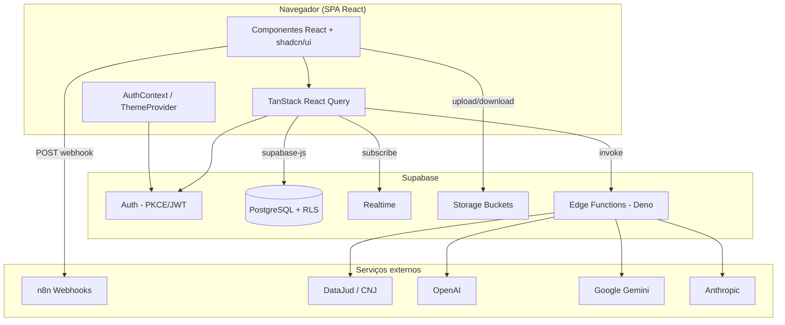
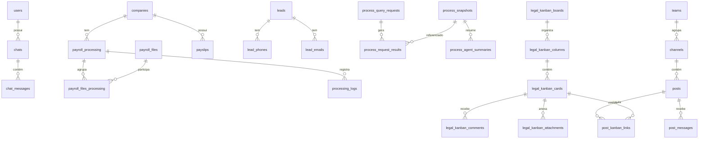
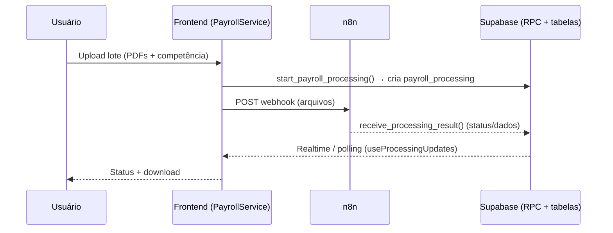
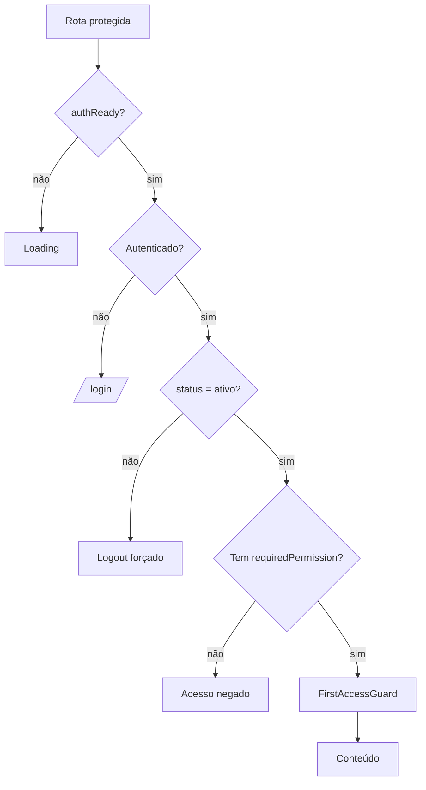
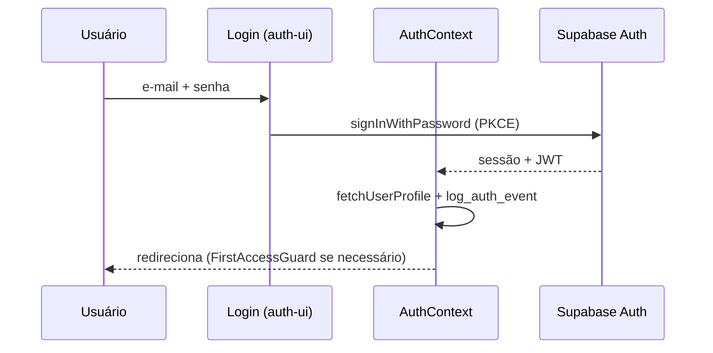
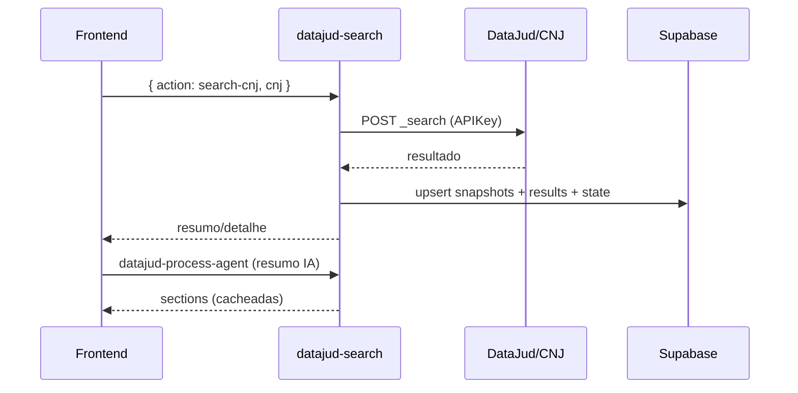
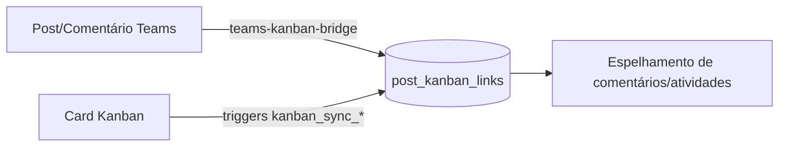

# Documentação Final Técnica — E7 AI Center

> **Público-alvo:** equipe de desenvolvimento e manutenção.
> **Data de geração:** 24/06/2026
> **Versão da aplicação:** `0.0.0` (conforme `package.json`)
> **Fonte:** análise automatizada do código-fonte, migrations Supabase e Edge Functions.

> ⚠️ Esta documentação descreve **apenas o que existe no código** no momento da análise. Itens não confirmados estão explicitamente marcados como "não identificado" ou "stub".

---

## Sumário

1. [Visão geral da arquitetura](#1-visão-geral-da-arquitetura)
2. [Tecnologias utilizadas](#2-tecnologias-utilizadas)
3. [Estrutura do projeto](#3-estrutura-do-projeto)
4. [Banco de dados](#4-banco-de-dados)
5. [APIs e Edge Functions](#5-apis-e-edge-functions)
6. [n8n e serviços externos](#6-n8n-e-serviços-externos)
7. [Autenticação, autorização e segurança](#7-autenticação-autorização-e-segurança)
8. [Módulos e regras de negócio](#8-módulos-e-regras-de-negócio)
9. [Fluxos internos](#9-fluxos-internos)
10. [Componentes, hooks, contextos, serviços e utilitários](#10-componentes-hooks-contextos-serviços-e-utilitários)
11. [Configuração, variáveis de ambiente, build e deploy](#11-configuração-variáveis-de-ambiente-build-e-deploy)
12. [Boas práticas adotadas](#12-boas-práticas-adotadas)
13. [Pontos de atenção e inconsistências](#13-pontos-de-atenção-e-inconsistências)
14. [Melhorias futuras](#14-melhorias-futuras)

---

## 1. Visão geral da arquitetura

O **E7 AI Center** é uma **Single Page Application (SPA)** em **React 18 + TypeScript**, empacotada com **Vite 5**, voltada a **escritórios de advocacia e contabilidade**. Combina assistentes de IA, automações jurídicas/contábeis, gestão documental, consulta processual, quadros Kanban, comunicação em equipe (estilo Slack/Teams) e CRM de leads.

O backend é integralmente **Supabase** (PostgreSQL + Auth + Realtime + Storage + Edge Functions em Deno), complementado por **webhooks n8n** (orquestração de agentes de IA e processamento de documentos), pela **API pública DataJud/CNJ** (consulta processual) e por provedores de **LLM** (OpenAI, Google Gemini, Anthropic) acessados exclusivamente via Edge Functions.



**Padrões arquiteturais empregados:**

| Padrão | Onde se aplica |
|--------|----------------|
| **Feature-based folders** | `src/features/*` (cada domínio com `components/`, `hooks/`, `services/`, `pages/`, `types.ts`, `utils/`) |
| **Service Layer** | Classes/objetos estáticos em `src/services/*` e `*/services/*Service.ts` encapsulam acesso a dados |
| **Adapter** | `processProvider.ts` desacopla a UI do formato da API processual |
| **Provider/Context** | `AuthContext`, `ThemeProvider`, `KanbanModuleProvider` |
| **Backend-for-Frontend** | Edge Functions concentram operações sensíveis (admin, LLM, e-mail, bridges) |
| **Server-state cache** | TanStack Query (stale 5 min, gc 10 min) |
| **RBAC** | `hasPermission()` + `ProtectedRoute` + RLS no banco |
| **Timeout wrapper** | `withTimeout()` em chamadas Supabase/HTTP |

---

## 2. Tecnologias utilizadas

| Camada | Tecnologias | Motivo |
|--------|-------------|--------|
| Build/bundler | **Vite 5**, `@vitejs/plugin-react-swc` | Dev server rápido, HMR, build otimizado com hash de cache |
| Linguagem | **TypeScript 5.8** (strictness relaxada) | Tipagem com `noImplicitAny:false` e `strictNullChecks:false` |
| UI | **React 18.3**, **react-router-dom 6.30** | SPA com roteamento declarativo |
| Estilo | **Tailwind CSS 3.4**, `tailwindcss-animate`, `@tailwindcss/typography` | Utility-first + tipografia para conteúdo rich text |
| Componentes | **shadcn/ui** sobre **Radix UI** | Acessibilidade e composição |
| Estado de servidor | **TanStack React Query 5** | Cache, revalidação, retries exponenciais |
| Formulários | **react-hook-form 7**, **Zod 3**, `@hookform/resolvers` | Validação declarativa |
| Rich text | **TipTap 3** (+ extensões: image, link, highlight, task-list, text-align, underline…) | Editores de cards Kanban e posts Teams |
| Drag & drop | **@dnd-kit/core, sortable, utilities** | Reordenação de colunas/cards Kanban |
| Virtualização | **@tanstack/react-virtual** | Listas longas (colunas/cards) |
| Gráficos | **recharts** | Dashboard |
| Tema | **next-themes** | Dark/Light mode |
| Toasts | **sonner** + shadcn toaster | Feedback ao usuário |
| Datas | **date-fns 3** | Formatação/cálculos |
| Auth UI | `@supabase/auth-ui-react` | Tela de login |
| Cliente backend | `@supabase/supabase-js 2` | Acesso a Auth/DB/Realtime/Storage/Functions |

---

## 3. Estrutura do projeto

```text
app-e7aicenter/
├── src/
│   ├── App.tsx                # Rotas, QueryClient, Providers
│   ├── main.tsx               # Bootstrap React
│   ├── components/
│   │   ├── layout/            # AppLayout, AppSidebar, TeamsSecondarySidebar
│   │   ├── assistants/        # ChatMessage, ModelSelector, ChatSidebar
│   │   ├── payroll/           # PayrollProcessingDetails, uploaders
│   │   ├── ProtectedRoute.tsx # Guarda de rota + permissão
│   │   ├── FirstAccessGuard.tsx
│   │   └── ui/                # shadcn/ui (Radix)
│   ├── config/
│   │   └── aiAgents.ts        # 11 temas, 52 agentes n8n
│   ├── contexts/
│   │   └── AuthContext.tsx    # Sessão, RBAC, first access, inatividade
│   ├── features/             # Módulos de domínio (ver §8)
│   │   ├── leads/
│   │   ├── legal-kanban/
│   │   ├── operational-kanban/
│   │   ├── kanban-shared/
│   │   ├── processes/
│   │   ├── teams/
│   │   ├── profile/
│   │   ├── payroll/
│   │   └── theme/
│   ├── hooks/                # useChatHistory, usePermissions, useProcessingUpdates, use-mobile
│   ├── lib/                  # supabase.ts (PKCE, proxy anti-service-role), utils
│   ├── pages/                # Páginas roteáveis (assistants, documents, admin, leads)
│   └── services/             # Service layer global
├── shared/types/             # Tipos compartilhados (payroll, company, sped)
├── supabase/
│   ├── functions/            # 13 Edge Functions (Deno)
│   └── migrations/           # 112 migrations versionadas
├── docs/                     # Notas datadas + docs de API (DataJud, Judit legado, Uazapi)
├── vite.config.ts
├── package.json
└── CLAUDE.md / README.md
```

**Aliases (`vite.config.ts` / `tsconfig`):** `@/*` → `src/*` · `~shared/*` → `shared/*`.
**Dev server:** host `::`, porta **8081**.

---

## 4. Banco de dados

Backend PostgreSQL gerenciado pelo Supabase, com **RLS habilitada em quase todas as tabelas**, **112 migrations** versionadas em `supabase/migrations/`, **~76 funções** PL/pgSQL, **dezenas de triggers** e **0 views**.

> ⚠️ **Observação importante:** a tabela `public.sync_event_ledger` está com **RLS DESABILITADA** — ver §13.

### 4.1 Domínios e principais tabelas

#### Identidade e auditoria
| Tabela | Propósito | Linhas* |
|--------|-----------|---------|
| `users` | Perfil de usuário (espelho de `auth.users`), `role`, `status`, `first_access_*`, `last_access` | 33 |
| `audit_logs` | Trilha de auditoria de eventos de autenticação/sincronização | 2.160 |
| `companies` | Empresas clientes (CNPJ único, `payslips_count`, `status`) | 53 |

#### Folha de pagamento (Holerites)
| Tabela | Propósito |
|--------|-----------|
| `payroll_processing` | Controle principal de processamento de holerites via IA |
| `payroll_files` | Arquivos de holerites processados |
| `payroll_files_processing` | Relacionamento N:N arquivos ↔ processamento |
| `processing_logs` | Logs detalhados de cada processamento |
| `payslips` | Holerites individuais (atualiza `companies.payslips_count` via trigger) |
| `rubric_patterns` | Padrões de rubricas para mapeamento inteligente |
| `extracted_rubrics` | Rubricas extraídas dos PDFs |

#### SPED
| Tabela | Propósito |
|--------|-----------|
| `sped_processing` | Controle de processamento SPED |
| `sped_files` | Arquivos SPED |
| `sped_files_processing` | Relacionamento N:N |

#### Assistentes de IA (chats)
| Tabela | Propósito |
|--------|-----------|
| `chats` | Conversas (`assistant_type`, `llm_model`, `is_favorite`) |
| `chat_messages` | Mensagens (`role`: user/assistant/system, `metadata`) |
| `rag_documents` | Documentos RAG (atualmente sem registros) |

#### Leads (CRM)
| Tabela | Propósito |
|--------|-----------|
| `leads` | Leads (cliente/parceiro), dados empresariais |
| `lead_phones`, `lead_emails` | Contatos múltiplos (flag `is_primary`) |
| `message_template_categories`, `message_templates`, `message_template_placeholders` | Modelos de mensagem (legado — ver §13) |

#### Processos (DataJud/CNJ)
| Tabela | Propósito |
|--------|-----------|
| `process_query_requests` | Histórico de buscas processuais |
| `process_snapshots` | Cache de dados processuais (por CNJ; hash de versão) |
| `process_request_results` | Ligação request → snapshot |
| `process_user_state` | Estado por usuário (favorito, exclusão lógica) |
| `process_agent_summaries` | Cache de resumos gerados por IA |

#### Kanban (jurídico + operacional, mesmas tabelas via coluna `domain`)
| Tabela | Propósito |
|--------|-----------|
| `legal_kanban_boards` | Quadros (coluna **`domain`** = `legal` \| `operational`) |
| `legal_kanban_columns` | Colunas do quadro |
| `legal_kanban_cards` | Cards (prioridade, status, datas, rich text) |
| `legal_kanban_labels`, `legal_kanban_card_labels` | Etiquetas e associação a cards |
| `legal_kanban_card_members` | Membros atribuídos ao card |
| `legal_kanban_comments`, `legal_kanban_comment_mentions` | Comentários e menções |
| `legal_kanban_attachments` | Anexos |
| `legal_kanban_checklists`, `legal_kanban_checklist_items` | Checklists |
| `legal_kanban_custom_fields`, `legal_kanban_card_custom_field_values` | Campos personalizados |
| `legal_kanban_board_members`, `legal_kanban_board_favorites` | Membros e favoritos do quadro |
| `legal_kanban_activities` | Histórico/atividades do quadro |
| `kanban_card_links` | Compartilhamento de card entre quadros/domínios |

#### Teams (comunicação)
| Tabela | Propósito |
|--------|-----------|
| `teams`, `team_members`, `team_activities` | Equipes, membros (owner/admin/member), atividades |
| `channels`, `channel_members`, `channel_read_state` | Canais, membros, estado de leitura |
| `posts`, `post_attachments`, `post_mentions`, `post_favorites`, `post_read_state`, `post_activities` | Postagens e relacionados |
| `post_messages`, `message_attachments`, `message_reactions`, `message_mentions`, `message_favorites` | Comentários/mensagens e relacionados |
| `notifications` | Notificações ao usuário |
| `post_kanban_links` | Vínculo bidirecional post ↔ card Kanban |
| `sync_event_ledger` | Ledger de eventos de sincronização (⚠️ **sem RLS**) |

\* Contagem de linhas no momento da análise (referência de volume, não estrutural).

### 4.2 Diagrama de relacionamento (núcleo)



### 4.3 Funções relevantes (PL/pgSQL)

| Categoria | Funções |
|-----------|---------|
| **Autenticação / primeiro acesso** | `check_first_access_status`, `complete_first_access`, `create_user_manually`, `handle_new_user` (trigger), `get_users_requiring_first_access`, `log_auth_event`, `diagnose_user_auth_issues`, `sync_user_with_auth`, `sync_existing_auth_users`, `get_user_id_from_auth` |
| **Empresas / payroll / sped** | `validate_cnpj`, `get_payroll_stats`, `get_processing_stats`, `get_sped_processing_stats`, `start_payroll_processing`, `receive_processing_result`, `start_sped_processing`, `receive_sped_processing_result`, `update_company_payslips_count` (trigger) |
| **Chat** | `update_chat_on_message` (trigger) |
| **Kanban — RLS helpers** | `current_legal_kanban_user_id`, `current_legal_kanban_user_role`, `is_legal_kanban_admin`, `is_legal_kanban_member`, `is_legal_kanban_board_manager`, `legal_kanban_board_domain`, `legal_kanban_can_admin_board`, `legal_kanban_can_edit_board`, `legal_kanban_has_board_access`, `legal_kanban_has_operational_access`, `legal_kanban_is_member_of_board`, `legal_kanban_comment_board_id` |
| **Kanban — sincronização (bridges)** | `kanban_link_sync_begin/end/is_active`, `kanban_linked_peer_card_id`, `kanban_ensure_peer_label`, e triggers `kanban_sync_linked_*` (core, members, labels, checklists, comments, attachments) |
| **Teams — RLS helpers** | `teams_current_user_id`, `teams_is_global_admin`, `teams_is_member`, `teams_can_admin`, `teams_role`, `channels_can_read`, `channels_can_admin` |
| **Teams — automações (triggers)** | `auto_join_general_channel`, `bump_post_last_activity`, `notify_post_created`, `notify_post_mention`, `notify_message_mention`, `notify_board_member_added`, `notify_card_member_added`, `notify_legal_kanban_comment_mention`, `prevent_last_owner_removal`, `teams_soft_delete_post`, `teams_sync_kanban_activity_to_post`, `teams_sync_post_activity_to_kanban`, `teams_log_kanban_comment_activity`, `teams_log_post_attachment_activity` |
| **Genéricas** | `update_updated_at_column` (trigger reutilizado em ~25 tabelas), `enforce_users_email_update_permissions` (trigger) |

### 4.4 Triggers em destaque

- **`update_*_updated_at`** — `BEFORE UPDATE` em ~25 tabelas (mantém `updated_at`).
- **`update_chat_on_message_insert`** — `AFTER INSERT` em `chat_messages` (atualiza o chat).
- **`update_payslips_count_insert/delete`** — mantém `companies.payslips_count`.
- **`trg_auto_join_general`** — ao adicionar membro à equipe, entra automaticamente no canal "Geral".
- **`trg_prevent_last_owner`** — `BEFORE DELETE` em `team_members` impede remover o último owner.
- **`trg_notify_*`** — disparam notificações (post criado, menções, membros adicionados).
- **`trg_kanban_sync_linked_*` / `trg_teams_sync_*`** — sincronização bidirecional Kanban ↔ Teams.
- **`trg_enforce_users_email_update_permissions`** — bloqueia troca de e-mail por roles não autorizadas direto na camada de banco.

### 4.5 Fluxo de persistência (exemplo: holerite)



---

## 5. APIs e Edge Functions

Há **13 Edge Functions** (Deno) em `supabase/functions/`. Todas usam CORS aberto e validam sessão Supabase (JWT Bearer) quando aplicável.

```text
admin-create-user      admin-update-user-password   chat-completion
datajud-process-agent  datajud-search               download-file
kanban-card-bridge     profile-update-email         teams-admin-mutate
teams-channel-mutate   teams-kanban-bridge          teams-message-send
teams-search
```

### 5.1 Catálogo

| Função | Método | Objetivo | Integrações | Secrets | Erros |
|--------|--------|----------|-------------|---------|-------|
| `chat-completion` | POST | Chat multi-provedor; persiste mensagens | OpenAI / Gemini / Anthropic | `OPENAI_API_KEY`, `GEMINI_API_KEY`, `ANTHROPIC_API_KEY` | 401/400/500; fallback p/ `gpt-4` |
| `download-file` | GET | Download seguro de arquivo S3 (anti-SSRF, whitelist de bucket) | AWS S3 | — | 400/403/500 |
| `admin-create-user` | POST | Cria usuário (auth + perfil) — admin | Supabase Admin API | `SUPABASE_SERVICE_ROLE_KEY` | 401/403/409 |
| `admin-update-user-password` | POST | Troca senha — admin | Supabase Admin API | `SUPABASE_SERVICE_ROLE_KEY` | 401/403 |
| `profile-update-email` | POST | Atualiza e-mail do próprio usuário — restrito a roles | Supabase Admin API | `SUPABASE_SERVICE_ROLE_KEY` | 401/403 |
| `datajud-search` | POST | Busca processual (actions: `search-cnj`, `advanced-search`, `process-details`, `toggle-favorite`, `delete-process`) | DataJud/CNJ | `DATAJUD_API_KEY`, `DATAJUD_BASE_URL` | 400/401/404/500; retry 429/5xx |
| `datajud-process-agent` | POST | Resumo IA do processo (cache por hash) | OpenAI (`gpt-4o-mini`) | `OPENAI_API_KEY` | 400/500 |
| `teams-admin-mutate` | POST | CRUD de equipes/membros | Supabase | — | RBAC por role |
| `teams-channel-mutate` | POST | CRUD de canais/membros, reordenação | Supabase | — | impede excluir canal "Geral" |
| `teams-message-send` | POST | Envia comentário (sanitização TipTap + menções; rate-limit 30/min) | Supabase | — | 400/429 |
| `teams-search` | POST | Busca full-text (config `portuguese`) | Supabase | — | mín. 2 caracteres |
| `teams-kanban-bridge` | POST | Sincroniza post ↔ card (criar/desvincular/espelhar comentário) | Supabase | — | — |
| `kanban-card-bridge` | POST | Compartilha card entre quadros/domínios | Supabase | — | — |

### 5.2 Exemplo de contrato — `chat-completion`

**Request**
```json
{
  "chatId": "uuid",
  "message": "texto do usuário",
  "assistantType": "tax-law",
  "llmModel": "claude-sonnet-4.5"
}
```
**Response**
```json
{ "content": "resposta", "metadata": { "model": "...", "tokens_used": 0, "finish_reason": "stop" } }
```

> ⚠️ **Sincronização de modelos LLM:** ao adicionar/alterar modelos, manter coerência entre `chatService.ts` (`LLMModel`), `ModelSelector.tsx` (`MODEL_INFO`), a CHECK constraint de `chats.llm_model` e o roteamento em `chat-completion`. Observou-se que o tipo de domínio define `gpt-4 | gpt-4-turbo | gpt-5.2 | gemini-2.5-flash | claude-sonnet-4.5`, enquanto a Edge Function aceita IDs adicionais (ver §13).

### 5.3 Exemplo de contrato — `datajud-search` (`search-cnj`)

```json
{ "action": "search-cnj", "cnj": "0009999-99.9999.8.26.9999" }
```
Persistência: `process_query_requests` (audit) → `process_snapshots` (dados) → `process_request_results` (ligação) → `process_user_state` (favorito/exclusão).

---

## 6. n8n e serviços externos

### 6.1 Biblioteca de IA (n8n) — `n8nAgentService.ts` + `aiAgents.ts`

- **Webhook dinâmico:** `VITE_N8N_WEBHOOK_DINAMICO` roteia para **52 agentes** organizados em **11 temas** (`criacao-pecas-juridicas`, `revisao-pecas-juridicas`, `extracao-dados`, `revisao-melhoria-textos`, `estrategia-caso`, `jurisprudencia`, `atendimento-comunicacao-cliente`, `audiencia-julgamento`, `marketing-juridico-vendas`, `contratos`, `areas-direito`).
- **Payload:** `{ agente, input, arquivo?: { nome, tipo, base64 }, sessionId? }`.
- **Resposta:** `{ output }` (ou `.response`).
- **Resiliência:** timeout 30s, retry 2× com backoff exponencial; tratamento específico para 204/HTML (configuração inválida do workflow).

### 6.2 Processamento de documentos (n8n)

- **Holerites/SPED:** envio de lotes de PDFs via webhook (ex.: `VITE_N8N_WEBHOOK_HOLERITE`), com resultado gravado via RPC (`receive_processing_result` / `receive_sped_processing_result`) e acompanhamento por `useProcessingUpdates`.

### 6.3 DataJud / CNJ (migração de Judit)

A consulta processual foi **migrada de Judit para DataJud** (ver `docs/22-06-2026 - Migracao_Consultas_Processuais_Judit_para_DataJud.md`). A integração Judit permanece como **documentação legada** em `docs/api-judit-docs/` e `docs/docs_old/`. O padrão **adapter** (`processProvider.ts`) mantém a UI desacoplada do formato da API.

### 6.4 LLM providers

| Provedor | Endpoint | Usado em |
|----------|----------|----------|
| OpenAI | `api.openai.com/v1/chat/completions` | `chat-completion`, `datajud-process-agent` (`gpt-4o-mini`) |
| Google Gemini | `generativelanguage.googleapis.com/v1beta/...` | `chat-completion` |
| Anthropic | `api.anthropic.com/v1/messages` | `chat-completion` |

### 6.5 Integrações documentadas mas não ativas no código

- **Uazapi (WhatsApp):** documentação em `docs/Integracao WPP - Uazapi/`; **não identificada** implementação no `src/`.
- **Power BI / Calendário:** mencionados historicamente; o menu de Integrações foi **removido** (ver `docs/22-06-2026 - Remocao_Menu_Integracoes.md`). **Não identificadas** rotas ativas.

---

## 7. Autenticação, autorização e segurança

### 7.1 Autenticação (`AuthContext.tsx`, `lib/supabase.ts`)

- **Fluxo PKCE**, `storageKey: 'e7ai-auth-token'`, `autoRefreshToken`, `persistSession`, `detectSessionInUrl`.
- **Timeout de operações auth:** 30s. **Timeout de inatividade da sessão:** **30 min** (`SESSION_TIMEOUT_MS`), com reset em mousedown/mousemove/keypress/scroll/touchstart/click.
- **Proteção anti–service-role no browser:** `supabaseAdmin` é um `Proxy` que **lança erro** se acessado no frontend.
- **Diagnóstico/sincronização:** `UserSyncService` detecta inconsistências entre `auth.users` e `public.users` e repara (`diagnose_user_auth_issues`, `sync_user_with_auth`).
- **Auditoria:** `log_auth_event` grava eventos (login, logout, first access, reset, sync) em `audit_logs`, com fallback direto caso a RPC falhe.

### 7.2 Autorização / RBAC

Mapa de permissões por role (`AuthContext` + `usePermissions`):

| Role | Permissões |
|------|-----------|
| `administrator` | `admin`, `users`, `companies`, `modules`, `operational_kanban`, `all` |
| `it` | `admin`, `users`, `companies`, `modules`, `operational_kanban`, `all` |
| `advogado_adm` | `admin`, `users`, `companies`, `modules`, `operational_kanban`, `all` |
| `advogado` | `modules`, `companies` |
| `contabil` | `modules`, `companies`, `view_companies`, `add_companies` |
| `financeiro` | `modules` |

Regras transversais:
- `status` do usuário deve ser **`ativo`**.
- **Primeiro acesso** força troca de senha (`FirstAccessGuard` + `firstAccessService`), com validação de complexidade (mín. 8 caracteres, maiúscula/minúscula/número/especial, sem repetição consecutiva).
- Proteção de rotas: `ProtectedRoute` (com `requiredPermission` opcional) → autenticação → status → permissão → `FirstAccessGuard`.



### 7.3 RLS

RLS está **habilitada em 63 das 64 tabelas** do schema `public`. As políticas de Kanban e Teams usam funções `SECURITY DEFINER` auxiliares (ex.: `teams_is_member`, `legal_kanban_has_board_access`) para evitar recursão e centralizar regras.

---

## 8. Módulos e regras de negócio

### 8.1 Assistentes de IA (chats nativos)
- **Rotas:** `/assistants/chat`, `/assistants/tax`, `/assistants/civil`, `/assistants/financial`, `/assistants/accounting`.
- **Backend:** Edge Function `chat-completion` (multi-modelo). **Persistência:** `chats`/`chat_messages` com Realtime (`useChatHistory`).
- **Permissão:** todos os autenticados.

### 8.2 Biblioteca de IA (n8n)
- **Rotas:** `/assistants/library`, `/assistants/library/:themeId`, `/assistants/library/agent/:agentId`.
- **Backend:** webhooks n8n (52 agentes). Suporta anexo (base64) e `sessionId`.
- **Permissão:** todos os autenticados.

### 8.3 Documentos — Holerites
- **Rota:** `/documents/payroll` (+ `/payroll/processing/:processingId`, `/companies/:companyId/payrolls`).
- **Regras:** lote por empresa; competência `MM/AAAA` obrigatória; limite de arquivos por lote; processamento assíncrono via n8n; acompanhamento em tempo real; histórico filtrável.

### 8.4 Documentos — SPED
- **Rota:** `/documents/sped`. Padrão análogo ao de holerites (validação de competência, upload em lote, webhook, histórico).

### 8.5 Processos (DataJud)
- **Rotas:** `/documents/cases`, `/documents/cases/queries`, `/documents/cases/:caseId`.
- **Funcionalidades:** busca por CNJ, busca avançada (tribunal/classe/assunto/grau/datas), favoritos, exclusão lógica, resumo por IA (`datajud-process-agent`), movimentações.
- **Regra:** apenas dados públicos do DataJud (sem partes/advogados/valor da causa).

### 8.6 Kanban Jurídico
- **Rotas:** `/documents/cases/quadros`, `/documents/cases/quadros/:boardSlug` (via `KanbanModuleProvider domain="legal"`).
- **Funcionalidades:** múltiplos quadros, colunas, cards com rich text, prioridade/status, membros, labels, checklists, anexos, comentários com menção, campos personalizados, filtros, drag-and-drop, favoritos, bridge com Teams.
- **Permissão:** acesso por `domain` + `accessLevel` (viewer/editor/admin) via RLS; gestão por roles admin.

### 8.7 Gestão Operacional (Kanban operacional)
- **Rotas:** `/gestao-operacional/quadros`, `/gestao-operacional/quadros/:boardSlug`.
- **Permissão:** `requiredPermission="operational_kanban"`.
- **Implementação:** mesmas tabelas `legal_kanban_*` com `domain='operational'`; pode compartilhar cards com o jurídico (`kanban-card-bridge`).

### 8.8 Teams (comunicação)
- **Rotas:** `/teams`, `/teams/favorites`, `/teams/:teamSlug/:channelSlug`, `/teams/:teamSlug/:channelSlug/:postId`; admin em `/admin/teams` e `/admin/teams/:teamId`.
- **Funcionalidades:** equipes/canais, posts e comentários (rich text), reações, menções, favoritos, anexos, busca full-text PT-BR, notificações em tempo real, bridge com Kanban.
- **Regras:** canal "Geral" obrigatório e indestrutível; último owner não pode ser removido; soft-delete de posts/mensagens.

### 8.9 Leads (CRM)
- **Rota:** `/leads`.
- **Funcionalidades:** CRUD de leads (cliente/parceiro), múltiplos telefones/e-mails (1 primário), import/export CSV, ativação/desativação.
- **Observação:** módulo de **templates de mensagem foi removido** da UI (ver §13).

### 8.10 Perfil
- **Rota:** `/perfil`. Edição de nome/telefone, avatar (≤5MB, jpg/png/webp), troca de senha. E-mail editável apenas por roles admin (via `profile-update-email` + trigger de banco).

### 8.11 Admin / Empresas / Dashboard
- **Admin de usuários:** `/admin`, `/admin/users` (`requiredPermission="admin"`) — CRUD via Edge Functions.
- **Empresas:** `/companies` (`requiredPermission="companies"`) — CRUD com validação de CNPJ.
- **Dashboard:** `/` — métricas (conversas IA, documentos, processos, usuários/empresas) via `dashboardService` e `processesService`.

---

## 9. Fluxos internos

### 9.1 Login



### 9.2 Consulta processual (DataJud)



### 9.3 Sincronização Teams ↔ Kanban



---

## 10. Componentes, hooks, contextos, serviços e utilitários

### 10.1 Contextos
- **`AuthContext`** — sessão, RBAC (`hasPermission`), first access, inatividade, refresh de perfil/sessão.
- **`ThemeProvider`** (next-themes) — dark/light (default light, sem preferência do SO).
- **`KanbanModuleProvider`** — injeta config por `domain` (rotas, query keys, colunas padrão).

### 10.2 Hooks globais (`src/hooks`)
| Hook | Função |
|------|--------|
| `usePermissions` | Flags derivadas de role (admin, manageUsers, companies…) |
| `useChatHistory` | Histórico de chats com Supabase + Realtime + dedupe |
| `useProcessingUpdates` | Polling + Realtime de processamentos (payroll/sped), cancelar/reprocessar |
| `use-mobile` | Detecção de viewport mobile (<768px) |

### 10.3 Serviços globais (`src/services`)
`chatService`, `companyService`, `payrollService`, `spedService`, `userService`, `firstAccessService`, `userSyncService`, `n8nAgentService`, `llmService`, `dashboardService`. Padrão comum: classes estáticas + `withTimeout` (15s default; 10s em RPC de payroll; 5s em logs; 30s em n8n).

### 10.4 Serviços por feature
`leadsService`, `legalKanbanService`, `processesService` (+ `processProvider`), `teams/*Service` (`teamService`, `postService`, `messageService`, `searchService`, `attachmentService`, `kanbanBridgeService`, `linkedActivityService`), `profileService`, `kanbanCardBridgeService`.

### 10.5 Utilitários
- `lib/utils.ts` (`cn`, helpers).
- `features/leads/utils` (`csv.ts`, `masks.ts`).
- `features/payroll/utils/holeriteWebhook.ts` (`isValidCompetencia`, `sortCompetencias`).
- `features/legal-kanban/utils.ts` (datas, normalização de rich text).

---

## 11. Configuração, variáveis de ambiente, build e deploy

### 11.1 Variáveis de ambiente

**Frontend (`.env`, prefixo `VITE_`):**
```bash
VITE_SUPABASE_URL=...
VITE_SUPABASE_ANON_KEY=...
VITE_N8N_WEBHOOK_DINAMICO=...
# VITE_N8N_WEBHOOK_HOLERITE=...   # opcional
```

**Edge Functions (Supabase secrets):**
```bash
SUPABASE_SERVICE_ROLE_KEY=...   # nunca no frontend
OPENAI_API_KEY=...
GEMINI_API_KEY=...
ANTHROPIC_API_KEY=...
DATAJUD_API_KEY=...
# DATAJUD_BASE_URL=https://api-publica.datajud.cnj.jus.br  # opcional
```

### 11.2 Scripts

```bash
npm install       # dependências
npm run dev       # Vite dev server (porta 8081)
npm run build     # build produção
npm run build:dev # build modo desenvolvimento
npm run lint      # ESLint
npm run preview   # preview do build
```

### 11.3 Build & Deploy
- **Build:** Vite + esbuild minify, `cssCodeSplit`, hashing de assets (`[name]-[hash]`), sourcemaps **desabilitados** em produção.
- **Deploy do frontend:** artefato estático (pasta `dist/`) servível em qualquer host estático/CDN.
- **Edge Functions:** deploy via Supabase CLI / MCP (Deno).
- **Migrations:** versionadas em `supabase/migrations/` — aplicar em ordem.

---

## 12. Boas práticas adotadas

- ✅ Organização **feature-based** com separação de responsabilidades.
- ✅ **Service layer** com `withTimeout` consistente.
- ✅ **PKCE** + proteção anti–service-role no browser.
- ✅ **RBAC** em três camadas (UI, rota, RLS).
- ✅ **Auditoria** de eventos de autenticação.
- ✅ **Soft-delete** em Teams; **histórico/atividades** em Kanban e Teams.
- ✅ **Realtime** para chats e processamentos.
- ✅ Sanitização de rich text e **rate-limiting** em `teams-message-send`.
- ✅ Build com **cache busting** e code splitting.

---

## 13. Pontos de atenção e inconsistências

> Itens identificados durante a análise — recomenda-se triagem.

### 13.1 Segurança (advisors do Supabase)
A varredura retornou **171 alertas** (todos WARN, exceto 1 ERROR):

| Severidade | Alerta | Qtd. | Ação sugerida |
|------------|--------|------|---------------|
| 🔴 ERROR | `rls_disabled_in_public` — **`sync_event_ledger` sem RLS** | 1 | Avaliar habilitar RLS **com políticas** (não habilitar sem política, pois bloquearia acesso). SQL: `ALTER TABLE public.sync_event_ledger ENABLE ROW LEVEL SECURITY;` + políticas adequadas |
| 🟡 WARN | `anon/authenticated_security_definer_function_executable` | 132 | Revisar `EXECUTE` concedido a `anon`/`authenticated` em funções `SECURITY DEFINER` |
| 🟡 WARN | `function_search_path_mutable` | 27 | Definir `search_path` fixo nas funções |
| 🟡 WARN | `rls_policy_always_true` | 6 | Políticas que sempre retornam `true` — revisar |
| 🟡 WARN | `public_bucket_allows_listing` | 3 | Buckets públicos permitindo listagem |
| 🟡 WARN | `auth_leaked_password_protection` | 1 | Ativar proteção contra senhas vazadas no Supabase Auth |
| 🟡 WARN | `auth_insufficient_mfa_options` | 1 | Habilitar mais opções de MFA |

> Referência de remediação: `https://supabase.com/docs/guides/database/database-linter`.

### 13.2 Código / consistência
- **Modelos LLM divergentes:** o tipo `LLMModel` (`gpt-4 | gpt-4-turbo | gpt-5.2 | gemini-2.5-flash | claude-sonnet-4.5`) e os IDs aceitos na Edge Function `chat-completion` (que cita também `gemini-pro`, `claude-3-opus`, `claude-3-5-sonnet`) **não estão totalmente alinhados**. Padronizar nos 4 pontos descritos em §5.2.
- **Migrations com forte ruído histórico:** dezenas de migrations de "fix" repetidas para `log_auth_event`/RLS (ex.: vários `*ultimate_log_auth_event_fix*`, `*final_pgrst202_solution*`). Funciona, mas dificulta leitura — considerar consolidação/squash em ambiente controlado.
- **Funcionalidades removidas com resíduos no banco:** templates de mensagem de Leads foram removidos da UI (`docs/23_06_2026 - Remocao_Mensagens_Templates_Leads.md`), mas as tabelas `message_template*` permanecem. Avaliar limpeza.
- **Integração Judit legada:** código/edge functions migrados para DataJud; restam secrets/migrations e docs legados (`docs/api-judit-docs/`, `docs/docs_old/`). Confirmar remoção de secrets Judit.
- **Integrações documentadas sem implementação:** Uazapi (WhatsApp) e Power BI/Calendário — documentadas, porém **sem rotas ativas** após a remoção do menu de integrações.
- **Página `/documents/reports`:** Reports identificada como placeholder (sem implementação efetiva).
- **Páginas de teste expostas:** `/test` e `/test/payroll-workflow` acessíveis a qualquer autenticado — remover/proteger em produção.
- **`rag_documents` e `extracted_rubrics` vazias:** estruturas presentes sem uso atual (possível feature incompleta de RAG/rubricas).

### 13.3 Tipagem
- `strictNullChecks:false` e `noImplicitAny:false` — refatorações devem considerar a ausência de checagem estrita de null.

---

## 14. Melhorias futuras

1. **Resolver os alertas de segurança** (prioridade: RLS em `sync_event_ledger`, `search_path` das funções, revisão de `EXECUTE` em funções `SECURITY DEFINER`, listagem de buckets públicos, MFA e proteção de senha vazada).
2. **Padronizar a matriz de modelos LLM** entre tipos, seletor, constraint e Edge Function.
3. **Consolidar migrations** (squash do histórico de fixes) em ambiente controlado.
4. **Limpeza de código morto:** templates de leads, secrets/migrations Judit, páginas de teste.
5. **Testes automatizados:** não foi identificada suíte de testes (unit/e2e) — introduzir cobertura mínima nos serviços críticos.
6. **Concluir ou remover** features inacabadas (RAG/`rag_documents`, rubricas, Reports).
7. **Observabilidade:** centralizar logs de Edge Functions e métricas de uso de IA/n8n.
8. **Documentar formalmente** os contratos n8n (payload/resposta por agente) — hoje dispersos em `aiAgents.ts`.

---

*Documento gerado automaticamente a partir da análise do código-fonte, migrations e Edge Functions do repositório `app-e7aicenter` em 24/06/2026.*
