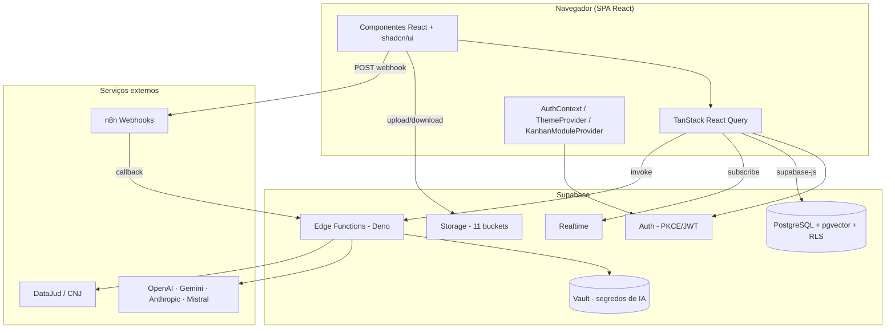
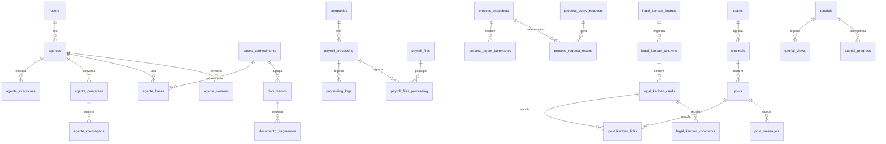
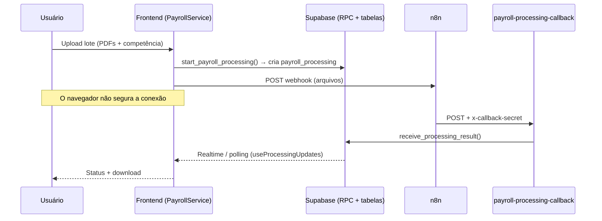
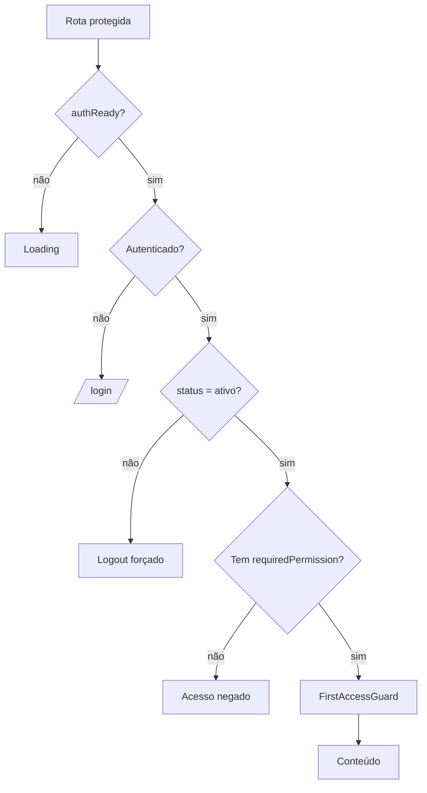
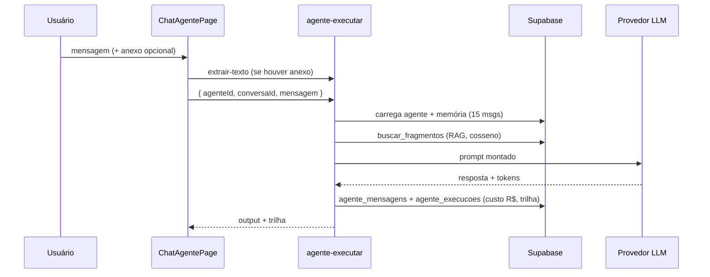
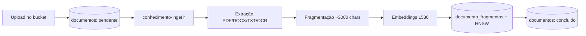
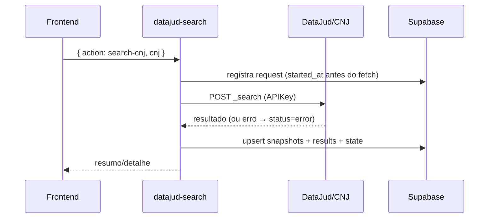
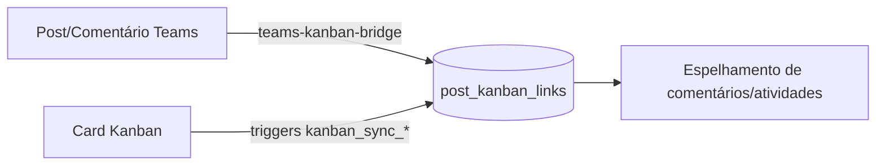

# Documentação Final Técnica — E7 AI Center

> **Público-alvo:** equipe de desenvolvimento e manutenção.
> **Data de geração:** 14/08/2026 · **Última atualização:** 16/08/2026 (revisão de segurança, código morto e pontos de atenção — ver [docs/16-08-2026 - Revisao_Seguranca_Codigo_Morto_Secoes_13_14.md](16-08-2026%20-%20Revisao_Seguranca_Codigo_Morto_Secoes_13_14.md))
> **Versão da aplicação:** `0.0.0` (conforme `package.json`)
> **Fonte:** análise do código-fonte, migrations Supabase, Edge Functions e inspeção do banco remoto (MCP Supabase).

> ⚠️ Esta documentação descreve **apenas o que existe no código/banco** no momento da análise. Itens não confirmados estão explicitamente marcados como "não identificado" ou "legado".

---

## Sumário

1. [Visão geral da arquitetura](#1-visão-geral-da-arquitetura)
2. [Tecnologias utilizadas](#2-tecnologias-utilizadas)
3. [Estrutura do projeto](#3-estrutura-do-projeto)
4. [Banco de dados](#4-banco-de-dados)
5. [APIs e Edge Functions](#5-apis-e-edge-functions)
6. [n8n e serviços externos](#6-n8n-e-serviços-externos)
7. [Autenticação, autorização e segurança](#7-autenticação-autorização-e-segurança)
8. [Módulos e regras de negócio](#8-módulos-e-regras-de-negócio)
9. [Fluxos internos](#9-fluxos-internos)
10. [Componentes, hooks, contextos, serviços e utilitários](#10-componentes-hooks-contextos-serviços-e-utilitários)
11. [Configuração, variáveis de ambiente, build e deploy](#11-configuração-variáveis-de-ambiente-build-e-deploy)
12. [Boas práticas adotadas](#12-boas-práticas-adotadas)
13. [Pontos de atenção e inconsistências](#13-pontos-de-atenção-e-inconsistências)
14. [Melhorias futuras](#14-melhorias-futuras)

---

## 1. Visão geral da arquitetura

O **E7 AI Center** é uma **Single Page Application (SPA)** em **React 18 + TypeScript**, empacotada com **Vite 5**, voltada a **escritórios de advocacia e contabilidade**. Combina uma plataforma própria de **criação e execução de agentes de IA com RAG** (AI Center E7), automações documentais, consulta processual, quadros Kanban (jurídico e operacional), comunicação em equipe, hub de relatórios, videoteca de tutoriais e CRM de leads.

O backend é integralmente **Supabase** (PostgreSQL + pgvector + Auth + Realtime + Storage + Edge Functions em Deno), complementado por **webhooks n8n** (processamento de holerites e SPED), pela **API pública DataJud/CNJ** (consulta processual) e por provedores de **LLM** (OpenAI, Google Gemini, Anthropic, Mistral para OCR) acessados exclusivamente via Edge Functions, com as chaves guardadas no **Supabase Vault**.


```mermaid
flowchart TB
    subgraph Cliente["Navegador (SPA React)"]
        UI[Componentes React + shadcn/ui]
        RQ[TanStack React Query]
        Ctx[AuthContext / ThemeProvider / KanbanModuleProvider]
    end

    subgraph Supabase["Supabase"]
        Auth[Auth - PKCE/JWT]
        DB[(PostgreSQL + pgvector + RLS)]
        RT[Realtime]
        ST[Storage - 11 buckets]
        VA[(Vault - segredos de IA)]
        EF[Edge Functions - Deno]
    end

    subgraph Externos["Serviços externos"]
        N8N[n8n Webhooks]
        DJ[DataJud / CNJ]
        LLM[OpenAI · Gemini · Anthropic · Mistral]
    end

    UI --> RQ --> Auth
    RQ -->|supabase-js| DB
    RQ -->|subscribe| RT
    UI -->|upload/download| ST
    RQ -->|invoke| EF
    UI -->|POST webhook| N8N
    N8N -->|callback| EF
    EF --> VA
    EF --> LLM & DJ
    Ctx --> Auth
```

**Padrões arquiteturais empregados:**

| Padrão | Onde se aplica |
|--------|----------------|
| **Feature-based folders** | `src/features/*` (13 módulos, cada um com `components/`, `hooks/`, `services/`, `pages/`, `types.ts`, `utils/`) |
| **Service Layer** | Classes/objetos estáticos em `src/services/*` e `*/services/*Service.ts` |
| **Adapter** | `processProvider.ts` desacopla a UI do formato da API processual |
| **Interpretador declarativo** | `agente-executar` lê o grafo do agente (`agentes.grafo`) e monta o pipeline em runtime |
| **Provider/Context** | `AuthContext`, `ThemeProvider`, `KanbanModuleProvider` |
| **Backend-for-Frontend** | Edge Functions concentram operações sensíveis (admin, LLM, Vault, bridges) |
| **Server-state cache** | TanStack Query (stale 5 min, gc 10 min) |
| **RBAC** | `hasPermission()` + `ProtectedRoute` + RLS no banco |
| **Timeout wrapper** | `withTimeout()` em chamadas Supabase/HTTP |
| **Code splitting** | `React.lazy` nas rotas de AI Center E7 e Tutoriais (mantém React Flow e Video.js fora do bundle inicial) |

---

## 2. Tecnologias utilizadas

| Camada | Tecnologias | Motivo |
|--------|-------------|--------|
| Build/bundler | **Vite 5**, `@vitejs/plugin-react-swc` | Dev server rápido, HMR, build com hash de cache |
| Linguagem | **TypeScript 5.8** (strictness relaxada) | `noImplicitAny:false`, `strictNullChecks:false` |
| UI | **React 18.3**, **react-router-dom 6.30** | SPA com roteamento declarativo |
| Estilo | **Tailwind CSS 3.4**, `tailwindcss-animate`, `@tailwindcss/typography` | Utility-first + tipografia para rich text |
| Componentes | **shadcn/ui** sobre **Radix UI** | Acessibilidade e composição |
| Estado de servidor | **TanStack React Query 5** | Cache, revalidação, retries exponenciais |
| Tabelas | **@tanstack/react-table 8** | Data table da administração de tutoriais |
| Formulários | **react-hook-form 7**, **Zod 3** | Validação declarativa |
| Rich text | **TipTap 3** (+ extensões) | Cards Kanban e posts Teams |
| Editor de fluxo | **@xyflow/react 12** (React Flow) | Construtor visual de agentes (AI Center E7) |
| Vídeo | **video.js 8**, **tus-js-client** | Player de tutoriais e upload resumível |
| Planilhas | **xlsx** | Exportação de relatórios e leads |
| Drag & drop | **@dnd-kit** | Reordenação de colunas/cards Kanban |
| Virtualização | **@tanstack/react-virtual** | Listas longas |
| Gráficos | **recharts** | Dashboard e hub de relatórios |
| Animação | **framer-motion** | Transições de interface |
| Tema | **next-themes** | Dark/Light mode |
| Toasts | **sonner** + shadcn toaster | Feedback ao usuário |
| Datas | **date-fns 3** | Formatação/cálculos |
| Auth UI | `@supabase/auth-ui-react` | Tela de login |
| Cliente backend | `@supabase/supabase-js 2` | Auth/DB/Realtime/Storage/Functions |
| Testes | **vitest 2** (`npm test`) | Suíte pontual (cobertura ainda reduzida) |

---

## 3. Estrutura do projeto

```text
app-e7aicenter/
├── src/
│   ├── App.tsx                # Rotas, QueryClient, Providers, React.lazy
│   ├── main.tsx               # Bootstrap React
│   ├── components/
│   │   ├── layout/            # AppLayout, AppSidebar, TeamsSecondarySidebar
│   │   ├── assistants/        # ChatMessage, MarkdownContent, ModelSelector, ChatSidebar
│   │   ├── payroll/           # PayrollProcessingDetails, uploaders
│   │   ├── ProtectedRoute.tsx # Guarda de rota + permissão
│   │   ├── FirstAccessGuard.tsx
│   │   └── ui/                # shadcn/ui (Radix)
│   ├── config/
│   │   ├── llmModels.ts       # Catálogo único de modelos LLM (14 modelos)
│   │   └── aiAgents.ts        # 11 temas, 52 agentes n8n (biblioteca legada)
│   ├── contexts/
│   │   └── AuthContext.tsx    # Sessão, RBAC, first access, inatividade
│   ├── features/              # 13 módulos de domínio (ver §8)
│   │   ├── ai-center-e7/      # Agentes, RAG, construtor visual
│   │   ├── tutorials/         # Videoteca + admin
│   │   ├── reports/           # Hub de relatórios (4 abas)
│   │   ├── system-settings/   # Configurações do sistema
│   │   ├── legal-kanban/  operational-kanban/  kanban-shared/
│   │   ├── processes/  teams/  leads/  profile/  payroll/  theme/
│   ├── hooks/                 # useChatHistory, usePermissions, useProcessingUpdates, use-mobile
│   ├── lib/                   # supabase.ts (PKCE, proxy anti-service-role), utils
│   ├── pages/                 # Páginas roteáveis (assistants, documents, admin, leads)
│   └── services/              # Service layer global
├── shared/types/              # Tipos compartilhados (payroll, company, sped)
├── supabase/
│   ├── functions/             # 19 Edge Functions (Deno) + _shared/llm.ts
│   └── migrations/            # 116 migrations versionadas + 15 scripts de fix legados
├── docs/                      # Notas datadas + docs de API (DataJud; Judit/Uazapi legados)
├── vite.config.ts
├── package.json
└── CLAUDE.md / README.md
```

**Aliases:** `@/*` → `src/*` · `~shared/*` → `shared/*`.
**Dev server:** host `::`, porta **8081**.

---

## 4. Banco de dados

PostgreSQL gerenciado pelo Supabase, com extensão **pgvector** habilitada (RAG do AI Center E7).

| Métrica | Valor (16/08/2026) |
|---------|--------------------|
| Tabelas no schema `public` | **85** |
| Tabelas com RLS habilitada | **85** (100%) |
| Funções próprias (fora de extensões) | **109** |
| Triggers (não internos) | **84** |
| Views | **0** |
| Migrations versionadas | **116** (+15 scripts avulsos de fix) |
| Buckets de Storage | **11** |

> ✅ Todas as tabelas do schema `public` têm RLS habilitada. Revisão de acesso (grants de `EXECUTE`) concluída em 16/08/2026 — ver §12.

### 4.1 Domínios e principais tabelas

#### Identidade e auditoria
| Tabela | Propósito | Linhas* |
|--------|-----------|---------|
| `users` | Perfil (espelho de `auth.users`), `role`, `status`, `first_access_*`, `last_access` | 37 |
| `audit_logs` | Trilha de eventos de autenticação/sincronização | 2.924 |
| `companies` | Empresas clientes (CNPJ único, `payslips_count`, `status`) | 54 |

#### AI Center E7 (agentes próprios + RAG)
| Tabela | Propósito |
|--------|-----------|
| `agentes` | Agentes criados pelo usuário. `grafo` = spec declarativa (React Flow); `config` = spec compilada; status rascunho/publicado/escritório |
| `agente_versoes` | Snapshot do grafo/config a cada publicação |
| `bases_conhecimento` | Bases de RAG que agrupam documentos |
| `documentos` | Arquivos enviados a uma base (status pendente→processando→concluido/erro) |
| `documento_fragmentos` | Chunks vetorizados — `embedding vector(1536)`, índice **HNSW** |
| `agente_bases` | Vínculo N:N agente ↔ base de conhecimento |
| `agente_conversas`, `agente_mensagens` | Threads e memória persistente do agente |
| `agente_execucoes` | Tokens, custo estimado em R$, modelo, origem e trilha do pipeline |
| `precos_modelos` | Preço por 1k tokens + câmbio, para estimar custo em R$ |
| `configuracoes_ia` | Prompts de sistema editáveis dos agentes utilitários |
| `agente_projetos`, `agente_favoritos`, `agente_arquivados` | Organização da galeria |

#### Folha de pagamento (Holerites)
| Tabela | Propósito |
|--------|-----------|
| `payroll_processing` | Controle principal do processamento |
| `payroll_files`, `payroll_files_processing` | Arquivos e relacionamento N:N |
| `processing_logs` | Logs detalhados por processamento |
| `payslips` | Holerites individuais (atualiza `companies.payslips_count` via trigger) |
| `rubric_patterns` | Padrões de rubricas |

#### SPED
`sped_processing`, `sped_files`, `sped_files_processing`.

#### Assistentes legados (chats fixos)
`chats`, `chat_messages` (fora da navegação — ver §8.10).

#### Leads (CRM)
`leads`, `lead_phones`, `lead_emails`, `message_template_*` (sem UI ativa — mantidas por conter dados históricos).

#### Processos (DataJud/CNJ)
`process_query_requests`, `process_snapshots`, `process_request_results`, `process_user_state`, `process_agent_summaries`.

#### Kanban (jurídico + operacional, mesmas tabelas via coluna `domain`)
`legal_kanban_boards` (coluna **`domain`** = `legal` \| `operational`), `legal_kanban_columns`, `legal_kanban_cards`, `legal_kanban_labels`, `legal_kanban_card_labels`, `legal_kanban_card_members`, `legal_kanban_comments`, `legal_kanban_comment_mentions`, `legal_kanban_attachments`, `legal_kanban_checklists`, `legal_kanban_checklist_items`, `legal_kanban_custom_fields`, `legal_kanban_board_members`, `legal_kanban_board_favorites`, `legal_kanban_activities`, `kanban_card_links`.

#### Teams (comunicação)
`teams`, `team_members`, `team_activities`, `channels`, `channel_members`, `channel_read_state`, `posts`, `post_attachments`, `post_mentions`, `post_favorites`, `post_read_state`, `post_activities`, `post_messages`, `message_attachments`, `message_reactions`, `message_mentions`, `message_favorites`, `notifications`, `post_kanban_links`, `sync_event_ledger` (⚠️ sem RLS).

#### Tutoriais
| Tabela | Propósito |
|--------|-----------|
| `tutorial_categories` | Categorias editoriais |
| `tutorials` | Metadados, status, contadores, caminhos no Storage, `search_tsv` (GIN, config `portuguese`) |
| `tutorial_progress` | Ponto de parada por usuário (PK `user_id + tutorial_id`) |
| `tutorial_views` | Visualizações únicas |
| `tutorial_favorites` | Favoritos |

#### Configurações do sistema
| Tabela | Propósito |
|--------|-----------|
| `system_webhooks` | Webhooks n8n (CRUD via RLS admin-only) |
| `system_llm_settings` | Provedor, modelo padrão, temperatura, max_tokens, timeout |
| `system_ai_credentials` | **Apenas metadados** (provider, máscara, status). O segredo fica no Vault |
| `system_settings_audit` | Auditoria de alterações |

\* Contagem de linhas no momento da análise (referência de volume, não estrutural).

### 4.2 Buckets de Storage

| Bucket | Visibilidade | Limite | Conteúdo |
|--------|--------------|--------|----------|
| `agentes-conhecimento` | privado | 50 MB | Documentos de RAG |
| `tutorials` | privado | 2 GB | Vídeos (URL assinada de 2h) |
| `tutorial-thumbnails` | público | 5 MB | Capas |
| `e7pdf-holerite` | privado | — | PDFs de holerite |
| `legal-kanban-attachments` | privado | 50 MB | Anexos de cards |
| `legal-kanban-board-covers` | público | 5 MB | Capas de quadro |
| `legal-kanban-inline-images` | público | 5 MB | Imagens do editor |
| `teams-attachments` | privado | 25 MB | Anexos de posts |
| `teams-inline-images` | público | 5 MB | Imagens do editor |
| `teams-team-icons` | público | 2 MB | Ícones de equipe |
| `user-avatars` | público | 5 MB | Fotos de perfil |

### 4.3 Diagrama de relacionamento (núcleo)


```mermaid
erDiagram
    users ||--o{ agentes : cria
    agentes ||--o{ agente_versoes : versiona
    agentes ||--o{ agente_bases : usa
    bases_conhecimento ||--o{ documentos : agrupa
    documentos ||--o{ documento_fragmentos : vetoriza
    bases_conhecimento ||--o{ agente_bases : referenciada
    agentes ||--o{ agente_conversas : conversa
    agente_conversas ||--o{ agente_mensagens : contem
    agentes ||--o{ agente_execucoes : executa
    companies ||--o{ payroll_processing : tem
    payroll_processing ||--o{ payroll_files_processing : agrupa
    payroll_files ||--o{ payroll_files_processing : participa
    payroll_processing ||--o{ processing_logs : registra
    process_query_requests ||--o{ process_request_results : gera
    process_snapshots ||--o{ process_request_results : referenciado
    process_snapshots ||--o{ process_agent_summaries : resume
    legal_kanban_boards ||--o{ legal_kanban_columns : organiza
    legal_kanban_columns ||--o{ legal_kanban_cards : contem
    legal_kanban_cards ||--o{ legal_kanban_comments : recebe
    teams ||--o{ channels : agrupa
    channels ||--o{ posts : contem
    posts ||--o{ post_messages : recebe
    posts ||--o{ post_kanban_links : vincula
    legal_kanban_cards ||--o{ post_kanban_links : vincula
    tutorials ||--o{ tutorial_progress : acompanha
    tutorials ||--o{ tutorial_views : registra
```

### 4.4 Funções relevantes (PL/pgSQL)

| Categoria | Funções |
|-----------|---------|
| **Autenticação / primeiro acesso** | `check_first_access_status`, `complete_first_access`, `create_user_manually`, `handle_new_user`, `get_users_requiring_first_access`, `log_auth_event`, `diagnose_user_auth_issues`, `sync_user_with_auth`, `is_active_administrator` |
| **Empresas / payroll / sped** | `validate_cnpj`, `get_payroll_stats`, `get_processing_stats`, `get_sped_processing_stats`, `start_payroll_processing`, `receive_processing_result`, `start_sped_processing`, `receive_sped_processing_result`, `update_company_payslips_count` |
| **AI Center E7** | `agentes_usuario_atual`, `agentes_is_admin`, `agentes_pode_ler_base`, `buscar_fragmentos` (similaridade cosseno) |
| **Relatórios (RPC v2)** | `report_payroll_sped_summary(p_from, p_to, p_company_id)`, `report_kanban_throughput(p_from, p_to, p_domain)`, `report_ai_center_e7(p_from, p_to)`, `report_processes_overview(p_from, p_to)` |
| **Tutoriais** | `register_tutorial_view`, `upsert_tutorial_progress`, `tutorials_is_admin`, `tutorials_search_document` (IMMUTABLE, base da coluna gerada) |
| **Configurações / Vault** | `is_system_admin`, `set_ai_secret`, `get_ai_secret`, `delete_ai_secret` (EXECUTE apenas para `service_role`) |
| **Kanban — RLS helpers** | `current_legal_kanban_user_id/role`, `is_legal_kanban_admin/member/board_manager`, `legal_kanban_board_domain`, `legal_kanban_can_admin_board`, `legal_kanban_can_edit_board`, `legal_kanban_has_board_access`, `legal_kanban_has_operational_access` |
| **Kanban — sincronização** | `kanban_link_sync_begin/end/is_active`, `kanban_linked_peer_card_id`, `kanban_ensure_peer_label` e triggers `kanban_sync_linked_*` |
| **Teams — RLS helpers** | `teams_current_user_id`, `teams_is_global_admin`, `teams_is_member`, `teams_can_admin`, `teams_role`, `channels_can_read/admin` |
| **Teams — automações** | `auto_join_general_channel`, `bump_post_last_activity`, `notify_post_created`, `notify_post_mention`, `notify_message_mention`, `notify_board_member_added`, `notify_card_member_added`, `notify_card_pending_approval`, `prevent_last_owner_removal`, `teams_soft_delete_post`, `teams_sync_kanban_activity_to_post`, `teams_sync_post_activity_to_kanban` |
| **Genéricas** | `update_updated_at_column` / `touch_updated_at`, `enforce_users_email_update_permissions`, `audit_sensitive_user_changes` |

### 4.5 Fluxo de persistência (exemplo: holerite assíncrono)


```mermaid
sequenceDiagram
    participant U as Usuário
    participant FE as Frontend (PayrollService)
    participant DB as Supabase (RPC + tabelas)
    participant N as n8n
    participant CB as payroll-processing-callback
    U->>FE: Upload lote (PDFs + competência)
    FE->>DB: start_payroll_processing() → cria payroll_processing
    FE->>N: POST webhook (arquivos)
    Note over U,FE: O navegador não segura a conexão
    N->>CB: POST + x-callback-secret
    CB->>DB: receive_processing_result()
    DB-->>FE: Realtime / polling (useProcessingUpdates)
    FE-->>U: Status + download
```

---

## 5. APIs e Edge Functions

Há **19 Edge Functions** (Deno) ativas em `supabase/functions/`, além do módulo compartilhado `_shared/llm.ts` (roteamento multi-provedor, resolução de chave via Vault, embeddings, OCR e estimativa de custo em R$).

```text
admin-create-user           admin-update-user-password   agente-executar
agente-gerar                chat-completion              conhecimento-ingerir
datajud-process-agent       datajud-search               download-file
extrair-texto               kanban-card-bridge           payroll-processing-callback
profile-update-email        system-settings-mutate       teams-admin-mutate
teams-channel-mutate        teams-kanban-bridge          teams-message-send
teams-search
```

### 5.1 Catálogo

| Função | JWT | Objetivo | Integrações / Secrets |
|--------|-----|----------|-----------------------|
| `agente-executar` | ✅ | Interpreta a spec do agente (`grafo`/`config`) e executa `entrada → memória → RAG → modelo → saída`; persiste mensagem, tokens, custo e trilha | LLM via Vault |
| `agente-gerar` | ✅ | Linguagem natural → spec de agente (`modo=agente`) ou apenas system prompt (`modo=prompt`) | LLM via Vault |
| `conhecimento-ingerir` | ✅ | Baixa do bucket, extrai texto (PDF via `unpdf`, DOCX via `jszip`, TXT, imagem via OCR), fragmenta (~3000 chars, overlap 300), gera embeddings `text-embedding-3-small` e grava `documento_fragmentos` | OpenAI / Mistral |
| `extrair-texto` | ✅ | Extrai texto de anexo do chat (não vai para RAG); limite ~120k caracteres | OpenAI / Mistral |
| `chat-completion` | ✅ | Chat multi-provedor dos assistentes legados; lê chave no Vault com fallback para env e parâmetros de `system_llm_settings` | OpenAI / Gemini / Anthropic |
| `datajud-search` | ✅ | Busca processual (`search-cnj`, `advanced-search`, `process-details`, `toggle-favorite`, `delete-process`); mede latência e persiste falhas | `DATAJUD_API_KEY` |
| `datajud-process-agent` | ✅ | Resumo IA do processo, com cache por hash | OpenAI |
| `system-settings-mutate` | ✅ | Credenciais de IA no Vault (`credential.set/validate/delete`) e `webhook.test`; valida papel admin pelo JWT | `SUPABASE_SERVICE_ROLE_KEY` |
| `payroll-processing-callback` | ❌ | Callback do n8n para atualizar o processamento de holerites de forma assíncrona | `PAYROLL_CALLBACK_SECRET` (header `x-callback-secret`) |
| `admin-create-user` | ✅ | Cria usuário (auth + perfil) — admin | Supabase Admin API |
| `admin-update-user-password` | ✅ | Troca senha — admin | Supabase Admin API |
| `profile-update-email` | ✅ | Atualiza e-mail do próprio usuário — restrito a roles | Supabase Admin API |
| `download-file` | ✅ | Download seguro de arquivo S3 (anti-SSRF, whitelist de bucket) | AWS S3 |
| `teams-admin-mutate` | ✅ | CRUD de equipes/membros | Supabase |
| `teams-channel-mutate` | ✅ | CRUD de canais/membros, reordenação; impede excluir o canal "Geral" | Supabase |
| `teams-message-send` | ✅ | Envia comentário (sanitização TipTap + menções; rate-limit 30/min) | Supabase |
| `teams-search` | ✅ | Busca full-text (config `portuguese`), mín. 2 caracteres | Supabase |
| `teams-kanban-bridge` | ✅ | Sincroniza post ↔ card (criar/desvincular/espelhar comentário) | Supabase |
| `kanban-card-bridge` | ✅ | Compartilha card entre quadros/domínios | Supabase |

### 5.2 Contrato — `agente-executar`

**Request**
```json
{
  "agenteId": "uuid",
  "conversaId": "uuid | null",
  "mensagem": "texto do usuário",
  "arquivoTexto": "texto extraído do anexo (opcional)"
}
```
**Response**
```json
{
  "output": "resposta",
  "conversaId": "uuid",
  "execucaoId": "uuid",
  "custoReais": 0.0142,
  "trilha": [{ "etapa": "rag", "detalhe": "..." }],
  "metadados": { "modelo": "...", "tokensEntrada": 0, "tokensSaida": 0 }
}
```

Regras do interpretador: janela de memória de **15 mensagens**; nós de `modelo` no grafo sobrepõem o padrão do agente; nós de `rag` fazem união com `agente_bases`; nó de `saida` define o formato; ferramenta `ferramenta.cnpj` consulta a BrasilAPI quando detecta um CNJ/CNPJ na mensagem.

### 5.3 Contrato — `chat-completion`

```json
{ "chatId": "uuid", "message": "texto", "assistantType": "tax-law", "llmModel": "claude-sonnet-4.6" }
```
```json
{ "content": "resposta", "metadata": { "model": "...", "tokens_used": 0, "finish_reason": "stop" } }
```

> **Sincronização de modelos LLM:** o catálogo único é [src/config/llmModels.ts](../src/config/llmModels.ts) (**14 modelos**). Ao adicionar um modelo, atualizar também o espelho em `chat-completion`, o CHECK de `chats.llm_model` e `precos_modelos` (custo em R$).

### 5.4 Contrato — `datajud-search` (`search-cnj`)

```json
{ "action": "search-cnj", "cnj": "0009999-99.9999.8.26.9999" }
```
Persistência: `process_query_requests` (auditoria + latência) → `process_snapshots` → `process_request_results` → `process_user_state`.

---

## 6. n8n e serviços externos

### 6.1 Processamento de documentos (n8n) — integração ativa

- **Holerites:** upload em lote → webhook (`VITE_N8N_WEBHOOK_HOLERITE`) → retorno pelo **callback** `payroll-processing-callback`, autenticado por segredo compartilhado. O acompanhamento no front usa `useProcessingUpdates`.
- **SPED:** webhooks separados por tipo (`VITE_N8N_WEBHOOK_SPED_ICMS_IPI`, `VITE_N8N_WEBHOOK_SPED_CONTRIBUICOES`), com resultado gravado por `receive_sped_processing_result`.
- Os endpoints também podem ser cadastrados e testados por **Administração → Configurações** (`system_webhooks` + ação `webhook.test`).

### 6.2 Biblioteca de IA (n8n) — legado fora da navegação

`n8nAgentService.ts` + `aiAgents.ts` mantêm **52 agentes** em **11 temas**, roteados por `VITE_N8N_WEBHOOK_DINAMICO` (payload `{ agente, input, arquivo?, sessionId? }`, timeout 30s, retry 2× com backoff). As rotas `/assistants/library/*` continuam funcionais, mas **não há mais item de menu** — o AI Center E7 ocupa esse espaço.

### 6.3 DataJud / CNJ

Provedor **ativo** da consulta processual (migração de Judit concluída). O adapter `processProvider.ts` mantém a UI desacoplada do formato da API. Dados legados da Judit foram purgados em `20260729120000_purge_judit_legacy_process_data.sql`; os backups temporários `_backup_judit_*_20260729` foram removidos em 16/08/2026 após validação.

### 6.4 Provedores de LLM

| Provedor | Uso |
|----------|-----|
| OpenAI | `agente-executar`, `agente-gerar`, `chat-completion`, embeddings (`text-embedding-3-small`), OCR por visão, `datajud-process-agent` |
| Google Gemini | `agente-executar`, `chat-completion` |
| Anthropic | `agente-executar`, `chat-completion` |
| Mistral | OCR de PDF escaneado / imagem (`ocrMistral`) |

As chaves são resolvidas por `resolveApiKey` → **Vault** (`get_ai_secret`, `service_role`), com fallback para variáveis de ambiente da função.

### 6.5 Documentado mas não ativo no código

- **Uazapi (WhatsApp):** documentação em `docs/Integracao WPP - Uazapi/`; **sem implementação** em `src/`.
- **Power BI / Calendário / Trello:** removidos da navegação; **sem rotas ativas**.

---

## 7. Autenticação, autorização e segurança

### 7.1 Autenticação

- **Fluxo PKCE**, `storageKey: 'e7ai-auth-token'`, `autoRefreshToken`, `persistSession`, `detectSessionInUrl`.
- **Timeout de operações auth:** 30s. **Inatividade da sessão:** **30 min** (`SESSION_TIMEOUT_MS`), com reset em mousedown/mousemove/keypress/scroll/touchstart/click.
- **Proteção anti–service-role no browser:** `supabaseAdmin` é um `Proxy` que **lança erro** se acessado no frontend.
- **Sincronização:** `UserSyncService` detecta e repara inconsistências entre `auth.users` e `public.users`.
- **Auditoria:** `log_auth_event` grava em `audit_logs`; `audit_sensitive_user_changes` registra alterações sensíveis de usuário.

### 7.2 Autorização / RBAC

| Role | Permissões |
|------|-----------|
| `administrator` | `admin`, `users`, `companies`, `modules`, `operational_kanban`, `all` |
| `it` | idem `administrator` |
| `advogado_adm` | idem `administrator` |
| `advogado` | `modules`, `companies` |
| `contabil` | `modules`, `companies`, `view_companies`, `add_companies` |
| `financeiro` | `modules` |

Regras transversais:
- `status` do usuário deve ser **`ativo`**.
- **Primeiro acesso** força troca de senha (`FirstAccessGuard` + `firstAccessService`), com validação de complexidade (mín. 8 caracteres, maiúscula/minúscula/número/especial, sem repetição consecutiva).
- Proteção de rotas: `ProtectedRoute` (com `requiredPermission` opcional) → autenticação → status → permissão → `FirstAccessGuard`.
- O menu lateral aplica a mesma checagem via `filterMenuItems`, escondendo grupos vazios.


```mermaid
flowchart TD
    A[Rota protegida] --> B{authReady?}
    B -- não --> L[Loading]
    B -- sim --> C{Autenticado?}
    C -- não --> Login[/login/]
    C -- sim --> D{status = ativo?}
    D -- não --> Logout[Logout forçado]
    D -- sim --> E{Tem requiredPermission?}
    E -- não --> Deny[Acesso negado]
    E -- sim --> F[FirstAccessGuard]
    F --> G[Conteúdo]
```

### 7.3 RLS e segredos

- RLS habilitada em **100% das tabelas** do schema `public`. As políticas de Kanban, Teams, Tutoriais e AI Center usam funções `SECURITY DEFINER` auxiliares para evitar recursão e centralizar regras.
- **Segredos de IA no Supabase Vault**, com wrappers `set/get/delete_ai_secret` executáveis apenas por `service_role`. O frontend recebe somente máscara (`••••XXXX`) e status.
- Endurecimento de privilégios de `EXECUTE` em funções `SECURITY DEFINER` aplicado em 27/06/2026, 15/07/2026 e 16/08/2026 (ver §12), consolidando o princípio de menor privilégio para os roles `anon`/`authenticated`.

---

## 8. Módulos e regras de negócio

### 8.1 AI Center E7
- **Rotas:** `/ai-center-e7` (galeria), `/ai-center-e7/agentes/novo`, `/ai-center-e7/agentes/:id/editar`, `/ai-center-e7/agentes/:id` (chat), `/ai-center-e7/conhecimento`, `/ai-center-e7/config` (`requiredPermission="admin"`).
- **Permissão:** criação e chat abertos a todos os autenticados; a configuração dos prompts utilitários é restrita a admin.
- **Regras:** agente nasce como rascunho privado; ao publicar, gera snapshot em `agente_versoes` e passa a ser visível ao escritório. O grafo é a fonte de verdade — o formulário simples gera o grafo canônico (`utils/grafoCanonico.ts`) e o editor visual o altera diretamente.
- **RAG:** documentos são fragmentados e vetorizados; a recuperação usa `buscar_fragmentos` (cosseno) e injeta os trechos no system prompt.
- **Custos:** cada execução grava tokens e custo estimado em R$ (`precos_modelos`).

### 8.2 Documentos — Holerites
- **Rotas:** `/documents/payroll`, `/payroll/processing/:processingId`, `/companies/:companyId/payrolls`.
- **Regras:** lote por empresa; competência `MM/AAAA` obrigatória por arquivo; processamento **assíncrono** via n8n + callback; acompanhamento em tempo real; histórico filtrável por empresa e competência.

### 8.3 Documentos — SPED
- **Rota:** `/documents/sped`. Padrão análogo ao de holerites, com webhooks distintos por tipo de arquivo.

### 8.4 Processos (DataJud)
- **Rotas:** `/documents/cases` (dashboard), `/documents/cases/queries`, `/documents/cases/:caseId`.
- **Funcionalidades:** busca por CNJ, busca avançada, favoritos, exclusão lógica, movimentações, resumo por IA.
- **Regra:** apenas dados públicos do DataJud (sem partes, advogados ou valor da causa).

### 8.5 Kanban Jurídico
- **Rotas:** `/documents/cases/quadros`, `/documents/cases/quadros/:boardSlug` (via `KanbanModuleProvider domain="legal"`).
- **Funcionalidades:** múltiplos quadros, colunas/raias, cards com rich text, prioridade e status (incl. *aguardando aprovação*), membros, labels, checklists, anexos, comentários com menção, filtros, drag-and-drop, favoritos, arquivamento, duplicação sincronizada e bridge com Teams.

### 8.6 Gestão Operacional
- **Rotas:** `/gestao-operacional/quadros`, `/gestao-operacional/quadros/:boardSlug` (`requiredPermission="operational_kanban"`).
- **Implementação:** mesmas tabelas `legal_kanban_*` com `domain='operational'`; compartilhamento de cards com o jurídico via `kanban-card-bridge`.

### 8.7 Teams
- **Rotas:** `/teams`, `/teams/favorites`, `/teams/:teamSlug/:channelSlug`, `/teams/:teamSlug/:channelSlug/:postId`; admin em `/admin/teams` e `/admin/teams/:teamId`.
- **Regras:** canal "Geral" obrigatório e indestrutível; último owner não pode ser removido; soft-delete de posts/mensagens; busca full-text PT-BR.

### 8.8 Relatórios
- **Rota:** `/documents/reports` — 4 abas (`payroll-sped`, `kanban`, `ai-adoption`, `processes`).
- **Regra arquitetural:** toda agregação acontece em **RPCs no Postgres** (`20260729121000_reports_rpc_v2.sql`); os gráficos recebem as chaves cruas do banco e traduzem apenas na renderização (`reports/labels.ts`). Exportação em `.xlsx`.

### 8.9 Tutoriais
- **Rotas:** `/tutoriais`, `/tutoriais/:slug`, `/admin/tutoriais` (`requiredPermission="admin"`).
- **Regras:** somente vídeos `status='publicado'` são visíveis a não-admin; visualização única registrada aos 10s; progresso salvo a cada 10s e marcado como concluído a partir de 90%; vídeo servido por URL assinada de 2h; upload resumível (TUS, blocos de 6 MB).

### 8.10 Assistentes e Biblioteca de IA (legado)
- **Rotas ativas, fora do menu:** `/assistants/chat`, `/tax`, `/civil`, `/financial`, `/accounting` e `/assistants/library/*`.
- Persistência em `chats`/`chat_messages` com Realtime (`useChatHistory`). Mantidos por compatibilidade com o histórico já gravado.

### 8.11 Leads (CRM)
- **Rota:** `/leads`. CRUD de leads (cliente/parceiro), múltiplos telefones/e-mails (1 primário), import/export de planilha, ativação/desativação. O módulo de templates de mensagem foi removido da UI.

### 8.12 Perfil
- **Rota:** `/perfil`. Nome, telefone, avatar (≤5MB, jpg/png/webp) e troca de senha. E-mail editável apenas por roles admin (via `profile-update-email` + trigger de banco).

### 8.13 Administração, Empresas e Dashboard
- **Usuários:** `/admin`, `/admin/users` (`requiredPermission="admin"`).
- **Configurações do sistema:** `/admin/settings` — webhooks, parâmetros de LLM e credenciais no Vault.
- **Empresas:** `/companies` (`requiredPermission="companies"`) com validação de CNPJ.
- **Dashboard:** `/` — 5 indicadores (conversas IA, SPEDs, holerites, processos ativos, empresas) e 7 atalhos rápidos.

---

## 9. Fluxos internos

### 9.1 Execução de um agente (AI Center E7)


```mermaid
sequenceDiagram
    participant U as Usuário
    participant FE as ChatAgentePage
    participant EF as agente-executar
    participant DB as Supabase
    participant L as Provedor LLM
    U->>FE: mensagem (+ anexo opcional)
    FE->>EF: extrair-texto (se houver anexo)
    FE->>EF: { agenteId, conversaId, mensagem }
    EF->>DB: carrega agente + memória (15 msgs)
    EF->>DB: buscar_fragmentos (RAG, cosseno)
    EF->>L: prompt montado
    L-->>EF: resposta + tokens
    EF->>DB: agente_mensagens + agente_execucoes (custo R$, trilha)
    EF-->>FE: output + trilha
```

### 9.2 Ingestão de conhecimento (RAG)


```mermaid
flowchart LR
    Up[Upload no bucket] --> Doc[(documentos: pendente)]
    Doc --> EF[conhecimento-ingerir]
    EF --> Ext[Extração PDF/DOCX/TXT/OCR]
    Ext --> Frag[Fragmentação ~3000 chars]
    Frag --> Emb[Embeddings 1536]
    Emb --> Vec[(documento_fragmentos + HNSW)]
    Vec --> Done[(documentos: concluido)]
```

### 9.3 Consulta processual (DataJud)


```mermaid
sequenceDiagram
    participant FE as Frontend
    participant EF as datajud-search
    participant DJ as DataJud/CNJ
    participant DB as Supabase
    FE->>EF: { action: search-cnj, cnj }
    EF->>DB: registra request (started_at antes do fetch)
    EF->>DJ: POST _search (APIKey)
    DJ-->>EF: resultado (ou erro → status=error)
    EF->>DB: upsert snapshots + results + state
    EF-->>FE: resumo/detalhe
```

### 9.4 Sincronização Teams ↔ Kanban


```mermaid
flowchart LR
    Post[Post/Comentário Teams] -- teams-kanban-bridge --> Link[(post_kanban_links)]
    Card[Card Kanban] -- triggers kanban_sync_* --> Link
    Link --> Mirror[Espelhamento de comentários/atividades]
```

---

## 10. Componentes, hooks, contextos, serviços e utilitários

### 10.1 Contextos
- **`AuthContext`** — sessão, RBAC (`hasPermission`), first access, inatividade, refresh de perfil/sessão.
- **`ThemeProvider`** (next-themes) — dark/light.
- **`KanbanModuleProvider`** — injeta config por `domain` (rotas, query keys, colunas padrão).

### 10.2 Hooks globais (`src/hooks`)
| Hook | Função |
|------|--------|
| `usePermissions` | Flags derivadas de role |
| `useChatHistory` | Histórico dos chats legados com Realtime + dedupe |
| `useProcessingUpdates` | Polling + Realtime de processamentos (payroll/sped) |
| `use-mobile` | Detecção de viewport mobile (<768px) |

### 10.3 Serviços globais (`src/services`)
`chatService`, `companyService`, `payrollService`, `spedService`, `userService`, `firstAccessService`, `userSyncService`, `n8nAgentService`, `dashboardService`. Padrão comum: classes estáticas + `withTimeout` (15s default; 10s em RPC de payroll; 5s em logs; 30s em n8n).

### 10.4 Serviços por feature
`agenteService`, `conhecimentoService`, `configIAService` (AI Center E7); `tutorialsService`, `tutorialUploadService`, `tutorialProgressService`; `reportsService`, `xlsxExport`; `systemSettingsService`, `aiCostsService`; `leadsService`; `legalKanbanService`, `kanbanCardBridgeService`; `processesService` (+ `processProvider`); `teams/*Service`; `profileService`.

### 10.5 Utilitários
- `lib/utils.ts` (`cn`, helpers).
- `features/ai-center-e7/utils/grafoCanonico.ts` (formulário ⇄ grafo).
- `features/reports/labels.ts` (dicionários pt-BR e formatadores).
- `features/tutorials/utils/` (`format`, `media`, `moduleStats`).
- `features/leads/utils` (`csv.ts`, `masks.ts`).
- `features/payroll/utils/holeriteWebhook.ts` (`isValidCompetencia`, `sortCompetencias`).
- `features/legal-kanban/utils.ts` (datas, normalização de rich text).

---

## 11. Configuração, variáveis de ambiente, build e deploy

### 11.1 Variáveis de ambiente

**Frontend (`.env`, prefixo `VITE_`):**
```bash
VITE_SUPABASE_URL=...
VITE_SUPABASE_ANON_KEY=...
VITE_N8N_WEBHOOK_DINAMICO=...              # biblioteca de agentes n8n (legado)
VITE_N8N_WEBHOOK_HOLERITE=...
VITE_N8N_WEBHOOK_SPED=...
VITE_N8N_WEBHOOK_SPED_ICMS_IPI=...
VITE_N8N_WEBHOOK_SPED_CONTRIBUICOES=...
VITE_SPED_S3_BUCKET=...
VITE_SPED_S3_BASE_PATH=...
```

Todo o acesso a LLM é feito exclusivamente pelas Edge Functions (chaves no Supabase Vault) — não há mais nenhuma variável de API key de IA lida pelo frontend.

**Edge Functions (Supabase secrets):**
```bash
SUPABASE_SERVICE_ROLE_KEY=...   # nunca no frontend
OPENAI_API_KEY=...              # fallback; preferência é o Vault
GEMINI_API_KEY=...
ANTHROPIC_API_KEY=...
MISTRAL_API_KEY=...             # OCR
DATAJUD_API_KEY=...
PAYROLL_CALLBACK_SECRET=...     # compartilhado com o n8n
```

### 11.2 Scripts

```bash
npm install       # dependências (o projeto exige --legacy-peer-deps em algumas libs)
npm run dev       # Vite dev server (porta 8081)
npm run build     # build produção
npm run build:dev # build modo desenvolvimento
npm run lint      # ESLint
npm run preview   # preview do build
npm test          # Vitest (run)
```

### 11.3 Build & Deploy
- **Build:** Vite + esbuild minify, `cssCodeSplit`, hashing de assets, sourcemaps desabilitados em produção, code splitting por rota (`React.lazy`).
- **Deploy do frontend:** artefato estático (`dist/`) servível em qualquer host estático/CDN.
- **Edge Functions:** deploy via Supabase CLI / MCP (Deno).
- **Migrations:** versionadas em `supabase/migrations/` — aplicar em ordem.

---

## 12. Boas práticas adotadas

- ✅ Organização **feature-based** com separação de responsabilidades.
- ✅ **Service layer** com `withTimeout` consistente.
- ✅ **PKCE** + proteção anti–service-role no browser.
- ✅ **Segredos de IA no Vault**, nunca expostos ao frontend.
- ✅ **RBAC** em três camadas (menu, rota, RLS).
- ✅ **Agregação de relatórios no banco** (RPC), evitando somas client-side.
- ✅ **Catálogo único de modelos LLM** (`config/llmModels.ts`) eliminando duplicação.
- ✅ **Processamento assíncrono** de holerites via callback autenticado.
- ✅ **Code splitting** das rotas pesadas (React Flow, Video.js).
- ✅ Sanitização de rich text e **rate-limiting** em `teams-message-send`.
- ✅ **Auditoria** de autenticação, de configurações e de alterações sensíveis de usuário.
- ✅ **Revisão de segurança e hardening de privilégios** (RLS, `EXECUTE` de funções `SECURITY DEFINER`, remoção de segredos do bundle do frontend) concluída em 16/08/2026 — ver [docs/16-08-2026 - Revisao_Seguranca_Codigo_Morto_Secoes_13_14.md](16-08-2026%20-%20Revisao_Seguranca_Codigo_Morto_Secoes_13_14.md).

---

## 13. Pontos de atenção e inconsistências

> Itens identificados na análise de 14/08/2026, com status atualizado após a revisão de 16/08/2026.

### 13.1 Segurança

Uma revisão completa de segurança e hardening de acesso ao banco foi realizada em 16/08/2026, cobrindo RLS, privilégios de execução de funções e exposição de segredos no frontend. O resultado foi validado (build de produção + checagem de privilégios por role) e não introduziu nenhuma regressão de uso. Por política de segurança, os detalhes operacionais dessa revisão (achados específicos, superfícies revisadas) não são listados neste documento — ficam registrados internamente para a equipe de desenvolvimento em [docs/16-08-2026 - Revisao_Seguranca_Codigo_Morto_Secoes_13_14.md](16-08-2026%20-%20Revisao_Seguranca_Codigo_Morto_Secoes_13_14.md).

Dois itens de configuração da plataforma Supabase Auth (não versionáveis em migration) seguem como ação operacional pendente da equipe responsável pelo projeto no dashboard do Supabase.

### 13.2 Código / consistência

- **Embeddings, OCR e `extrair-texto` não são contabilizados** em `agente_execucoes` (o custo de geração de texto já é — ver §14).
- **Lead time do Kanban com amostra pequena:** cards arquivados não preenchem `completed_at`, então a métrica cobre menos de 1% da base.
- **Migrations com ruído histórico:** 15 scripts avulsos de "fix" (`fix_pgrst202_*`, `ultimate_fix_*`, `final_pgrst202_*`) sem prefixo de versão. Funciona, mas dificulta leitura — considerar consolidação em ambiente controlado.
- **Módulos legados fora da navegação:** `/assistants/*` e `/assistants/library/*` continuam roteados sem entrada de menu. Mantidos intencionalmente (decisão de 16/08/2026) por preservarem histórico já gravado — não é mais tratado como pendência de decisão.
- **`process_snapshots` sem `company_id`**, o que impede filtrar a aba Processos por empresa.
- **`ORIGEM_LABELS` duplicado** em `reports/labels.ts` e `system-settings/services/aiCostsService.ts` (textos propositalmente diferentes).

### 13.3 Tipagem e testes

- `strictNullChecks:false` e `noImplicitAny:false` — refatorações devem considerar a ausência de checagem estrita de null.
- Vitest está configurado (`npm test`), mas a cobertura é pontual: os serviços críticos (payroll, agentes, RLS) ainda não têm suíte.

---

## 14. Melhorias futuras

1. **Contabilizar embeddings, OCR e extração de texto** em `agente_execucoes`, ampliando o relatório de custos além da geração de texto.
2. **Popular `completed_at` no arquivamento de cards** (ou derivar de `legal_kanban_activities`) para dar significado ao lead time.
3. **Consolidar migrations** (squash dos scripts de fix legados sem prefixo de versão).
4. **Adicionar `company_id` a `process_snapshots`** para permitir filtrar a aba Processos por empresa.
5. **Ampliar a suíte de testes** (Vitest) nos serviços críticos.
6. **Observabilidade:** centralizar logs de Edge Functions e métricas de uso/custo de IA.
7. **Transcodificação de vídeo** para os tutoriais: o schema já prevê `hls_path`, `video_variants` e `transcode_status`.

---

*Documento gerado a partir da análise do código-fonte, migrations, Edge Functions e do banco remoto do repositório `app-e7aicenter` em 14/08/2026, com atualização em 16/08/2026.*
